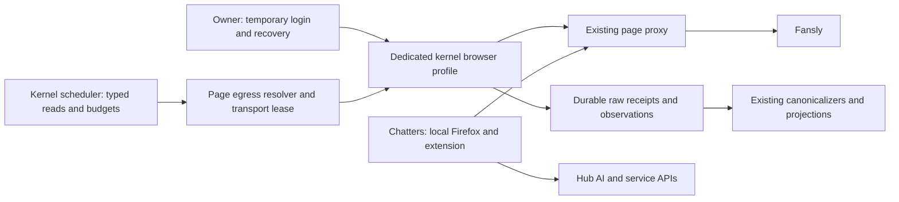

# Fansly capture hardening — independent plan

Date: 2026-09-06. Planner: Astra. Phase 3; planning only.

## Summary

**Build a kernel-owned, persistent browser session per Fansly page, used only for capture, behind that page's existing proxy. Keep chatters in their own Firefox tabs with the extension indefinitely. First ship the smaller change that already has owner approval: reduce the kernel's conversation sweep to every two hours.**

The evidence does **not** establish an impending ban. The owner reports no restrictions, challenges or forced logouts; the supplied snapshot shows working capture across six pages. The current design nevertheless has avoidable weaknesses: the kernel reuses the owner's still-interactive authorization token, advertises Firefox while using Node's transport, probably omits the browser's device/session headers, and repeatedly enumerates entire conversation lists. There are also concrete correctness defects in route-check caching and long `Retry-After` handling. These are reasons to improve the system, not evidence that either of the two reported 401s was a ban. Sources: `answers.md` §§1–6; `reference/prod-facts-2026-09-05.md`; Hub `packages/fansly/src/{adapter,request-headers}.ts`; extension `src/background/{session-capture,session-store,fansly-client}.ts`.

Three findings materially change the starting brief:

1. **The extension does not provision the kernel's Fansly session.** The owner manually pasted one authorization token; chatters have separate management sessions. The kernel does not refresh when a chatter recaptures or logs out. The actual producer and consumer code agrees with that topology, although production credential-field presence still needs a secret-free verification.
2. **`fansly-client-check` is not a short-lived token for one of seven broad route families in the captured application.** The August app derives it from the exact URL pathname, the device ID and an application constant. Offline calculation matched all 408 check-bearing requests examined across six August HAR files; those files overlap and are not 408 independent sessions. The current family caches can therefore select a check for the wrong pathname. This does not prove server enforcement or explain errors when production apparently sends no check.
3. **Conversation enumeration is the largest measured source of work.** It accounts for 104,692 of 204,904 pull observations in the supplied seven-day snapshot: 51.1%, approximately 14,956/day. Under an unchanged-work-per-sweep assumption, a two-hour cadence would remove about 11,217 observations/day, or 38.3% of the total. These are observations and a conditional projection, not measured HTTP-attempt savings or a safe request allowance.

The target removes cross-machine reuse of the owner's session and lets a real browser own TLS, HTTP, cookies and browser identity. It does not make scheduled crawling indistinguishable from human work. Request reduction, shared cooldowns, durable capture and explicit reauthentication remain necessary. A browser canary must demonstrate lower total traffic, correct data and zero unintended platform mutations before expansion.

This plan was developed from read-only local code, the addressed reference files, the permitted HARs and public documentation. No platform or production requests were made. Hub reviewed revision: `582ef1cf8a2de52eba6639ef775ddbe3e15ba74c`; extension: `1a74b8114235f95818425f49699178e5f451e29e`, manifest 1.9.11. The deployed Hub revision is **assumed**, not verified. Generated maps and historical stage documents are navigation aids; current code and explicit owner answers take precedence.

## Diagnosis of the current implementation

### Actual session topology and custody

The supported kernel contract is broader than the remembered production input. `packages/contracts/src/routes.ts:3166` accepts authorization plus optional client ID, session ID, scalar check and a seven-family check map. `apps/runtime/src/services/page-context.ts` normalizes and decrypts that material; `apps/runtime/src/services/page-onboarding.ts` verifies through the supplied proxy and saves encrypted credentials. `apps/runtime/src/services/connections.ts` replaces a submitted session as a whole, preserves an omitted proxy and verifies the expected account identity. These are useful custody and account-binding controls.

The owner says only authorization was entered, nothing was repasted after August 23, and the originating browser remains active. Therefore the working assumption is that the kernel sends static Firefox-like headers, authorization and a current client timestamp, with the other identity headers absent. Reading a schema cannot establish which optional fields are populated on production. Before changing header behavior, produce an owner-visible presence-only report: credential format version, which fields exist, provenance, last update and transport selection. Do not display their values.

The extension captures page requests in `src/background/session-capture.ts`, stores session material in its in-memory `SessionStore`, and uses it locally in `fansly-client.ts`. `operations.ts` handles capture and identity recovery; `agency-hub-client.ts` exposes Hub service/AI/data operations, not a Fansly credential uploader. The brief's claim that recapture pushes credentials to the kernel is unsupported by this implementation and contradicted by the owner.

Chatters' management sessions must remain separate from both the owner's session and the future capture session. Fansly officially supports permission-limited management links; logout requires a new link, and sensitive areas such as payouts remain restricted. That supports separate operator sessions, but does not mean all automation or all shared-IP traffic is safe. It also means a management session cannot be assumed to cover every archival lane. [Fansly management-session documentation](https://help.fansly.com/en/articles/12328641-management-sessions).

There is a remaining identity nuance: extension capture derives its initial key by decoding a legacy authorization format, then resolves canonical identity through account data. It does not explicitly model manager identity, managed creator, permission scope, browser container and credential generation separately. The captured app has management-session metadata, but the supplied evidence does not establish what every chatter's wire identity looks like. Treat “own account” in the answers as the owner's description, not proof that the decoded token prefix identifies the managed creator. Verify this from a chatter's ordinary traffic without adding calls. Sources: extension `session-capture.ts:4`, `session-store.ts:15`, `fansly-client.ts`; HAR H4 application session model, indexed below.

### Headers, transport and check semantics

`packages/fansly/src/request-headers.ts` uses a fixed Firefox 153/macOS header set from the August 21 capture, including language, privacy and fetch-metadata headers. It refreshes `fansly-client-ts` with `Date.now()` and tries to reproduce HAR insertion order. Correct spelling of `referer`, omission of invented Chromium hints and secret-redacted diagnostics are improvements. They do not reproduce Firefox's network stack.

The adapter executes `undici.fetch` through dispatchers built in `packages/shared/src/http-client.ts`. They use one connection, pipelining one and explicit keep-alive settings. No HTTP/2 option is enabled. In the locked Undici 7.27.2 connector, `allowH2` defaults to false and ALPN therefore offers HTTP/1.1; the custom SOCKS TLS connector also omits that option. Thus this code path is configured for HTTP/1.1, whereas the examined HAR API entries report HTTP/2. This is code-level evidence; no production packet trace was supplied. Changing an HTTP/1.1 header object's order cannot fix TLS ClientHello, HTTP/2 settings, pseudo-header order, flow control or connection reuse. An ordinary CONNECT/SOCKS tunnel changes the exit address while the client still performs destination TLS. Sources: Hub `packages/shared/src/http-client.ts:25`, `packages/fansly/src/adapter.ts:1949`, `pnpm-lock.yaml`; [locked Undici connector](https://github.com/nodejs/undici/blob/v7.27.2/lib/core/connect.js).

HAR header arrays are not packet captures. They even contain HTTP/1-style fields alongside an HTTP/2 label, and order varies between captures. Use them to recover names, values and request shapes, not to claim exact on-wire parity. General bot systems can use TLS fingerprints and traffic features; Cloudflare documents such signals, but that is evidence about the technique, **not evidence that Fansly runs Cloudflare Bot Management**. [Cloudflare JA3/JA4 documentation](https://developers.cloudflare.com/bots/additional-configurations/ja3-ja4-fingerprint/).

The permitted HARs provide stronger check evidence than the repository comments:

| Question | Evidence from the captured app and offline comparison | Consequence |
|---|---|---|
| What is a check tied to? | H4's HTTP interceptor computes a hexadecimal `cyrb53` result from an application constant, `new URL(request.url).pathname` and the current device ID. | Exact path matters, including per-group IDs and a trailing slash. A broad `earnings` or `group` key is insufficient. |
| Is it a fresh token for every request? | Timestamp, authorization, session ID, method and query are absent from the captured derivation. Same-path checks recur across different timestamps. | Do not build periodic seven-family token harvesting or a “check expires every request” design. |
| How well was that checked? | 408 matches, zero mismatches: H1 138, H2 21, H3 65, H4 128, H5 55, H6 1. No check values were emitted by the comparison. H4/H5 overlap. | Strong evidence for that application build; not a guarantee about the September app or backend validation. |
| How is time produced? | The app maintains a clock value, updates it on a roughly three-second timer with small jitter, and adjusts for sufficiently large server-clock differences. | Hub's fresh `Date.now()` is not inherently stale, but is not a literal reproduction. Keep host time correct; do not invent an expiry interval. |
| Where does device identity come from? | The app persists its device identifier and can obtain one through its device service; the session model separately carries account/device/session information. | Let the new profile create and retain its own coherent identity. Never combine a new device ID with an unrelated pasted token to fill missing fields. |

Current Hub behavior selects only `session.routeChecks[family]`, ignores the legacy scalar for replay, and leaves many routes unclassified, including `/account/me`. The extension uses `routeChecks[family] ?? latestCheck`, so it additionally falls back across unrelated paths. On credential/device/session changes, `session-store.ts:24` refreshes credentials in place while retaining old route checks and resolved identity. Multiple sessions indexed under the same initial account key can overwrite each other's material within one extension worker. These are concrete cache/binding weaknesses, not demonstrated production bans. Sources: Hub `request-headers.ts:31`; extension `session-capture.ts:14`, `session-store.ts:24`, `fansly-client.ts:360`.

The historical Stage 6 success proves that some requests were accepted with the then-used material. It does not prove a check is universal, required, ignored everywhere, indefinitely valid or protective against account restrictions. Decision #234 later changed the header behavior; the phase-3 answers further change the assumed credential contents. Do not rerun the old probe and interpret a non-auth 400 as successful data capture. Sources: `docs/decisions.md` #62/#234; `docs/migration-history/stages/stage-06-fansly-server-replay-gate.md`; `apps/runtime/src/services/fansly-replay-probe.ts`.

### WAF evidence and its limits

The H4 application includes `AwsWafIntegration`, challenge-script loading, `getToken()` and a request interceptor that waits for token acquisition. This is direct evidence of **AWS WAF integration capability in that captured app**. The examined H4 has neither an AWS WAF token cookie nor a recorded request to the WAF script host; its API responses identify a Fansly API gateway. It does not prove an active challenge on these successful requests, a particular enforcement rule or Cloudflare involvement.

AWS describes its token mechanism as collecting browser characteristics and automation signals, with additional interaction information when its integration SDK is used. A browser profile handles native cookies/JavaScript more coherently than a bearer-token-only replay, but an automated browser remains observable. Do not add challenge solvers, automated fingerprint rotation or IP rotation after rejection. [AWS WAF token contents and browser interrogation](https://docs.aws.amazon.com/waf/latest/developerguide/waf-tokens-details.html).

No authoritative Fansly request-per-second threshold, guaranteed session lifetime or account-ban probability was found. Successful short probes and commercial providers' existence cannot supply those missing guarantees.

### Proxy identity, geography and concurrent use

The current fail-closed belts are valuable. `apps/runtime/src/services/egress/resolver.ts` refuses vendor-scoped Fansly and requires a page proxy; `apps/runtime/src/services/page-context.ts` refuses a proxyless Fansly context; the adapter also refuses a missing proxy. `packages/shared/src/http-client.ts` supports HTTP proxying and SOCKS5. Proxy credentials and platform credentials are encrypted. These safeguards should be extended to browser launch, login, navigation, API reads and WebSockets, rather than replaced.

There is a seam to repair: the adapter still imports `createProxyRequestDispatcher` and caches its own dispatchers from `context.proxy`; its fetch does not consume the dispatcher returned by `resolveEgress`. It follows the same stored page route and fails closed, but “everything already physically goes through one resolver-owned transport” overstates the code. Introduce the browser through a resolver-owned transport capability, not another constructor with its own proxy policy. Sources: `apps/runtime/src/services/egress/resolver.ts:54`; `apps/runtime/src/services/page-context.ts:255`; `packages/fansly/src/adapter.ts:2004,2156`.

The owner reports one dedicated US residential proxy per page, shared with that page's chatters. Provider, protocol, city, exclusivity and rotation behavior remain unknown. “Dedicated” does not prove a static exit. `page-context.ts` stores a rate-limit scope key or derives one from proxy configuration; it does not record a verified residential classification, exit history or rotation policy. The snapshot's `has_proxy=f` column is explicitly invalid for this schema and must not be used as evidence of direct egress.

The highest-priority concurrency question concerns the **same owner's session** used on the owner's machine and by the kernel. The owner's actual exit was not supplied: two simultaneous IPs are a plausible risk, not a verified fact. Separate manager sessions sharing a page IP are a different topology. They avoid this particular token-copy issue while still contributing to page/IP traffic limits. The kernel's DB pacer cannot govern native chatter clicks or their extension workers.

Keep existing US routes initially. Record actual exits, stability and ownership before considering replacement. Do not automatically move proxies to each chatter's home country, randomize geography or buy “mobile” proxies as a cure. OnlyMonster documents account proxies and geographic choices, which supports deliberate routing; its rotation features do not establish a safe Fansly rotation policy. [OnlyMonster proxy management](https://docs.onlymonster.ai/onlymonster-browser/proxy-management).

### Volume, pacing and request shape

The current registry declares **17 Fansly streams**, not ten: `light`, `transactions`, `top_spenders`, `subscribers`, `followers`, `followers_reconcile`, `dm_conversations`, `dm_messages`, `fan_earnings`, `purchase_history`, `posts`, `stats_snapshot`, `notifications`, `catalog`, `post_replies`, `payouts`, `media_stats`. The snapshot contains 102 corresponding state rows. Sources: `apps/runtime/src/platforms/registry.ts:83`; `packages/db/src/repositories/page-sync.ts`; production reference.

Seven-day pull observations, calculated from the supplied snapshot:

| Kind/group | Observations/day | Share of total | Interpretation |
|---|---:|---:|---|
| Conversation lists | 14,956 | 51.1% | First reduction target. |
| Followers | 4,178 | 14.3% | Significant enumeration work; preserve audience completeness. |
| Per-fan monthly + aggregate earnings | 5,925 | 20.2% | Second major bulk workload; not the ordinary transaction ledger poll. |
| Message pages | 713 | 2.4% | Much smaller than conversation enumeration. |
| Media-offer statistics | 552 | 1.9% | Bounded low-priority enrichment. |
| Notifications | 480 | 1.6% | Protect forward coverage; some facts cannot be recovered elsewhere. |
| Everything else | 2,468 | 8.4% | Includes other requests, failure records and synthetic completion facts. |
| **Total** | **29,272** | **100%** | **204,904 observations over seven days.** |

Page averages are highly uneven: lilly-2 11,199/day, lora-1 6,974, lora-2 4,517, lora-3 3,789, lilly-1 approximately 2,342, ari-1 approximately 451. An ari-1 canary can prove basic operation; it cannot alone validate the busiest page's sweep duration or memory use. Hourly observations show activity throughout the day, but aggregate hourly counts cannot establish per-second bursts or per-session behavior.

These counts are **not a full egress ledger**. `persistRawPayload` writes observations per fetched payload; failure journaling is a failed-chunk path, and synthetic completion kinds also exist. Retries and chatter/browser activity are not enumerated one-for-one. The snapshot has no sufficient status distribution to derive a 401/429 rate. Sources: `apps/runtime/src/services/sync/shared.ts:83,650`; `apps/runtime/src/services/sync/fansly-lane.ts`; production reference.

There is already substantial pacing:

- `apps/runtime/src/services/sync/rate-limiter.ts` reserves DB-backed slots by provider, egress key and scope. Default global spacing is 2,500 ms plus a 100 ms margin; followers, conversation lists and message pages default to 5,000 ms. Both DM handlers require the shared limiter. Effective production settings still need confirmation.
- `packages/fansly/src/adapter.ts:2212` invokes that waiter when supplied, otherwise uses an in-process fallback. `packages/shared/src/config.ts` defaults shared limiting to true. Generic `EGRESS_PACER_MODE` is a separate mechanism, defaults off, and is not a switch that automatically paces this Fansly adapter or chatter browsers. Several transport settings are boot-captured according to `config-registry.ts`.
- New archival handlers have attempt-counted daily lane caps and durable continuation cursors. `fansly-lane.ts` spreads continuations; `fansly-notifications.ts` prioritizes forward polling over deep history. Decision #225 explicitly removed an additional global per-page/day cap. Do not silently reintroduce it or convert a cap into discarded work.

Residual concerns are whole-list repetition, deterministic runs, retry traffic and uncoordinated browser activity. Fixed minimum spacing is not proof of abuse; random sleeps are not a safety certificate. Preserve the minimum spacing, reduce unnecessary work and measure actual starts, concurrency and retries across all kernel request paths. Admission reservations should not collapse into a burst after process suspension or a delayed connection; test actual send starts as well as reservation times.

Conversation capture runs a resumable full scan, normally requesting 100 groups per page. It detects list drift/overlap, journals the page, can restart a generation, repairs missing/contradictory partner identities, and requests message follow-up when a head changes. Its exact-set completion guards protect visibility; removing detail reads or stopping at the first unchanged page can lose facts. Mutable offset ordering can cause expensive restarts, so count restarts separately from productive pages. Sources: `apps/runtime/src/services/sync/executor-handlers.ts:2780,2906,3113,3540,3583`; `tests/fansly-dm-generation-membership.integration.test.ts`.

The HARs show native conversation limits of 10/20 and message limits of 25; they also show followers/subscribers at 100 and payouts at 10. Therefore “100 is never a browser page size” is false. The kernel's conversation limit of 100 is not demonstrated by the supplied browser captures, but absence from a short UI walk is not proof the API forbids it. Preserve request shapes during the transport comparison. Blindly changing conversations from 100 to 20 multiplies list-page requests approximately fivefold: combined with 30 minutes → two hours, that could produce **1.25 times the original list requests**, before other effects. Four hours with 20 gives approximately 0.625 times the original. Evaluate page size and cadence jointly; do not label a larger number of browser requests as hardening merely because their shape matches one HAR.

### Freshness, completeness and operational state

The owner accepted a two-to-four-hour kernel DM/workboard lag while requiring independent capture when chatter browsers are closed. Keep the extension as the live reader. Fansly AI features receive its `clientContext`; the kernel's archive is not their transcript source. A new conversation may lack a Hub dossier until the sweep creates its join row, and dossier push can return 404 in that interval. Preserve the existing behavior explicitly in the connection/freshness explanation rather than accidentally treating it as a regression. Sources: `answers.md` §6; Hub `apps/runtime/src/modules/ai/features/index.ts:345`, `apps/runtime/src/services/fan-profiles.ts:107`; extension `kernel-feature-gateway.ts:445`, `agency-hub-client.ts`.

More precisely than the answers' shorthand, conversation head movement **queues** `dm_messages`; it does not fetch every new body synchronously inside the list request. `fanslyDmMessagesChunk` handles incremental, ordinary backfill and separately gated deep backfill work. The daily schedule is not the only message-fetch trigger, and slowing conversations increases discovery latency before that follow-up. Sources: `apps/runtime/src/services/sync/executor-handlers.ts:3583,3740`; `apps/runtime/src/services/sync/fansly-dm-messages.ts`.

Notification recovery is count- and retention-bounded, not guaranteed for a number of days. The handler walks up to 20 pages per forward poll, with 50 rows/page, and has its own attempt cap and filter fallbacks. The approximate “33 days” comment assumes a particular observed event rate; it is not a provider guarantee and cannot justify a blanket overnight pause. Preserve 30-minute forward polling initially, measure the age of the last covered head and unreached-overlap anomalies, and let deep backfill yield to forward work. Sources: `apps/runtime/src/services/sync/fansly-notifications.ts:1,103,730`; production reference.

The snapshot includes coverage debt: pending notifications/media statistics without a completed success on several pages, old catalog completion dates, and **ari-1 purchase history blocked as `provider_bad_data`**. Pending is not synonymous with authentication failure; a resumable initial walk may be making progress. Record phase, cursor, latest forward coverage and stop reason before the migration. A new transport must neither hide these debts nor clear provider-data blockers as if login had repaired them.

There is also a capture-law mismatch worth making explicit. `persistRawPayload` is durable and loud on insert failure, but the adapter returns the decoded `response` payload, and some handlers trim aggregation data before calling it. Conversation metadata preserves its observed nine list fields, while account sidecars and aggregated message details have named reductions; notifications also trim account sidecars to improve content-addressed deduplication. Thus “every wire response is already journaled verbatim before parsing” is not literally true. Preserve current canonical results, but the new transport must journal the original business response before transformations, with a versioned bridge to existing mappers. Raw login/cookie material is credential state, not a business observation. Sources: `packages/fansly/src/adapter.ts:2006,2140`; `apps/runtime/src/services/sync/shared.ts:83,526`; `apps/runtime/src/services/sync/fansly-notifications.ts:39`; `tests/fansly-capture-allowlist.test.ts`.

### Errors and lifecycle

Kernel reads allow up to three retries after the initial attempt, subject to remaining-attempt budget. 401/403 are terminal within the adapter. The executor blocks the failing stream and attempts to pause the entire page; successful re-verification is the recovery path. Redaction before snippet truncation is already implemented. These are useful protections. Sources: `adapter.ts:1987,2058`; `apps/runtime/src/services/sync/executor.ts:768`; `apps/runtime/src/services/connections.ts`; `packages/shared/src/http-client.ts`.

Four remaining weaknesses matter:

1. **Long `Retry-After` is shortened.** Hub's shared parser clamps a valid delay to 60 seconds; extension retries clamp it to five seconds. Either can retry earlier than requested. Fix this in Fansly-specific policy without unintentionally changing OnlyFans or AI vendor behavior. A long wait should become a durable `retry_at`, not occupy a worker lease indefinitely. Sources: Hub `http-client.ts:546`; extension `fansly-client.ts:398` and `shared/constants.ts`.
2. **A cooldown is not automatically shared with sibling requests.** The DB limiter controls spacing, but an individual retry delay does not itself publish a page/session-wide rejection deadline. Other streams, probes or extension requests can continue. Add a durable kernel cooldown consulted by every kernel attempt, and a local extension cooldown for its existing reads; native chatter traffic remains outside those controls.
3. **401 and 403 are over-collapsed.** Expired authorization, insufficient management permissions, a challenge and a denied route are different states. Unknown 403 must still stop safely; classify only from trustworthy evidence and never automatically try alternate routes, new credentials or another IP to get around it. An already-in-flight response may finish after a pause; generation fencing must prevent further requests and stale state updates. The current whole-page pause is best-effort after blocking the first stream, so its failure must remain visible.
4. **There is no demonstrated kernel refresh protocol.** Chatter recapture is local. Logging out of a management session does not refresh or revoke the owner's kernel token; logging out/revoking the owner's source session may invalidate it. The new browser needs explicit states for ready, reauthentication required, challenge required, proxy unavailable and paused, with a single owner recovery action. Avoid guessing token lifetime or repeatedly submitting passwords. Sources: extension `session-store.ts`, `session-capture.ts`; Hub `apps/runtime/src/services/connections.ts`, `platforms/registry.ts` session descriptor.

## Options

Ratings are comparative engineering judgments, not probabilities: **medium** means important unknown platform-policy/behavior risks remain; **high** means substantial identity or challenge behavior must be imitated or operationally worked around. **Low incremental** describes passive collection that adds no requests; it does not rate all other account activity. No self-built option earns a “ban-safe” rating from these sources. Effort estimates assume one engineer familiar with the repositories, including tests, excluding passive observation windows. They are planning estimates, not delivery commitments. Existing six-to-eight page proxies are a common cost.

### A. Hardened server replay with a dedicated capture identity

**How it works and prerequisites.** Keep existing typed adapter methods and sync handlers. Provision a separate kernel session through a real browser on the page proxy, then replay through a maintained TLS/HTTP impersonation transport with a matching browser identity. Add versioned complete-session custody, correct exact-path checks, cookie handling where required, shared rejection cooldowns and reduced sweeps. Do not keep copying the owner's daily-use session.

**Pros.** Smallest steady runtime; retains all existing autonomous archival workflows; quickest way to reduce work and correct retry behavior. One transport seam contains most changes.

**Cons and ban risk: medium–high.** Browser/network version matching remains our responsibility, and a TLS impersonation library does not supply native WAF execution, session lifecycle or browser interactions. Importing cookies from an active browser recreates split custody unless that browser is solely a provisioning tool. A browser that must remain running to refresh WAF/session material weakens the operational advantage. The maintained `curl_cffi` project documents TLS/HTTP fingerprint support; it does not promise Fansly acceptance. [Project documentation](https://github.com/lexiforest/curl_cffi).

**Completeness and freshness.** All 17 lanes can continue at their chosen cadence while no chatter is online. Existing cursor and generation semantics survive. Failure to acquire a required new route identity must be visible as unavailable capture, not silently empty data.

**Operations and cost.** Lowest recurring compute beyond current infrastructure; occasional browser capacity for login. Owner handles email/TOTP on session death. Estimated 2–4 engineer-weeks beyond the common early hardening, with continuing transport/app-version maintenance; no paid browser vendor required.

**Implementation sequence and hard rules.** Extract transport under `packages/fansly`, route it through `apps/runtime/src/services/egress/resolver.ts`, then add custody/contracts and a page canary. Preserve capture-first, attempt budgets and GET-only operations. Keep any new transport dependency inside this boundary; no client AI SDK or money logic changes. This is an acceptable interim state, but not the selected destination because it retains the most expensive identity imitation work.

### B. Kernel-owned persistent browser per page, separate from chatters — recommended

**How it works and prerequisites.** One persistent, independently authenticated browser profile per page runs on a dedicated capture host or isolated Hub service. Its route comes exclusively from the page resolver. Existing kernel jobs submit typed read operations; those execute in the logged-in page's browser context, with that profile's session/device/cookies and actual browser network stack. The owner uses a temporary authenticated remote screen for login and challenges. Chatters continue with their separate management sessions in local Firefox.

**Pros.** Removes the owner's token copy and the Firefox-header/Node-transport contradiction together. Keeps native storage and WAF facilities with the session. Autonomous capture, a familiar TS runtime and existing journal/cursors fit the six-page scale. It does not require a shared chatter workstation or an alternate CRM.

**Cons and ban risk: medium, lowest identity-mismatch risk among qualifying options.** A real browser still performs scheduled reads and can be recognized as automated. Browser upgrades, private app interfaces, unsolicited background requests and accidental mark-read behavior introduce new failure modes. A read-only browser bridge is a feasibility gate, not an assumed Playwright feature. Merely calling `browserContext.request` or moving Node fetch beside a browser does not satisfy this design.

**Completeness and freshness.** All current lanes remain independently scheduled. Start with two-hour conversations, unchanged message follow-up/history policy and unchanged notification forward polling. Passive WebSocket deltas may later improve latency, but do not replace REST reconciliation or become a prerequisite. The HARs show app WebSocket code, not enough frame evidence to certify replay or loss recovery.

**Operations and cost.** One isolated host/service, profile disk, browser patching and owner reauthentication. Initially no saved password is required; the profile itself is a high-privilege secret. Size experimentally for 5–8 profiles: a planning starting point is 4–8 vCPU and 16–24 GiB RAM, with headroom outside Postgres; these are capacity allowances, not measured requirements. Allow roughly **$100–$200/month additional compute**, excluding existing proxies, backups and any growth in the durable fact store. For a public price reference, DigitalOcean lists 16 GiB/8 shared vCPU at $96/month and 32 GiB/4 memory-optimized vCPU at $168/month; actual host choice follows the benchmark, not this example. [DigitalOcean pricing](https://www.digitalocean.com/pricing/droplets). Estimated 4–7 engineer-weeks for the full browser path and recovery flow, plus common early changes and staged observation windows. Playwright documents persistent profiles and proxy configuration, but not our resource estimates. [Persistent-context API](https://playwright.dev/docs/api/class-browsertype#browser-type-launch-persistent-context).

**Implementation sequence and hard rules.** Common hardening → resolver-owned transport and durable receipt seam → offline browser bridge/write guard → ari-1 cutover → busy-page validation → remaining pages. Preserve the single-tenant kernel as fact owner; no architecture-wide framework, no change to chatter live reads, no automated sends. Login is a separate explicit owner mutation capability. New platform branches require the existing budget justification.

### C. Extension as the sole passive collector

**How it works and prerequisites.** Capture bodies of requests the chatter's page already makes, durably spool them locally, and upload page-bound observations through a generated SDK contract. The kernel performs no Fansly requests. Multiple extension producers need authenticated scope, deduplication, durable acknowledgements and coverage reporting.

**Pros.** Adds no scheduled platform requests if kept strictly passive; uses each chatter's real session and transport. Best relative choice for avoiding additional traffic attributable to our collector.

**Cons and ban risk: low incremental capture risk, but fails the owner requirement.** Browsers may be closed and users will not naturally visit every payout, historical message, catalog or statistics surface. Asking the extension to crawl those surfaces would abandon passive collection and violate its out-of-band-request rule. Running an always-on extra browser to fill gaps turns this into option B, not a repair to C.

**Completeness and freshness.** Fresh for facts actually encountered by a chatter, incomplete elsewhere and unavailable offline. It cannot guarantee independent backfill. Existing `apps/runtime/src/services/ingest-observations.ts` is a desktop/harvest ingest surface, not a ready-made trusted Fansly business producer; unfamiliar kinds are retained as unknown rather than magically canonicalized.

**Operations and cost.** Little additional server compute, but local spool disk, extension updates and device-loss/offline support. Estimated 2–4 engineer-weeks for reliable passive capture/ingest, without solving autonomous completeness. Chatter logout is producer unavailability, not authority to reuse another session.

**Implementation sequence and hard rules.** New scoped ingest contract → re-vendor SDK → passive response capture/spool → canonicalizer provenance and dedup tests. Keep the extension live reader and no added platform requests. Reject as the primary architecture; reconsider only as a separately justified supplement after the kernel migration, with no requirement for this plan's completion.

### D. Managed cloud/anti-detect browser profiles as the kernel collector

**How it works and prerequisites.** The kernel drives a persistent vendor-hosted browser profile for each page using Playwright/CDP, custom page proxies and the same read bridge/journaling as B. Only the capture profile moves to that service. An alternative where every chatter moves into a remote shared workstation is excluded by owner answer §8.

**Pros.** Outsources browser hosting, profile storage and some remote-screen mechanics. Persistent profiles and proxy assignment are existing product concepts. Can reduce host maintenance if a provider proves the necessary isolation and control.

**Cons and ban risk: medium and vendor-dependent; no demonstrated advantage over B.** Adds a third party holding active sessions and profile material, proprietary fingerprint settings, concurrency limits and vendor update risk. “Anti-detect” is a marketing category, not evidence of lower Fansly ban incidence. Vendor default auto-rotation/retry features must be disabled. We still own request behavior, write guards, app compatibility and capture durability.

**Completeness and freshness.** Equivalent to B only if profiles remain available, the provider permits all required concurrent sessions, and durable result delivery survives provider restarts. A shared-profile launch on two hosts must be prevented.

**Operations and cost.** Subscription plus browser hours, proxies/traffic and our integration/support. For orientation, six always-running profiles consume about 4,320 browser-hours per 30-day month. GoLogin's cloud page advertises hourly rates around $0.05–$0.09, implying roughly $216–$389 before base subscription, included-hour adjustments and other fees; 5–8 profiles span roughly $180–$518 on the same illustrative arithmetic. Its public documentation has differing plan/hour descriptions, so obtain an explicit 6–8-concurrency quote rather than treating this as a purchasable offer. Estimated 3–6 engineer-weeks because B's application and capture work remains. [GoLogin cloud service and pricing](https://gologin.com/cloud-browser/), [cloud API documentation](https://gologin.com/docs/api-reference/cloud-browser/what-is-gologin-cloud-browser).

**Implementation sequence and hard rules.** Secret-custody and proxy-control evaluation → offline contract compatibility → one owner-approved profile → staged capture cutover. Resolver policy must configure the remote browser; a vendor's datacenter default is unacceptable. Use standard CDP without a proprietary SDK; any required vendor SDK must respect the gateway boundary. No third-party credential disclosure occurs without the owner's concrete approval. Not selected at this scale: it buys hosting while leaving the principal implementation risks intact.

### E. Own username/password login and device/2FA protocol in an HTTP client

**How it works and prerequisites.** Build an authentication service implementing native login, device creation, challenge state, email/TOTP submission and session replacement, then use server replay for reads. This is an authentication architecture layered on a transport, not a transport solution by itself. The OFAPI reference demonstrates an asynchronous product flow, not how its backend obtains a browser identity.

**Pros.** Potentially convenient owner connection/reconnection without manual header paste; headless operation and low steady compute if the protocol remains stable. Credentials and captured facts stay in our infrastructure.

**Cons and ban risk: high during development, medium–high thereafter.** Adds password custody, challenge races and login-attempt limits while retaining HTTP/browser mismatch. WAF or new-device behavior can change independently of known REST endpoints. Repeated automatic login is a particularly poor response to an unexplained 403. Building our own CAPTCHA handling is not part of this plan.

**Completeness and freshness.** After successful authentication it has A's coverage. During unresolved challenges it pauses until the owner acts; credential storage does not make 2FA or platform revocation disappear.

**Operations and cost.** Low compute, highest authentication maintenance and secret-custody burden. Estimate 4–8+ engineer-weeks including challenges, rate controls and tests, in addition to transport work; no paid API dependency. Owner controls email/authenticator and recovery timing. OFAPI documents username/password, pending verification, encrypted credentials and managed/custom proxy selection; its separate OnlyFans cookie/cURL/Auth+ screenshots do not establish equivalent Fansly features. [OFAPI Fansly authentication](https://docs.onlyfansapi.com/api-reference/fansly/connect-fansly-account/start-authentication).

**Implementation sequence and hard rules.** Explicit owner principal and encrypted credential state → challenge state machine → per-page proxy-bound login → typed replay and canary. No hidden write path in the capture adapter, no automated indeterminate retry, no disabled 2FA requirement. Reject as the first build; use the actual browser's login UI in B.

## Recommendation and rationale

Choose **B with reduced scheduled sweeps and the existing local extension**. A remains the migration fallback; C cannot meet autonomous capture; D adds custody/cost without removing our application work; E implements the hardest authentication surface before it is needed.

The target has two independent authenticated roles per page category, not one cloned session distributed everywhere:

The diagram shares a proxy, not a session. The owner's everyday browser remains independent too; no requirement to copy its profile, move chatters or revoke all model sessions.

Use an isolated Linux capture service with a pinned, ordinary headed Chromium build and Playwright, persistent profile directories, the Chromium sandbox enabled and a bounded display server. This is an initial engineering choice for supported control/proxy tooling, not a claim that Chromium is safer than Firefox or headed mode defeats detection. Playwright is already a runtime dependency in `apps/runtime/package.json`; its Firefox support uses a patched browser, so it should not be sold as automatically identical to chatters' stock Firefox. Let the new profile advertise its actual browser/OS, maintain its own cookies/device identity and update through canaries. [Playwright browser support](https://playwright.dev/docs/browsers).

The new connection contract should refer to a profile and credential generation, not ship platform tokens through every job. Keep page ID, expected creator account, transport kind, profile reference, session generation, proxy generation, lifecycle state, last successful verification and last classified failure. Reuse encrypted secret storage and existing page ownership; add no tenant abstraction. A native session change invalidates in-flight identity assumptions before another read can start. A single durable page transport lease prevents two workers, two hosts or both transports from using the capture identity concurrently.

The browser bridge has a precise scope: submit an allowlisted read operation with validated query/cursor, execute it in the authenticated page origin, return an unmodified response plus safe transport metadata, and durably acknowledge it before the worker advances. Prefer the app's HTTP pipeline so its own session and WAF machinery produce the request. The offline prototype must establish how to access that pipeline in a production build. If a narrow versioned browser-side bridge is necessary, review it against the captured app's exact-path check/device/time recipe and current native traffic; keep all secret reads and header construction inside the profile. Do not export a bag of headers to Node or claim plain `page.evaluate(fetch)` automatically invokes application interceptors. An unsupported app version or missing identity leaves the connection paused; no fallback to fabricated values.

Capture-mode egress permits only named read operations and the reviewed minimal bootstrap surface. Default-deny arbitrary URLs, redirects out of scope and all platform mutations, including message acknowledgements. Block WebSocket connections initially; add them only after a typed read-event design proves no outbound business writes. The HAR contains ordinary app POSTs such as `/message/ack`, `/status` and telemetry, so navigating the inbox is not a read-only implementation. Handle login/device/2FA changes under a separate temporary owner capability, then return to capture mode. Browser request interception must cover workers/popups and service-worker behavior; Playwright explicitly documents service-worker limitations, so configure and test the supported mode rather than assuming `page.route` sees everything. [Playwright network interception](https://playwright.dev/docs/network).

Browser proxy flags alone are insufficient assurance. Have the resolver issue the selected page route and generation; isolate the process so platform-bound TCP, DNS, WebSocket and UDP/QUIC cannot fall back to the host's public route. If authenticated SOCKS requires a local bridge, that bridge must tunnel destination TLS without substituting its own TLS client fingerprint. Confirm proxy protocol before selecting the launch configuration. Empty/misconfigured proxy, resolver failure or detected exit change must stop capture. Do not leak credential-bearing proxy URLs into launch logs or remote-control URLs.

Reuse existing cursor/lease/generation and canonicalization machinery. A local receipt spool is for delivery recovery, not the archive of record. Give each operation a stable job/receipt identity and generation; journal a received business body before semantic validation or checkpoint advancement, then ACK. After a crash, deliver the same receipt again rather than refetching merely because the worker did not see the ACK. Content dedup and semantic event dedup remain separate from receipt identity. Never delete captured business facts on a schedule; clean transport scratch data only after durable custody is proven under the existing retention/deleter rules.

Keep requests bounded by the existing kernel pacing, with one in-flight scheduled read per page profile and a shared rejection cooldown. All browser API traffic, including allowed native background reads, must be counted. Coalesce identical concurrent reads within the same profile/generation; do not fabricate a new successful observation from an old cache entry. Do not add stealth fingerprints, fake mouse activity, automatic proxy rotation or a browser-vendor dependency to the initial build.

Commercial evidence supports the connection pattern, not a safety guarantee. OnlyMonster documents a browser/account-proxy model; OFAPI documents proxy-bound credential authentication and verification; Infloww's Fansly setup asks for creator credentials and currently advises disabling 2FA. We should retain native owner-handled 2FA rather than copy that trade-off. None of those public sources supplies audited account counts, restriction rates, internal TLS implementation or permission for arbitrary third-party automation. [OnlyMonster](https://docs.onlymonster.ai/onlymonster-browser/proxy-management), [OFAPI](https://docs.onlyfansapi.com/api-reference/fansly/connect-fansly-account/start-authentication), [Infloww](https://help.infloww.com/en/articles/324832-getting-started-with-fansly-on-infloww).

## Migration path and stages with dependencies

Each stage is an independently reviewable change. Code can ship disabled; production deploys, login/probes and flag changes are separately owner-gated. Flip one behavior at a time, record the effective revision/configuration and complete its observation window. “Shadow” below means metadata comparison or local replay of an already captured response, never a second Fansly fetch for comparison. Proposed flag names are new, not claims about existing controls.

### Stage 0 — Establish a baseline from normal capture

**Dependency:** none. **Effort:** approximately 1–2 engineer-days plus at least 48 hours of observation.

Add or expose sanitized per-attempt telemetry at the existing request-observer seam: page, transport/generation, operation template, stream, attempt number, request class, actual start/end, retry deadline, response status/envelope code/content type, body length, parse outcome and checkpoint outcome. Record presence/absence of identity headers, not values. Aggregate counts and redacted failure facts; avoid persisting an unbounded per-attempt payload copy. Sources to extend: `packages/fansly/src/adapter.ts`, `apps/runtime/src/services/sync/{chunk-budget,observability,rate-limiter}.ts`, `apps/runtime/src/services/page-context.ts`.

Confirm deployed revision and boot-effective pacing configuration through an owner-authorized presence/config report. Inventory proxy protocol/provider/rotation/exclusivity and actual exits without touching Fansly beyond capture; compare the owner's and chatters' routes through an owner-approved neutral diagnostic if needed. Do not assume `config_settings` matches an adapter already constructed at boot. Classify the two historical 401s from retained failure evidence if available; if not, leave their cause unknown.

Capture a coverage baseline for every lane: latest forward head/window, history cursor/floor, pending age, restart count and blockers. Record ari-1's existing purchase-history blocker. No new endpoint exploration, “is this header needed” matrix or bulk replay probes.

**Gate/rollback:** telemetry has no secrets, changes no request shapes/counts, and distinguishes attempts from observations. Disable only the new telemetry if overhead is material; keep any already journaled facts. This baseline enables comparison rather than promising to infer bans from volume.

### Stage 1 — Two-hour conversation cadence with coherent health and scheduling

**Dependency:** baseline instrumentation available. **Effort:** approximately 2–4 engineer-days; 48-hour ari-1 window, then one busy page and a seven-day comparison.

Introduce a Fansly/page-resolved sync policy, initially enabled through a fail-closed page allowlist such as `fanslyDmTwoHourPageIds`. Resolve it in one place and thread it through state seeding, maintenance, due scheduling, status and health. Keep the existing default for OnlyFans. Target Fansly conversation cadence 7,200 seconds and an archive freshness SLA of 14,400 seconds, within the owner's accepted interval. Apply the corresponding Fansly `messages_live` domain policy; do not change every platform's shared constant.

The migration must handle a concrete persisted-state trap. `ensurePageSyncStates` currently rewrites `cadence_seconds` and `slot_offset_seconds` without rebasing `last_scheduled_slot`; `scheduleDuePageSync` compares that old slot to an epoch divided by the new cadence. Increasing the cadence can strand scheduling far into the future. On either forward or rollback transition, atomically rebase the scheduled-slot bookkeeping to the new units under the row/lease fence. Preserve `request_seq`, `applied_seq`, active generation, cursor and existing pending work; never enqueue all missed historical slots. Transition running work at a safe lease boundary and schedule the next eligible sweep once.

Update `packages/db/src/repositories/page-sync.ts`, policy callers in `apps/runtime/src/services/sync/{planner,executor,targeted-thread-backfill}.ts`, `apps/runtime/src/services/sync-status.ts`, `apps/runtime/src/services/health.ts`, relevant API output/tests and deploy-health expectations together. Register the new live control through the configuration system. One-off SQL edits to cadence would be overwritten by current maintenance code. Keep queue/progress-stall checks meaningful; a two-hour cadence is not permission for a running chunk to stall for two hours.

Retain notification forward cadence, message head follow-up, history cursors, current page sizes and existing archive flags. Do not combine this with a quiet-hours policy. Make the expected dossier/workboard lag visible using existing freshness/status surfaces, without changing AI context sourcing.

**Gate/rollback:** ari-1, then lilly-2 or another busy page, achieves its two-hour schedule without stale-slot stranding or false 503/deploy failures; new-message bodies arrive within the four-hour archive target under ordinary load. Compare full-sweep counts, productive requests, restarts and completion times. The 38.3% total reduction is a hypothesis to test. If work per sweep dominates the interval, diagnose it rather than silently loosening the SLA. Rollback removes that page from the allowlist and rebases slots again; it never rewinds cursors or drops facts.

### Stage 2 — Respect rejection deadlines and correct session/check binding

**Dependency:** Stage 0 evidence. Implement independently of Stage 1, but deploy/enable each behavior in a separate window. **Effort:** approximately 3–5 engineer-days across the two repositories.

For kernel Fansly reads, preserve a valid full `Retry-After` deadline and publish it to a durable page/egress cooldown. Consult it at every actual attempt, including manual verification and normal probes. A 429 should yield a checkpoint-preserving retry, with retries counted as attempts; a wait longer than the chunk budget releases the lease. Repeated unadvised 429s use increasing bounded operational backoff, not an immediate alternate IP/session. Invalid or absurd delay formats become an explicit paused/deferred error for review rather than overflow or an early retry. Do not change the shared helper's semantics for other providers incidentally.

Retain no retry on 401/403. Add evidence-based failure classes for authorization, permission, challenge, throttling, proxy/transport and provider data. Unknown rejection still pauses safely. Ensure a stale generation cannot pause a newly verified session or submit another request. Make failure of the whole-page pause visible and enforce the stop at admission as well as scheduling.

Extension work is strictly for its existing live reads: exact-path check association including the full API pathname and trailing slash; clear checks, resolved identity and response caches on credential/device/session epoch change; bind the request to its originating session/tab/container rather than whichever account-level capture arrived last. Remove cross-route `latestCheck` fallback. An unseen path does not authorize a new harvesting request: use the page's already-existing request path or report the capability unavailable until valid native material exists. Confirm manager-to-creator binding from normal traffic. Publish a local deadline after 429 and return a typed deferred result when the UI cannot wait; never shorten a five-minute server request to five seconds.

Do not require the owner to fill every optional legacy kernel header or add a new manager-credential upload. Keep authorization-only replay unchanged until its page moves to the browser. If an actual kernel check map is present, version its exact-path/identity binding and do not reinterpret seven-family entries as exact keys. These corrections supersede the narrow family-check assumption in decision #234; record that explicitly in implementation decisions.

**Gate/rollback:** deterministic tests prove long deadlines, no cross-generation identity mixing, no added extension request count and correct recovery after ordinary recapture. Signed extension release/version changes follow its existing release process; any new Hub API follows contracts generation and SDK vendoring. A regression rolls back the isolated behavior or pauses the affected capability; do not restore knowingly wrong cross-route headers as an automatic fallback.

### Stage 3 — Resolver-owned transport, raw receipt contract and offline browser prototype

**Dependency:** Stage 0 identity/egress inventory; Stage 2 deadline and stop semantics before live use. **Effort:** approximately 2–3 engineer-weeks.

Extract the HTTP execution from `packages/fansly/src/adapter.ts:1949` into a small transport interface retaining typed operations, status/body access, observer calls, timeout, abort and retry-budget semantics. Keep the existing Undici implementation as the default. Have `apps/runtime/src/services/egress/resolver.ts` own the page route/capability used by both implementations, including onboarding, re-verification and replay-probe entry points. No public generic URL-fetch RPC.

Add the browser worker as a contained service/package, with single-page leases, persistent profile references, lifecycle state and generation fences. Extend `page-context.ts`, connection contracts and dashboard connection status only as needed to distinguish a profile-backed connection from the legacy bundle. Browser readiness comes from normal capture/known session state, not a new minute-by-minute authentication probe. All new DB changes are forward-only; select migration numbers at implementation time.

Build a local fake platform/proxy fixture from sanitized HAR structures and the captured app analysis. Do not commit the real HARs, tokens or profile data. Establish the actual browser-origin bridge, not just a browser launch. Test exact-path requests and all 17 lanes' required operations against existing adapter contracts, including empty responses, unknown fields, path variants, offset/before pagination and account mismatch. Explicitly prove service-worker/pop-up/WebSocket/write restrictions, login/capture mode separation and fail-closed egress. This is the go/no-go gate for B's technical premise.

For durable capture, retain the unmodified business response before parsing, then adapt it to existing canonicalizers. Reuse the observation/raw/CAS machinery rather than introduce a parallel archive. Version the producer/mapper contract and preserve existing domain-event dedup identities. Existing sidecar reductions may remain downstream transformations, but not the sole retained response. Full sidecars can materially reduce CAS dedup; measure bytes from the permitted HARs and later normal canary receipts, budget compression/storage and reserve disk before enabling. No new retention TTL or silent field dropping is an acceptable storage fix. Update the observation access scrubbers so additional retained fields do not widen agent/chatter disclosure.

The browser's delivery spool must stop issuing reads when it cannot durably retain a response. A crash after reception but before journaling is an incomplete operation; a lost ACK after journaling must redeliver the same receipt. Lease expiry may prevent projection/checkpoint advancement while still allowing an already received, correctly page-bound fact to be journaled with its original generation. Distinguish stale execution from an invalid account binding.

**Gate/rollback:** offline adapter/canonicalizer parity, all egress/write-guard tests, receipt recovery and storage/access controls pass. Keep the browser selector off and the tested legacy transport available. If the production app offers no maintainable safe read bridge, stop this stage and retain stages 1–2 plus A's hardened replay; report that concrete failed premise before revising the architecture. Do not improvise unrestricted inbox clicking or token export to make the demo pass.

### Stage 4 — Owner-provisioned ari-1 browser and exclusive transport canary

**Dependency:** Stage 3 gates, owner-approved profile host and login flow. **Effort:** setup plus at least 48 hours initially and seven days before broadening confidence.

Present a concrete owner connection action: select ari-1, show verified page proxy/expected account, open an authenticated short-lived remote screen, and complete the normal Fansly login/email/TOTP flow in the new profile. Do not copy the owner's existing browser profile or disable 2FA. Login attempts are deliberate and bounded; password storage remains off. Keep control access private and time-limited; close it after capture mode is enabled.

Before that live action, quiesce ari-1's old transport and drain/expire its fenced lease. Propose at most three single-attempt verification reads: account identity, one conversation-head page and one notification-head page, using already received native responses where possible. Each substitutes for the corresponding normal read; any additional diagnostic needs a separately declared owner-approved allowance. Do not force a history sweep as a probe. Native login/bootstrap traffic is counted separately from these three reads, with one deliberate login attempt and owner-handled verification rather than an automated retry loop. Onboarding verification uses the same ledger and pacing. Do not run an old/new A/B header matrix on the account. Preserve all existing cursors and provider-data blockers.

Enable `browser` for ari-1 through one explicit page transport selector. All its sync/verification paths use that selector. Initially block background WebSockets and unreviewed app requests; count any allowed bootstrap or native API traffic. Preserve the two-hour conversation policy and unchanged page sizes so transport results are interpretable. Demonstrate independent progress while chatter tabs are closed and ordinary owner/manager sessions remain usable.

**Gate/rollback:** no direct egress, unexpected mutation, cross-account receipt, duplicate collector or credential exposure; ordinary reads meet the declared data contract; native background traffic does not erase the reduction achieved in Stage 1; notification heads and DM follow-up stay within target. A challenge or 401/403 pauses the canary and asks for owner recovery; it never triggers auto-rotation, automatic relogin or automatic replay with the owner's token.

Rollback is controlled: pause and fence browser work, retain delivered/pending facts, then explicitly select legacy replay only if the retained legacy credential/route is still valid and the owner approves that recovery. The browser's newly minted token is not exported to Undici. If neither session is usable, remain visibly paused until the owner reconnects. Ari-1's pre-existing purchase-history `provider_bad_data` remains a separate unresolved item.

### Stage 5 — Busy-page proof, remaining pages and retirement

**Dependency:** Stage 4 success. **Effort:** approximately 1–2 engineer-weeks of completion work, with staged observation time normally extending the rollout by several weeks.

Move one busy page next, selected from lilly-2/lora-1, with the same drain/login/select sequence. Observe at least seven days, including complete conversation sweeps, all active archival lanes, retries and owner recovery. Require a full history/cursor cycle where its natural duration exceeds the window; pending work needs demonstrable forward progress and a reasoned completion estimate. Then move one remaining page at a time, with at least 48 hours per page before the next selector change and longer when an anomaly remains unexplained.

Benchmark 5–8 profiles with local fixtures before fleet enablement; measure actual production CPU/RAM/profile disk during normal capture. Keep Postgres and API latency isolated from browser pressure. Browser crash must stop that profile, not silently activate a backup copy or a direct network path. Patch the browser/app bridge with the same one-page canary discipline.

After the migrated fleet has a stable observation window, remove Hub's retained copies of the owner's legacy authorization material through a targeted, audited credential-config operation. Secret/config retirement is distinct from deleting captured facts. Do not revoke the owner's still-used native session as a side effect; retiring its Hub copy is enough. Keep migration compatibility until recovery is proven, then remove the obsolete replay mode in a separate cleanup change with a tombstone/decision entry.

Use post-cadence attempt telemetry to decide the next volume reduction. Per-fan earnings and followers are the next measured candidates, but do not skip inactive fans indefinitely or weaken reconciliation merely to hit a traffic target. Coalesce genuinely identical in-flight reads; retain periodic complete cycles and visible coverage debt. A page-size change or a move from two to four hours is a separate canary with its own request-volume and lag calculation. Retain 100-group pages during the initial comparison; use 20 only if the measured combined policy improves the trade-off. No mandatory overnight pause is introduced.

WebSocket/passive extension enrichment is optional future work, not a missing requirement for this migration. It would need frame semantics, durable delivery, provenance, deduplication and gap recovery before replacing any polling. The accepted two-to-four-hour archive lag makes that complexity unnecessary now.

## Verification and acceptance criteria

### Before any live enablement

Run the repositories' required checks during implementation, not during this read-only planning task: Hub `pnpm check`, relevant DB integration suites serially, extension `pnpm check`, generated-contract/SDK drift checks when touched, and existing platform-branch/raw-fetch/retention/auth ratchets. No new tests were run or claimed here. Add tests for the following behavioral failures; avoid tests that merely mirror a flag's implementation.

| Boundary | Required evidence |
|---|---|
| Scheduling | Forward and rollback cadence transitions rebase slots correctly on idle, pending and leased rows; no years-long scheduling gap, duplicate sweep, cursor rewind or OnlyFans policy change. |
| Identity | Exact full pathname and slash behavior; invalidation on device/session/account generation change; no cross-container reuse; manager and creator binding distinguished; no scalar/cross-route fallback. Use synthetic credentials only. |
| Rejection | Numeric/date `Retry-After` longer than 60 seconds and five seconds is respected; no sibling attempt before a durable cooldown; invalid values cannot overflow; 401/403 never auto-retry or start an alternate transport. |
| Egress | Missing/broken/auth-rejected proxy fails closed; redirects, DNS, IPv6, WebSocket and UDP paths cannot bypass it; browser/app updates cannot restore a direct path; destination TLS remains browser-owned. |
| Platform writes | Local recorded-traffic tests prove sends, acknowledgements, typing, purchase, deletion, settings and other mutations cannot leave capture mode. Login/2FA only under its owner capability. Service workers, popups and WebSockets included. |
| Durable capture | Kill browser/worker at receipt, journal and ACK boundaries; retry upload without refetch after durable capture; raw business body and unknown fields recover; no checkpoint before durable fact; disk full/DB unavailable applies backpressure. |
| Canonical correctness | Existing fixtures and stored-response replay preserve messages, sender/time/tips, partner/fan identities, purchases, earnings, metadata and coverage floors; no duplicate business events from multiple receipts/transports. |
| Sweep safety | Overlapping/reordered pages, changing/missing totals and mid-sweep erasure preserve existing generation-membership guards; incomplete sweep cannot hide conversations. |
| Access/custody | No platform tokens/cookies/checks/proxy passwords in logs, telemetry, SDK output, browser traces, screenshots or business observations; new raw sidecars retain existing owner/message access boundaries. |
| Recovery | One profile owner across hosts; stale generation cannot act after reconnect; challenge waits for the owner; proxy outage does not mint a new session or switch IP automatically. |

Relevant existing suites include `tests/{fansly-session,adapter-fansly-replay-probe,fansly-replay-probe,http-client,sync-rate-limiter,sync-status,connections,fansly-capture-allowlist}.test.ts`, `tests/{sync-rate-limiter,page-sync-lease-fencing,fansly-dm-generation-membership,fansly-notifications-lane,api}.integration.test.ts`, and the extension's session/client tests. Extend the nearest existing suite where appropriate; use local fake endpoints rather than a live model account as a test fixture.

### Production acceptance using normal capture

- **Identity and routing:** one active kernel capture profile/generation per page; one expected page route; no owner-token use on browser pages; zero direct-egress or cross-account events. Confirm separate manager sessions continue to work through their existing proxies.
- **Volume:** compare actual kernel attempts by page/operation/retry reason over matched windows before and after each change. Report sweep frequency and pages per successful sweep separately. Include native browser bootstrap/background traffic and provider failures; never substitute the 29,272 observation/day estimate for an actual rate budget. Stage 1 should materially reduce conversation enumeration; browser enablement should not increase total kernel API attempts over the post-Stage-1 baseline without an explained, approved trade-off.
- **Freshness:** schedule conversations every two hours and keep complete-head/new-body archive age within four hours during healthy operation; report backlog/overlap failure separately from recent partial progress. Keep existing transaction/audience SLAs, notification forward policy and live extension reads. A health endpoint may be degraded for a real missed target, but must not fail merely because it still expects a 30-minute sweep.
- **Completeness:** enumerate all 17 lanes with mode, cursor, latest covered head/window, floor proof or explicit incomplete status. A new transport cannot advance a floor, clear `provider_bad_data`, erase a generation or report unavailable data as empty. Verify one completed bounded cycle per active lane, or demonstrate durable progress with the measured completion time if naturally longer than the rollout window.
- **Recovery:** observe or rehearse browser/worker restart locally, a planned canary pause/resume and an owner-controlled session recovery. Preserve native owner/chatter sessions. Measure recovery time from owner action separately from the wait for owner availability; answer §7 explicitly permits that wait.
- **Restrictions:** count 401, permission/challenge 403, 429, forced logouts and owner-reported account signals with denominators and context. Stop the canary immediately on a new restriction, unexpected challenge, unintended write or routing/identity violation. A successful week is operational evidence, not proof against delayed platform enforcement.

For a functional issue without an account-risk signal, hold expansion, retain facts and inspect the existing response/telemetry before requesting another platform call. A failed canary does not justify testing more header, IP or login combinations on other pages.

## Risks, trade-offs, assumptions

| Item | Status and consequence | Treatment |
|---|---|---|
| Current account risk | No observed restriction per owner; future policy and detection thresholds unknown. | Preventive reduction and controlled rollout; no numerical ban probability or safety guarantee. |
| Production identity/configuration | Authorization-only input and current Hub revision are assumptions from the answers; proxy exits and effective overrides unverified. | Stage 0 presence/config report; no credential dump or invented history. |
| App-check evidence | Strong for the captured August build, not a published stable API contract. | Versioned bridge, exact-path tests, native profile identity; pause on incompatibility rather than guessing. |
| Browser feasibility | Real browser support exists; safe access to all required app read operations is not yet implemented/proven. | Explicit Stage 3 gate, typed operations and no unrestricted UI automation. |
| Background writes/traffic | Native app HAR includes acknowledgements and other POSTs. | Capture-mode write guard and attempt accounting are launch blockers, not post-launch polish. |
| Browser resource cost | More RAM/CPU and maintenance than replay; supplied snapshot has no host sizing. | Separate process/host isolation, measured capacity at eight profiles and a resource budget before fleet rollout. |
| More complete raw capture | Existing sidecar trimming aids dedup; retaining original responses can substantially increase durable storage. | Measure compressed bytes/CAS behavior, use existing storage machinery, preserve disclosure scrubs, budget space; no scheduled fact deletion. |
| Permission coverage | A manager session may not access payout or account surfaces; all-lane creator-session scope is privileged. | Dedicated owner-provisioned creator session initially, read-only enforcement; evaluate narrower permissions only against the complete operation inventory. |
| Rate aggregation | Kernel controls cannot fully pace human clicks and separate manager browsers sharing an exit. | Leave headroom, reduce archive traffic first, local extension cooldowns, document this control limit. No claim of an enforceable fleet-wide Fansly allowance. |
| Archive latency | Accepted two-to-four-hour delay can delay new-fan dossiers and workboard information. | Clear freshness state, protected notification heads and event-triggered message follow-up; no AI transcript regression. |
| Session death | Owner may recover on his schedule; a saved password does not remove 2FA/challenges. | Visible pause and durable cursors; protected notification recovery is bounded by actual provider retention, never guaranteed. |
| Existing capture debt | ari-1 purchase history and other long/pending lanes predate the change. | Baseline and keep visible; repair provider-contract faults separately without weakening guards. |
| Commercial comparisons | Vendor docs are product descriptions, not audited evidence of “thousands of accounts without bans.” | Adopt supported operating patterns only; no inference of platform endorsement or universal safe automation. |
| Scope | OnlyFans, money/ledger calculations, AI prompts and chatter-workstation topology are unchanged by the target. | Restrict policy resolution and transport to Fansly; retain contract/branch/SDK gates. |

Overnight pausing is a possible later trade-off, not a baseline requirement. It needs actual shift/activity information and a retention/notification analysis. Stable US routing is the initial policy; changing provider/country, storing passwords or adding a managed browser is a separate concrete decision, not an automatic consequence of this recommendation.

## Decisions left to the owner

The owner already accepted independent kernel collection, local chatter browsers indefinitely, a two-to-four-hour DM archive lag, ari-1 as a possible canary and additional infrastructure cost. Do not re-ask those questions.

The implementation should present these concrete gates when ready:

1. **Approve the selected browser host/profile custody and temporary remote-login flow.** Recommendation: self-hosted, isolated ordinary browser profiles; owner completes native login and 2FA; no saved model passwords initially. Provide the actual host resource/cost proposal and access design before approval.
2. **Confirm the existing page-proxy facts and owner's source-session route.** This is missing operational information, not a request to replace proxies. Any needed proxy change gets its own page-specific proposal; no automatic rotation or geography change.
3. **Approve each production deployment/flag transition and bounded ari-1 login/read canary.** Show the immutable change, target page, expected normal-call substitution, verification window and rollback first. The approved freshness range supports the proposed two-hour default without another product decision.
4. **Approve targeted retirement of legacy Hub credential copies after successful migration.** Keep the owner's native session working; do not revoke all sessions. Saved-password recovery, four-hour cadence/page-size changes, night pauses and cloud-browser procurement remain optional later decisions with separate evidence.

No additional answer is required to implement and review the offline stages. This document authorizes no live execution by itself.

## Evidence index (repo paths and URLs)

Paths below are relative to the named repository unless absolute. Line references identify the reviewed revision and may move during implementation.

### Addressed planning evidence

- `brief.md` — scope, hard rules, read-only constraints and required output.
- `answers.md` — full owner answers and orchestrator findings; in particular credential provenance, separate management sessions, accepted freshness, indefinite local-browser scope and canary authorization boundaries.
- `reference/prod-facts-2026-09-05.md` — seven-day observations, hourly counts and 102 Fansly stream states. Collection around 22:05–22:06 UTC; not an atomic cross-table snapshot. Does not reveal deployed commit, full credential shape or effective pacing config.
- `reference/README.md`, `reference/ofapi-fansly-start-authentication.md` — supplied September 5 reference and explicitly separate OnlyFans UI descriptions.

### Hub: `/Users/dmitriy/orca/workspaces/hub/hydra`

| Paths | What they establish |
|---|---|
| `CLAUDE.md`; `docs/decisions.md` #20/#21/#42/#62/#76/#100/#118/#124/#225/#234 | Architecture laws, encrypted secrets, historical replay findings, egress, capture/retention and later header changes. Historical success is not a current platform guarantee. |
| `docs/generated/00-overview.md`, `06-capture-and-canonicalization.md`, `07-sync-engine.md`, `08-platform-adapters-and-egress.md`, `15-auth-config-and-access.md` | Required navigation maps; checked against current source rather than treated as current deployed facts. |
| `docs/migration-history/stages/stage-06-fansly-server-replay-gate.md`; `stage-26-egress-pacing-unification.md` | Historical replay scope/owner probe gate and egress/pacing design; superseded details identified above. |
| `packages/fansly/src/request-headers.ts:1`; `packages/shared/src/types.ts`; `packages/contracts/src/routes.ts:3166` | Fixed browser header template, seven-family check selection and optional credential schema. |
| `packages/fansly/src/adapter.ts:1129,1190,1949,2156,2212`; `packages/fansly/src/types.ts` | Conversation/message requests, response handling, GET-only execution, attempt/retry behavior, dispatcher construction and pacing context. |
| `packages/shared/src/http-client.ts:25,62,546`; `packages/shared/src/config.ts:95`; `packages/shared/src/config-registry.ts:115`; `pnpm-lock.yaml` | Transport configuration, SOCKS tunnel, capped Retry-After, defaults/boot application and locked dependency versions. |
| `apps/runtime/src/services/egress/resolver.ts:54`; `apps/runtime/src/services/egress/pacer.ts`; `apps/runtime/src/services/page-context.ts:48,125,255` | Page-route policy, vendor Fansly refusal, encrypted material, egress keys and current physical transport seam. |
| `apps/runtime/src/services/page-onboarding.ts`; `apps/runtime/src/services/connections.ts`; `apps/runtime/src/services/fansly-replay-probe.ts` | Credential onboarding/verification/recovery, replacement semantics and limitations of the old probe verdict. |
| `apps/runtime/src/platforms/registry.ts:83`; `apps/runtime/src/services/sync/fansly-stream-gate.ts`; `apps/runtime/src/services/sync/fansly-stream-scheduling.ts` | Current 17-lane capability set, manual-scope distinction and gating. |
| `packages/db/src/repositories/page-sync.ts:175,449,995,1504,1593,1930`; `apps/runtime/src/services/sync/planner.ts` | Cadence/SLA policy, hashed offsets, persistent slot units, reconciliation and due scheduling. |
| `apps/runtime/src/services/sync-status.ts:956,1029,1083,1357`; `apps/runtime/src/services/health.ts`; `scripts/deploy-production.sh`; `tests/api.integration.test.ts` | Freshness evaluation, task/domain health, deployment checks and API cadence expectations. |
| `apps/runtime/src/services/sync/executor-handlers.ts:2780,2906,3113,3583,3740`; `apps/runtime/src/services/sync/fansly-dm-messages.ts`; `apps/runtime/src/services/sync/targeted-thread-backfill.ts` | Full scans, partner repair, generation safety, incremental message follow-up and independent history work. |
| `apps/runtime/src/services/sync/rate-limiter.ts`; `apps/runtime/src/services/sync/chunk-budget.ts`; `apps/runtime/src/services/sync/fansly-lane.ts` | DB reservations, request-attempt accounting, continuation behavior and shared lane machinery. |
| `apps/runtime/src/services/sync/executor.ts:768`; `apps/runtime/src/services/sync/shared.ts:83,526,650`; `tests/fansly-capture-allowlist.test.ts` | Auth pause, durable capture/failure records and pre-journal payload reductions. |
| `apps/runtime/src/services/sync/fansly-notifications.ts:1,103,730`; `tests/fansly-notifications-lane.integration.test.ts` | Head-first forward/backfill behavior, overlap and daily limits, type-filter fallback and notification sidecar reduction. |
| `apps/runtime/src/services/ingest-observations.ts`; `apps/runtime/src/modules/ai/features/index.ts:345`; `apps/runtime/src/services/fan-profiles.ts:107`; `apps/runtime/src/services/notification-incidents.ts`; `docs/workboard-v2-priority-design.md:376` | Existing client-ingest trust boundary, live AI context, dossier lag, notifications and workboard dependency. |
| `apps/runtime/package.json`; `scripts/check-platform-branches.mjs`; `scripts/platform-branch-budget.json`; `tests/retention-deleters.test.ts`; `tests/contracts-auth-declarations.test.ts` | Existing Playwright dependency and implementation ratchets to preserve. |

### Extension: `/Users/dmitriy/code/goose/fansly-ext`

| Paths | What they establish |
|---|---|
| `CLAUDE.md`; `docs/decisions.md`; `manifest.json`; `package.json` | Live-reader/no-extra-request laws, release/SDK process and 1.9.11 version. |
| `src/background/session-capture.ts:4,14,95` | Legacy token-key parsing, coarse families, required captured headers and tab-only request observation. |
| `src/background/session-store.ts:15,24,139` | In-memory account/tab custody, retained check/identity state on recapture, disconnect and orphan pruning. |
| `src/background/fansly-client.ts:341,398,993`; `src/shared/constants.ts` | Existing background GETs, cookie omission, check fallback, retry handling and message pagination. |
| `src/background/operations.ts:615`; `src/background/agency-hub-client.ts`; `src/background/kernel-feature-gateway.ts:445` | Capture handling, actual Hub operations and live `clientContext`; no implemented kernel credential producer. |

### Permitted local HARs and reproducibility

These are sensitive source files, not deliverable fixtures. No credential, cookie, session/device identifier or check value is included in this plan.

| ID | File | Use |
|---|---|---|
| H1 | `/Users/dmitriy/code/goose/hub/artifacts/fansly-network-capture-2026-08-19/fansly-session-2026-08-19.har` | Header shapes, protocol labels, native route/query patterns and 138 offline check comparisons. |
| H2 | `/Users/dmitriy/code/goose/hub/artifacts/fansly-app-bundle-2026-08-20/fansly-app-bundle-2026-08-20.har` | Native requests and 21 comparisons. Despite its name, the relevant main check implementation was found in H4/H5, not this file. |
| H3 | `/Users/dmitriy/code/goose/hub/artifacts/fansly-payouts-capture-2026-08-20/fansly-payouts-2026-08-20.har` | Payout pagination and 65 comparisons. |
| H4 | `/Users/dmitriy/code/goose/hub/artifacts/fansly-ui-walk-2026-08-21/fansly-ui-walk-2026-08-21.har` | Main app, browser requests/background POSTs, WAF/session/clock/WebSocket code and 128 comparisons. |
| H5 | `/Users/dmitriy/code/goose/hub/artifacts/fansly-ui-walk-2026-08-21/fansly-ui-walk-2026-08-21-pre-rewalk.har` | Overlapping earlier walk and 55 comparisons; not an independent account sample. |
| H6 | `/Users/dmitriy/code/goose/hub/artifacts/fansly-ui-walk-2026-08-21/fansly-ui-walk-2026-08-21-control.har` | Two-entry control and one comparison. |
| H7 | `/Users/dmitriy/tools/fansly_api_sdk/fansly_api_doc/fansly_full.har` | Older browser/API shapes, including subscriber pagination; excluded from the six-file derivation-match count. |

The listed older `profile_data.har` and `single_media.har` were absent at their supplied locations; no substitute files were sought under planning directories.

For the check result, parse only the permitted HARs in memory. H4/H5 entry index 358 (zero-based) contains `main.ac7fcc376bc818b0.js`. The decoded main body has 6,616,675 characters and SHA-256 `d5e6dca317991b218d1267c45e3cdf3ac8cf22d9fc6a7ac80cb6e44ee71f8588` (public application-body digest, not a credential). Relevant character neighborhoods: session model around 208,104; WAF integration around 212,663–214,479; active-session service around 220,928; WebSocket creation/auth around 324,841/339,050; check/clock interceptor around 644,836–648,000. Inspect the constructor's final assembled constant, not an overwritten initial assignment. Compare the captured algorithm's output with each request's check in memory; emit only counts/match status. Never print operands or results. The body offsets are local evidence pointers, not a supported runtime integration interface.

### Public primary sources, consulted 2026-09-06

- [Fansly management sessions](https://help.fansly.com/en/articles/12328641-management-sessions) — permissioned links, session/logout lifecycle and restricted sensitive functions; no blanket automation approval.
- [AWS WAF token details](https://docs.aws.amazon.com/waf/latest/developerguide/waf-tokens-details.html) — browser interrogation and integration-token semantics; connected to the app's AWS integration evidence, not proof of a specific active rule.
- [Cloudflare JA3/JA4 fingerprints](https://developers.cloudflare.com/bots/additional-configurations/ja3-ja4-fingerprint/) — general TLS/traffic signals; not evidence that Fansly uses that product.
- [Undici 7.27.2 connector source](https://github.com/nodejs/undici/blob/v7.27.2/lib/core/connect.js) — default HTTP/2/ALPN behavior for the locked dependency.
- [OnlyFansAPI Fansly overview](https://docs.onlyfansapi.com/api-reference/fansly) and [start authentication](https://docs.onlyfansapi.com/api-reference/fansly/connect-fansly-account/start-authentication) — published credential/verification/proxy product contract, not backend architecture or ban statistics.
- [OnlyMonster proxy management](https://docs.onlymonster.ai/onlymonster-browser/proxy-management) and [account management](https://docs.onlymonster.ai/team-and-security-management/creator-management) — account proxies, geographic configuration and multiple-operator administration. Their OnlyFans-specific rate-limit advice is not a Fansly policy.
- [Infloww Fansly setup](https://help.infloww.com/en/articles/324832-getting-started-with-fansly-on-infloww) — creator-credential connection and the documented 2FA trade-off; no internal implementation evidence.
- [Playwright persistent contexts](https://playwright.dev/docs/api/class-browsertype#browser-type-launch-persistent-context), [browser support](https://playwright.dev/docs/browsers), [network interception](https://playwright.dev/docs/network) — real API capabilities and limitations, not stealth or safety guarantees.
- [curl_cffi project](https://github.com/lexiforest/curl_cffi) — maintained transport-impersonation option and its scope.
- [GoLogin cloud browser](https://gologin.com/cloud-browser/) and [cloud API introduction](https://gologin.com/docs/api-reference/cloud-browser/what-is-gologin-cloud-browser) — persistent remote profiles, control model and indicative metered costs; subscription/concurrency terms require a concrete quote.
- [DigitalOcean Droplet pricing](https://www.digitalocean.com/pricing/droplets) — public compute-price examples for option B; not a capacity benchmark or a commitment to that provider.
