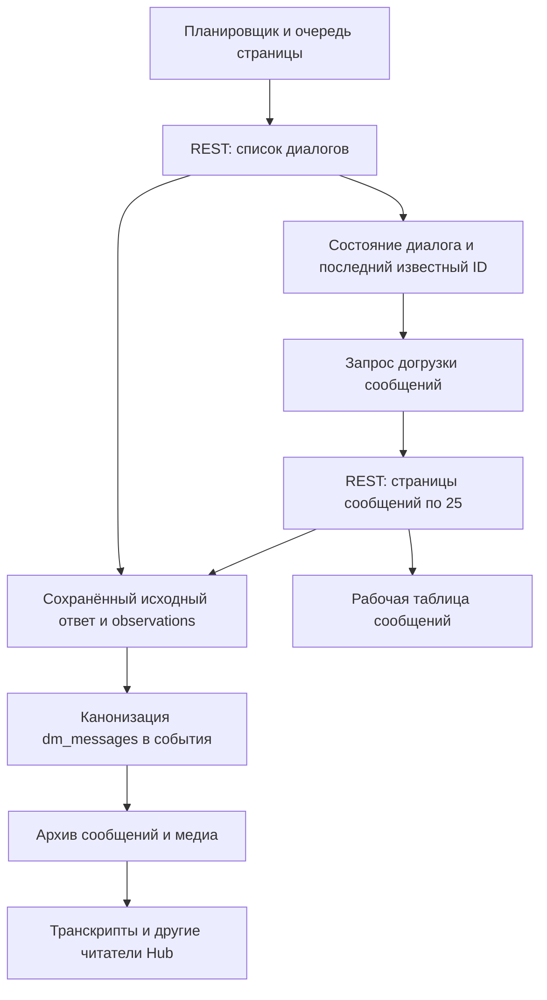

# Диагностика Fansly DM — 8 сентября 2026

**Вердикт: сбор работает, но утверждение «ничего не теряем и всё догоняется» не подтверждается. Найдены ошибка повторной загрузки известного сообщения, большой незавершённый сбор на lilly-2 и потеря связи reply при построении архивного транскрипта.**

**На проверенном production перехода Fansly DM на вебхуки нет.** API, worker и scheduler запущены из `21e0ee332740`; локальный main и GitHub main указывают на полный commit `21e0ee33274017e83f208d62506f4c835db01f6b`. В Fansly adapter `webhooks: false`, оба DM-потока — REST pull. Вебхуки включены у OnlyFans. Последние Fansly PR #153–155 подготовили рефакторинг обхода, защиту от пустого списка и корректный Retry-After; нового событийного транспорта они не включали. Это вывод о данном Hub production, а не заявление обо всех возможностях платформы Fansly.

Проверены все шесть страниц: ari-1, lilly-1, lilly-2, lora-1, lora-2, lora-3. Основное окно исходных данных: **7 сентября 04:45 — 8 сентября 04:45 МСК** (`2026-09-07T01:45:00Z` — `2026-09-08T01:45:00Z`). Последняя проверка инфраструктуры: **8 сентября 05:09 МСК**. Во всех файлах SQL/JSON время UTC, если явно не указано иначе. Изменены только файлы этого исследования; production, настройки, роли и данные не менялись. Дополнительные запросы к Fansly не запускались.

## Что сейчас работает

Список `/messaging/groups` планируется раз в **30 минут**, обходится с offset и сохраняемым checkpoint. Это интервал запуска, а не гарантия, что любой DM попадёт в Hub за 30 минут: обход, очередь страницы, повторы и ограничения запросов добавляют время. По изменившемуся последнему ID обработчик запрашивает `dm_messages`. Отдельный суточный запуск `dm_messages` тоже использует селектор подходящих диалогов; он не перечитывает безусловно каждый диалог.

`/message?groupId=…&before=…&limit=25` даёт историю. Запросы идут через контекст страницы, её proxy, общий ограничитель запросов и lease. Ответ сохраняется в raw/CAS и observations до записи сообщений и продвижения checkpoint. Сбой этого сохранения завершает chunk ошибкой. Рабочие строки сообщений и checkpoint защищены транзакциями и lease; долг перестроения сводки отделён от сохранности самих фактов.

Далее canonicalizer v5 формирует `message.received` / `message.sent`, а для сообщений с вложениями — также материал и связанные медиа-события. Архив читает эти события. Повторное чтение того же обычного сообщения не создаёт новый факт: ключ привязан к направлению и ID. Начальная загрузка ограничена 25 сообщениями, старую историю догружает отдельная бюджетируемая ветвь. Значения её текущих флагов этой проверкой не установлены.

Код: [регистрация Fansly](/Users/dmitriy/code/goose/hub/apps/runtime/src/platforms/registry.ts:154), [расписание DM](/Users/dmitriy/code/goose/hub/packages/db/src/repositories/page-sync.ts:253), [REST adapter](/Users/dmitriy/code/goose/hub/packages/fansly/src/adapter.ts:1132), [сохранение ответа](/Users/dmitriy/code/goose/hub/apps/runtime/src/services/sync/shared.ts:83), [обработка страницы сообщений](/Users/dmitriy/code/goose/hub/apps/runtime/src/services/sync/fansly-dm-messages.ts:209), [канонизация](/Users/dmitriy/code/goose/hub/apps/runtime/src/services/canonicalize/sync-pull.ts:157).

## 1. P1 — успешная попытка может навсегда снять нужную догрузку

Условие повторной загрузки требует одновременно разных `last_message_id` / `newest_stored_message_id` **и** времени последней синхронизации раньше времени последнего сообщения. После успешного ответа `/message` finalizer ставит текущее время в `last_message_sync_at`, даже если ожидаемого ID в ответе не было. Следующая проверка видит свежую попытку и больше не считает диалог требующим загрузки.

Наблюдаемый пример ari-1, диалог `953353803074117634`:

- Список содержит сообщение `953354621215076352`, время **7 сентября 17:36:53 МСК**.
- Сохранённый `/message` от **17:36:56 МСК** содержит максимум сообщение от **17:34:31**, без ожидаемого ID.
- Последующие списки продолжают показывать тот же новый ID. В проверке последних 48 часов последняя непустая страница этого диалога всё ещё от 17:36:56.
- Agent transcript вокруг ожидаемого времени не возвращает сообщение. Строка диалога при этом имеет `coverageStatus: complete`.

Ещё четыре аналогичных расхождения обнаружены на lilly-1: после известного нового head выполнены непустые `/message`, но максимальная дата возвращённых сообщений остаётся в апреле–июле; затем новых непустых страниц этих диалогов в проверенном окне нет. Ожидаемые ID не найдены и в транскриптах. Прямое поле `last_message_sync_at` этих production-диалогов недоступно текущей SQL-роли, поэтому точное состояние каждого селектора не заявляется прочитанным. Причинная ветка подтверждается сохранёнными ответами, кодом finalizer и локальным воспроизведением условия.

Локальный probe: при разных ID `shouldRequestDmMessagesFollowup` возвращает `true` до попытки и **`false` после успешной, но отставшей попытки**. Он не проверяет, получен ли требуемый ID. Конкретную причину расхождения двух ответов Fansly — задержка видимости, удаление, ограничения доступа или другое поведение источника — текущие данные не устанавливают. Ни одна из этих причин не даёт права молча считать недостающий ID подтверждённо обработанным.

**Исправлять:** подтверждать догрузку ожидаемым ID или явным разрешением расхождения, хранить отдельный долг и назначать ограниченные повторные попытки с backoff. Время успешного HTTP-чтения не должно закрывать этот долг. Иначе суточный запуск проходит мимо того же диалога. Долг надо показывать отдельно от полноты старой истории.

Код: [follow-up](/Users/dmitriy/code/goose/hub/apps/runtime/src/services/sync/fansly-dm-conversations.ts:197), [тот же предикат селектора](/Users/dmitriy/code/goose/hub/packages/db/src/repositories/page-dm.ts:1077), [штамп успешной попытки](/Users/dmitriy/code/goose/hub/packages/db/src/repositories/page-dm.ts:958). Доказательства: [список с ожидаемыми ID](/Users/dmitriy/code/goose/hub/investigations/fansly-dm-diagnostic-2026-09-08/evidence/missing-head-list-detail.json), [страницы сообщений](/Users/dmitriy/code/goose/hub/investigations/fansly-dm-diagnostic-2026-09-08/evidence/missing-head-message-detail.json), [выдача транскриптов](/Users/dmitriy/code/goose/hub/investigations/fansly-dm-diagnostic-2026-09-08/evidence/missing-head-serving-check.json), [воспроизведение](/Users/dmitriy/code/goose/hub/investigations/fansly-dm-diagnostic-2026-09-08/evidence/followup-probe.json).

## 2. P1 — lilly-2 догоняет тысячи уже известных сообщений

Проверены heads, наблюдавшиеся в списках за 02:45–04:45 МСК, созданные за предыдущие сутки и уже старше часа к 04:45. Сравнение выполнено по `(page, message_id)` с исходными ответами `dm_messages`, а не по числу успешных runs.

| Страница | Проверено heads | Нет ID в захвате `/message` к 04:45 МСК | Осталось к 05:02 МСК |
|---|---:|---:|---:|
| ari-1 | 64 | 1 | 1 |
| lilly-1 | 1 671 | 4 | 4 |
| lilly-2 | 5 615 | **4 926** | **4 883** |
| lora-1 | 43 | 1 | 1 |
| lora-2 | 21 | 0 | 0 |
| lora-3 | 13 | 0 | 0 |

На lilly-2 весь начальный остаток относится к 7 сентября **23:29 — 8 сентября 00:20 МСК**. В пяти детально проверенных heads отправитель — создатель. Концентрация тысяч исходящих heads за короткое окно похожа на массовую рассылку; её запуск и источник в этой диагностике отдельно не подтверждались.

Из пяти выбранных ID lilly-2 четыре не вернулись в архивном транскрипте; пятый успел сохраниться в 04:45:01 МСК и появился в архиве. Повторная SQL-сверка того же фиксированного набора показывает уменьшение остатка на **43 ID за 17 минут**. Worker жив и продолжает `/message`; в 05:09 поток `dm_messages` находится в `running`, без текущих ошибок, хотя `succeeded_at` остался на 7 сентября 23:28 МСК. Это незавершённый сбор, а не отсутствие работы.

**4 883 — число известных heads без отдельного захвата `/message` в указанном окне, не полный SQL-пересчёт отсутствующих архивных строк.** Прямого доступа к message_archive нет; архив проверен выборочно через Agent Read Plane. Исходные списки сохраняют ID и метаданные этих сообщений, но в проверенных heads поле content отсутствует. Поэтому наличие списка нельзя выдавать за сохранённый текст DM.

Из 4 926 начальных расхождений lilly-2 **4 699** относятся к строкам с `coverageStatus: complete`, остальные 227 — `partial_window`. Этот флаг описывает обработку прежней истории и явно не подтверждает, что последнее известное сообщение уже сохранено.

**Исправлять:** после устранения ошибки из пункта 1 измерить возраст и объём отдельной очереди недогруженных heads, проверить бюджеты и приоритеты lilly-2, затем подготовить ограниченное восстановление. Рост количества запросов сам по себе не исправит диалоги, исключённые ошибочным условием. Срок полного завершения по одному 17-минутному срезу не прогнозируется.

Доказательства: [начальный подсчёт и все ID](/Users/dmitriy/code/goose/hub/investigations/fansly-dm-diagnostic-2026-09-08/evidence/head-catchup.json), [повторная сверка](/Users/dmitriy/code/goose/hub/investigations/fansly-dm-diagnostic-2026-09-08/evidence/head-catchup-current.json), [SQL метода](/Users/dmitriy/code/goose/hub/investigations/fansly-dm-diagnostic-2026-09-08/evidence/head-catchup.sql), [итоговое состояние потоков](/Users/dmitriy/code/goose/hub/investigations/fansly-dm-diagnostic-2026-09-08/evidence/final-stream-state.txt).

## 3. P2 — reply-связь теряется при построении архивного транскрипта

В исходных `dm_messages` за окно найдено **994 различных сообщения** с непустым `inReplyTo`. Взято по одному примеру с каждой страницы. Во всех шести само сообщение вернулось из `message_archive`; в **пяти из шести** `inReplyToRef` и `replyMetadata` пусты, хотя исходный ответ содержит точный ID родительского сообщения. Исторический пример lilly-2 сохраняет связь; это показывает, что дефект не универсален для всех способов наполнения архива.

Рабочий writer сохраняет `inReplyToMessageId` и `inReplyToRootMessageId`. Обычный Fansly canonicalizer эти поля не передаёт. В материале сообщения с вложениями также формируется `reply: null` при `fieldPresence.reply: true`. Локальный probe подтверждает отсутствие исходного parent ID в обычном каноническом событии.

Это **подтверждённая потеря контекста в выдаче**, но не доказанное уничтожение исходного факта: исходные ответы сохранены. 994 не объявляются количеством потерянных связей во всём архиве — проверено шесть примеров.

**Исправлять:** передать reply/root-ссылки через общий материал события, корректно обозначить присутствие поля и подготовить повторную обработку сохранённых ответов с исправленным writer. Проверить обычные текстовые сообщения, сообщения с вложениями и уже заполненные исторические ссылки.

Код: [рабочий writer](/Users/dmitriy/code/goose/hub/apps/runtime/src/services/sync/fansly-dm-messages.ts:285), [обычное событие](/Users/dmitriy/code/goose/hub/apps/runtime/src/services/canonicalize/sync-pull.ts:200), [материал с reply null](/Users/dmitriy/code/goose/hub/apps/runtime/src/services/canonicalize/sync-pull.ts:964). Доказательства: [исходные reply ID](/Users/dmitriy/code/goose/hub/investigations/fansly-dm-diagnostic-2026-09-08/evidence/reply-source.json), [результат выдачи](/Users/dmitriy/code/goose/hub/investigations/fansly-dm-diagnostic-2026-09-08/evidence/reply-serving-check.json).

## Что сохранность уже подтверждает, а чего не подтверждает

- **Инфраструктура:** API, worker, scheduler и Postgres healthy; после старта текущих runtime-контейнеров перезапусков нет. Свободно **32 ГБ**, занято 59%. У 12 DM-состояний шести страниц нет текущих consecutive failures или blockers. [Снимок](/Users/dmitriy/code/goose/hub/investigations/fansly-dm-diagnostic-2026-09-08/evidence/infrastructure.json).
- **Исходные ответы:** проверено **18 755** DM observations: 15 862 ответа списка и 2 893 ответа сообщений. Все они используют CAS-ссылку без inline-копии; у каждой найден объект и читаемое JSON-тело. Потерянных ссылок, отсутствующих тел и неправильных message envelopes — **0**.
- **Структура сообщений:** 28 714 наблюдений элементов, **23 846 различных ID** по страницам. Нет пропущенного ID, groupId, senderId или ненумерического createdAt. Это количество захваченных объектов, а не всех сообщений Fansly и не число HTTP-попыток.
- **Обработка:** все 2 893 message observations закрыты текущей версией 5. Повторный снимок в 05:09 также не находит message observations старше трёх минут с устаревшей parse_version. Версия 0 у `dm_conversations` ожидаема: этот kind не канонизируется как отдельная страница сообщений. Поле `observationsEnabled: false` в CLI относится к выдаче raw через Agent API, а не к выключенному сохранению.
- **Положительная сверка выдачи:** все **134** выбранных уже захваченных сообщения найдены в архиве. ID, время, направление и число вложений совпали; для 93 сопоставимых текстовых представлений совпал и текст. Это шесть выбранных диалогов, не полное равенство raw/events/archive. Последующая отдельная проверка reply нашла дефект из пункта 3. [Результаты](/Users/dmitriy/code/goose/hub/investigations/fansly-dm-diagnostic-2026-09-08/evidence/parity-summary.json).
- **Повторы списков:** за сутки 21 failed observation у обходов: **18** защитных перезапусков из-за повторяющихся/пересекающихся group ID, **3** `fetch failed`. Позднее обходы всех страниц успешно завершались. Защиту снимать нельзя: она сохраняет уже захваченные данные и не позволяет ненадёжному обходу скрыть диалоги. Точная причина churn в выдаче источника отдельно не установлена. [Агрегаты и ошибки](/Users/dmitriy/code/goose/hub/investigations/fansly-dm-diagnostic-2026-09-08/evidence/observations-audit.txt).
- **Пустой список:** актуальный код уже содержит защиту #274: нулевой ответ при существующих видимых диалогах не скрывает их и не получает успешное завершение. Retry-After fix #275 тоже находится в production. Локальные проверки соответствующих путей прошли.

## Историческая загрузка

Инвентаризация Agent Read Plane вернула 34 450 различных строк диалогов в окне по `lastMessageAt`, с сортировкой и курсорами. Это наблюдаемый обход изменяемой базы, не замороженный точный census всех диалогов платформы; строки с null-даты и новые даты за верхней границей не входят. Все шесть обходов закончились без nextCursor, но API сохраняет `snapshotExhausted: false`, `delivery_not_exhausted`, `capture_floor_unknown`, `plane_not_read`, а продолжения добавляют `mutable_sort_key_traversal`. Эти ограничения сохранены в доказательствах.

| Страница | Строк в обходе | complete | partial_window | pending_backfill |
|---|---:|---:|---:|---:|
| ari-1 | 157 | 145 | 10 | 2 |
| lilly-1 | 3 309 | 3 106 | 146 | 57 |
| lilly-2 | 14 762 | 13 456 | 1 230 | 76 |
| lora-1 | 8 282 | 7 220 | 1 011 | 51 |
| lora-2 | 4 420 | 3 505 | 892 | 23 |
| lora-3 | 3 520 | 2 984 | 510 | 26 |
| **Всего** | **34 450** | **30 416** | **3 799** | **235** |

Есть 240 строк с нулевым рабочим messageCount. Это не утверждение, что общения не было: часть диалогов ожидает загрузки либо исключена/не разрешена по идентичности; точное распределение причин текущий доступ не раскрывает. `complete` тоже нельзя считать доказательством свежести или всех удалённых/отредактированных сообщений: пункт 2 показывает прямое расхождение с последним известным ID.

[Сводка и оговорки обхода](/Users/dmitriy/code/goose/hub/investigations/fansly-dm-diagnostic-2026-09-08/evidence/thread-inventory-summary.json). Сетевой сбой прервал первый обход lora-2; повторный обход только этой страницы завершился. Другие страницы повторно не выгружались.

## Оставшиеся пределы гарантии

1. **Редактирование обычного текста:** локальный probe показывает, что два разных текста одного message ID получают одинаковый `msg:direction:id`, без `message.material_observed`. Обычный архивный insert сохраняет первую настоящую версию. Изменений текста среди повторных захватов этого окна не найдено, поэтому это подтверждённое ограничение кода, а не обнаруженный массовый live-инцидент редактирования. Для уже существующего сообщения без нового head выборочный REST-путь может вообще не запуститься.
2. **Удаления и короткоживущие сообщения:** нынешний Fansly-путь не имеет полной событийной истории удаления/редактирования. Сообщение, появившееся и исчезнувшее между чтениями, этот аудит не может обнаружить или восстановить. Прочитанная история сохраняется; гарантия «сохранили всё, что когда-либо было на платформе» отсутствует.
3. **Доступ:** PostgreSQL использовался только как `read_only`, в READ ONLY транзакциях с timeout 15–25 секунд. Доступны observations/CAS, pages и 14 колонок page_sync_states; нет прямого доступа к архиву, domain_events, детальным checkpoint, config_settings и sync_http_attempts. Поэтому полная сверка всех message IDs между всеми слоями, действующие бюджеты/флаги и стоимость физических HTTP-попыток не объявляются проверенными. Защищённый sync-health не читался: локальный monitoring token отсутствовал. Это не препятствовало прямой проверке доступных состояний и Agent Read Plane.
4. **Retention:** рабочая таблица может чиститься только при включённом флаге и положительной проверке покрытия архивом. В актуальном SQL проверка сопоставляет ID сообщений, а не только количества строк. Raw-факты имеют отдельную длительную сохранность. Текущий флаг pruning в этой проверке не прочитан. Утверждать, что любой hot-row никогда не удаляется, нельзя. Проверка CAS подтверждает наличие тел конкретного окна, не полный аудит резервных копий или всей истории.
5. **Медиа:** проверено число вложений у выбранных сообщений и наличие исходных JSON-ответов. Сохранность самих оригинальных файлов, доступность всех медиа-ссылок и воспроизведение каждого вложения не проверялись; наличие метаданных не означает наличие независимой копии файла.

## Проверка кода и следующий порядок работы

На текущем main выполнены шесть suites: `fansly-dm-conversations-sweep.integration`, `fansly-dm-generation-membership.integration`, `canonicalize-sync-pull`, `message-archive.integration`, `capture-payloads.repository.integration`, `adapter-fansly-retry`. **50 тестов прошли**, включая PostgreSQL integration. Дополнительный чистый probe воспроизвёл ошибку follow-up и отсутствие изменения dedup для отредактированного обычного текста. Полный `pnpm check` не запускался: runtime-код не менялся. [Лог](/Users/dmitriy/code/goose/hub/investigations/fansly-dm-diagnostic-2026-09-08/evidence/tests.txt).

Приоритет: **(1)** исправить подтверждение получения известного head и добавить видимый долг; **(2)** подготовить восстановление этих диалогов и проверить, что очередь lilly-2 сокращается с приемлемой задержкой; **(3)** исправить reply-проекцию и восстановить ссылки из сохранённых ответов; **(4)** отдельно закрыть контракт edits/deletes и полноты истории. Для проверки исправления нужны сценарий stale `/message` после свежего list head, отсутствие лишних повторов при действительно закрытом долге, сохранность checkpoint при сбое и положительная сверка конкретных ранее пропущенных ID.

Сам по себе новый WebSocket/вебхук-транспорт эти ошибки не исправит. До сокращения REST-сверок надо устранить найденные дефекты и получить проверяемые показатели отставания. Изменения production и восстановительные запуски в рамках этой диагностики не выполнялись.
