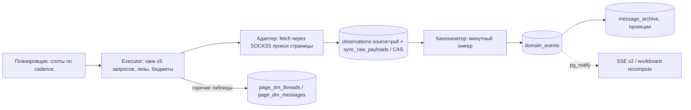

# Hub / Fansly: переход с постоянного polling на события

**Статус:** архитектурное предложение, 7 сентября 2026, вторая редакция после двух независимых критических ревью (`review-1-failure-modes.md`, `review-2-simplicity-rollout.md`) и кросс‑сверки с параллельным документом (`../fansly-events-cross-review-2026-09-07.md`). Реализация не начиналась, production не менялся. Основания: код Hub (локальный чекаут `582ef1cf`; **на момент кросс‑сверки он отстаёт от `origin/main` на 125 коммитов** — перед реализацией все file:line перепроверить на актуальном main) и расширения (`1a74b811`), статический реверс бандла Fansly (снимок 2026‑08‑20), HAR‑файлы в `artifacts/`, документация OFAPI, замер production под ролью `read_only` за 14 суток до 2026‑09‑06. Доказательная база — четыре отчёта в `evidence/` (A — протокол сокета, B — карта Hub, C — замер прода, D — расширение); ссылки вида `A §6.3`.

---

## 0. Итог для владельца

**Что выяснилось.** У Fansly есть ровно один событийный канал — WebSocket `wss://wsv3.fansly.com?v=3`, который держит веб‑клиент. Один кадр с токеном сессии — и сервер шлёт весь поток аккаунта: новые сообщения целиком, удаления, чеки прочтения, уведомления о деньгах и подписках (ссылками на id), кошелёк, фолловы. Фильтров нет, sequence‑номеров нет, докачки пропущенного нет, а «онлайн» модели — отдельный REST‑хартбит, к сокету не привязанный (по бандлу; живой проверкой не подтверждено). (A §1–§6)

**Куда уходят запросы.** 29 400 в сутки на 6 страниц. 53 % — полный обход списка диалогов каждые 30 минут круглые сутки, из которых 87 % страниц ответа байт‑в‑байт повторяют предыдущий обход. Ещё 19 % — ежедневное перечитывание статистики каждого спендера, 12 % — полный обход фолловеров каждые ~4 часа (в коде это поток на 48 часов; его гонит условие «восстановления», которое, похоже, всегда истинно). Fansly нас не ограничивает: 0×429 и 0×403 за 14 суток. (C §2–§7)

**Что предлагается — три независимых рычага, в этом порядке.**

| Рычаг | Что даёт | Цена и риск | Запросов/сутки на флот |
|---|---|---|---|
| **A. Ограниченный обход** — читать список диалогов «новые сверху» и останавливаться, как только страница целиком старше прошлого обхода; полный обход оставить раз в 6 часов как сверку | −86 % на самом тяжёлом потоке, свежесть прежняя (30 мин) | ~300–500 строк, никаких новых соединений с Fansly, ничего нового про сессию. Риск — сама логика обхода (ошибка = скрытые треды), закрывается shadow‑режимом | 29 400 → **≈15 900 (−46 %)** |
| **B. Сокет** — Hub сам держит соединение на страницу (в роли worker, через прокси страницы, тем же токеном, что и REST), журналирует кадры до разбора и применяет сообщения к горячим таблицам | **Свежесть: с «до 30 минут» до секунд**, работает при закрытом браузере; снимает потолок lilly‑2 (12,5 минут из каждых 30 уходит на обход). Запросов почти не экономит сверх A | ~3 800–4 300 строк с тестами; три неизвестных, решаемых только живым тестом: не мешает ли второй сокет браузеру модели, сколько живёт соединение, есть ли повторная доставка | ≈15 900 → ≈15 000 (полная сверка реже) |
| **C. Деньги и фолловеры по сигналу** — статистику спендера перечитывать только после новой транзакции (сигнал уже есть в часовом потоке `transactions`, сокет не нужен); починить условие, гоняющее обход фолловеров каждые 4 часа вместо 48 | −5 400 и −3 100 в сутки | Малые изменения; для фолловеров сначала выяснить, почему условие не сходится | ≈15 000 → **≈7 000–8 000 (−73…‑76 %)** |

**Почему в таком порядке.** A — самый дешёвый и большой выигрыш, и он же строит самую рискованную часть B (ограниченный обход нужен сокету как «догон» после обрыва) без сокета и без новых неизвестных. B оправдан свежестью, а не экономией — это надо решать осознанно, глядя на риски. C не зависит от сокета вовсе.

**Что не изменится.** История тредов, статистика, вольт, выплаты, посты, уведомления — как сейчас, по REST. Полный обход остаётся единственным доказательством «ничего не пропущено».

**Откат.** Каждый рычаг — свой живой ключ в `config_settings`, откат мгновенный без рестарта: A → снова полные обходы каждые 30 минут; B → сокеты закрываются, обходы продолжаются. Журнал кадров остаётся (закон DP 7); строки, записанные сокетом, сверка исправит за один полный обход.

**Что требует твоего решения** (§10): согласие на живой тест сокета (сначала на выброшенном аккаунте, потом одно тихое подключение на канареечной странице), выбор канарейки, приемлемое окно расхождения бейджей «непрочитано» (≤30 минут при любом рычаге), и хотим ли мы вообще держать полный токен модели в постоянном соединении (есть дешёвая проверка более узкой management‑сессии).

---

## 1. Что доказано, что нет

| Источник | Что даёт | Границы |
|---|---|---|
| Бандл Fansly (`artifacts/fansly-app-bundle-2026-08-20/analysis/main.pretty.js`) | Полный протокол сокета, таблица событий, что клиент дофетчивает по REST, логика reconnect, presence | Статика: что клиент умеет принять, не что сервер реально шлёт |
| HAR Firefox (`artifacts/fansly-ui-walk-2026-08-21`, `…app-bundle-2026-08-20`, `…network-capture-2026-08-19`) | Заголовки рукопожатия WS, REST после загрузки и реконнектов, `POST /status`, форма `/messaging/groups` (в `aggregationData.groups[]` есть `lastMessage` с `createdAt`) | Кадров WS в HAR нет |
| Документация OFAPI (Fansly events) | Их «вебхуки Fansly» — реле того же сокета; 38 событий; предупреждения о единицах, дублях, порядке | Их контракт слабее сырого сокета; о лимитах соединений молчат |
| Публичные репозитории | Ни одной реализации приёма событий с `wsv3`; Go‑клиент подключается без Origin/UA/cookies | Нет опыта по капам, idle‑таймаутам, банам для не‑браузерного клиента |
| Production (`observations`, `read_only`) | Объёмы по потокам/страницам (окно 1–6 сентября; геометрия обхода и байт‑идентичность — по 5–6 сентября), отказы, свежесть | Внутренние ретраи адаптера не видны: нижняя оценка |
| Код Hub и расширения, два ревью | Точки встраивания, инварианты, ловушки | — |

**Живого наблюдения кадров не было.** Firefox с сессией Lora работает без remote‑debugging; без GUI его кадры не прочитать, а поднимать вторую сессию из копии профиля автономно я не стал — это новое соединение на аккаунте модели. Сниппет для DevTools (перехват `WebSocket` в контексте страницы, токен маскируется) — `evidence/ws-tap-snippet.js`; это первый пункт этапа 0.

Параллельно другой агент (Codex) писал свой вариант в `investigations/fansly-events-architecture-2026-09-07/`; я его не читал, чтобы выводы были независимыми. Сверка двух документов — отдельный раунд.

---

## 2. Как устроено сейчас

### 2.1 Объёмы (production, устойчивое состояние 1–6 сентября; C §2–§7)

| Поток | Запросов/сутки (флот) | Доля | Что делает | Судьба |
|---|---:|---:|---|---|
| `dm_conversations` | 15 680 | 53 % | Полный offset‑обход `GET /messaging/groups?limit=100&sortOrder=1`, 48 раз в сутки; lilly‑2 — 142 страницы, 12,5 мин из каждых 30 | **Рычаг A**, затем B |
| `fan_earnings` | 5 724 | 19 % | 2 вызова на каждого спендера раз в сутки; тела совпадают день ко дню | **Рычаг C** |
| `followers_reconcile` | 3 469 | 12 % | Полный обход фолловеров каждые ~4,2 ч при cadence 48 ч — его перезапрашивает `triggerFollowersReconcileAnomaly` в конце каждого часового `followers`‑чанка, когда `activeFollowerCount !== sourceFollowerCount` (`executor-handlers.ts:2081-2087`; плюс seed‑условие `page-sync.ts:1061-1066`) | **Рычаг C** (сначала диагностика) |
| `dm_messages` | 797 | 2,7 % | `/message?groupId=&limit=25` по кандидатам из обхода (в окне 1–6 сентября; за 12 чистых суток из 14 — ≈1 380/сутки, C §2.4) | Остаётся; с сокетом до ~1 600 |
| `notifications` | 480 | 1,6 % | ~16 диспатчей в сутки на страницу по ~5 запросов (~1,5 ч) | Не трогать: единственный необратимо теряющий поток (B §6.2) |
| `transactions`, `light`, `followers`, `subscribers`, `top_spenders` | ≈1 855 | 6,3 % | Часовые head‑poll | Остаются |
| История/инвентарь (`media_stats`, `post_replies`, `catalog`, `posts`, `stats_snapshot`, `purchase_history`, `payouts`) | 1 417 | 4,8 % | Обходы под суточными кэпами | Не трогаются |
| **Итого** | **29 422** | | | |

Отказы за 14 суток: 289 из 379 237 (0,076 %): 2×401, 9×500, 1×422, 0×403, 0×429; 149 из 289 — наш guard «дубли group id», перезапускающий обход с нуля (следствие offset‑пагинации по списку, который переупорядочивается под нами).

### 2.2 Конвейер (B §1.3, §2)



Факты, на которых стоит дизайн:

- **Каждый ответ журналируется до разбора** (`sync/shared.ts:83-228`): `observations` с `source='pull'`, `account_id = page.id`, `kind = endpoint`. `source` — CHECK на 7 значений (`schema.ts:3391-3393`).
- **Горячие таблицы DM пишет обход**; `message_archive`, транскрипт AI и Agent Read Plane читают только то, что прошло через `domain_events`. У Fansly «heads only ever advance» (#50) **выключен намеренно**: обход — единственный писатель голов и должен уметь откатить голову при удалённом сообщении (`page-dm.ts:136-141`). Любой второй писатель обязан это учесть.
- **Дедуп в ядре — не по хэшу, а «первый писатель побеждает» по явному ключу** (`domain_event_keys`, `msg:<direction>:<messageId>`; `message_archive` обновляет только заглушки). Что первым попало в архив, там и останется 100 лет (review‑1 P1‑4).
- **OnlyFans уже работает по схеме «push + сверка раз в 6 часов»**: вебхуки журналируются, проекция применяется отдельной транзакцией со статусом, обход `dm_conversations` сохраняет cadence 1 800 с, но работу выполняет раз в `ofapiDmReconcileIntervalMinutes` (живой ключ), иначе `skipped: reconcile_not_due` со штампом `succeeded_at` — так блок‑здоровье остаётся зелёным (`ofapi-dm-sync.ts:552-573`, `ofapi-dm-projection.ts`, `ofapi-webhook-capture.ts:149-170`).
- **Cadence потока — константа в коде** и **её нельзя увеличивать без миграции**: `last_scheduled_slot` — абсолютный индекс, при росте cadence поток не планируется больше никогда (`page-sync.ts:1012-1019, 1590-1611, 1930-1933`; B §6.0 L1). Частоту работы меняем только внутри обработчика.
- **Свежесть в `/health/sync` — только по `succeeded_at`**; для OF блок `messages_live` подменяется давностью push‑ингеста через набор page‑id (`sync-status.ts:1394`, `:1579-1585`) — без ветки по платформе.
- **Сессия** — вставленный владельцем bundle в `page_credentials`; 401/403 паркует все 17 потоков страницы (`executor.ts:805`). Расширение bundle в Hub не шлёт (D §1).
- **Egress:** page‑scope `resolveEgress` строит свежий SOCKS5‑`Agent` и бросает `ProxyMissingError` без прокси (`egress/resolver.ts:100-119`); опции диспетчера настроены под REST раз в 5 с (`http-client.ts:33-43`). WebSocket в `apps/` и `packages/` сегодня нет вообще.

---

## 3. Механизм событий Fansly (A)

### 3.1 Транспорт

| Свойство | Значение | Уверенность |
|---|---|---|
| URL | `wss://wsv3.fansly.com?v=3`; только текстовые JSON‑кадры; второй сокет `chatws.fansly.com` — чат live‑стримов, не про DM | бандл |
| Рукопожатие | Браузер: `Origin: https://fansly.com`, cookies без токена; `fansly-client-*` в WS нет; публичный Go‑клиент подключается без Origin/UA | HAR + публичный код |
| Auth | `{"t":1,"d":"{\"token\":\"…\",\"v\":3}"}` (`d` — строка JSON внутри JSON); токен тот же, что заголовок `authorization` REST | бандл |
| Ping | Клиент шлёт `p` каждые 20–25 с; ответ `t=2`; при молчании >1,2× интервала рвёт и переподключается | бандл |
| Reconnect | 1,5 с, удвоение до потолка 15 с (`main.pretty.js:19944-19946`; в первой редакции ошибочно «без экспоненты») | бандл |
| Envelope | `t=0` ошибка (клиент знает только `code:401` → logout), `1` подтверждено, `2` pong, `10000` ServiceEvent `{serviceId, event:"<JSON>"}`, `10001` пачка | бандл |
| Подписки/фильтры | **Нет** — клиент больше ничего не шлёт | бандл |

### 3.2 Что приходит (полная таблица — A §4.2)

| Сервис/тип | Событие | Полнота |
|---|---|---|
| Message 5/1 | новое сообщение | **полный объект**: `id, groupId, senderId, content, createdAt (секунды), attachments[]={contentType, contentId}`, `totalTipAmount`; без `aggregationData` (аккаунты, медиа) |
| 5/2, 5/10, 5/22 | чеки delivered/read/mark‑unread, удаление, тайпинг | ids |
| Group 4/8 | новый диалог | **только id** → клиент делает `GET /group/{id}` |
| Notification 9/1 | 7001 тип, 2007/2008 покупка медиа, 15006/15007 подписка, 3002/3003 фолловер, лайки/комменты | id‑ссылки + `metadata` |
| Wallet 6/2, 6/3; Tipping 7/1; Subscription 15/5; Follower 3/2, 3/3; Media 2/7, 2/8 | баланс, транзакция, тип, подписка (с `version`), follow/unfollow, заказ PPV | полные/ids |
| OnlineStatus 8/1 | статус `{accountId, statusId}` — только для аккаунтов, уже закэшированных клиентом; безголовый потребитель может не получить ничего | ids |

**Нет событиями:** правки сообщений, счётчики непрочитанного, список диалогов и порядок, тела/цены медиа, профили фанов, тексты комментариев, агрегаты доходов, выплаты, вольт, тиры. Деньги в mills; время — секунды или миллисекунды в зависимости от поля. (A §4.4, §7.2)

### 3.3 Присутствие, пропуски, стабильность

- Онлайн — `POST /api/v1/status {statusId:1}` каждые 90–120 с при активности пользователя за последние 5 минут; сокет его не трогает. По бандлу; **подтвердить живым тестом (P1–P2), иначе рычаг B недопустим.** (A §5)
- Ни seq, ни replay‑API. Клиент после реконнекта перечитывает только открытый диалог; отбрасывает DM старше 180 с как «possibly duplicate» — косвенный признак повторной доставки недавних сообщений, окно неизвестно (G1). (A §6)
- OFAPI о своём реле: at‑least‑once, без порядка, «post» по разу на стену. Дедуп только по id объектов.
- В HAR 17 рукопожатий за 84 минуты (одно на ~5 мин), причина неизвестна (T1).

### 3.4 Неизвестное, решаемое только живым тестом (A §11, 31 пункт)

Критические: **M3** — fan‑out или балансировка событий между сокетами одного токена (если сервер отдаёт событие *одному* сокету, потребитель Hub молча ломает браузер модели); **M1** — кап соединений; **T1** — время жизни; **G1** — окно повторной доставки; **P1** — присутствие; **S1/S2** — реакция на не‑браузерный клиент и серию реконнектов; **C1–C6** — формы кадров и объём в сутки; **A6** — верифицируется ли токен management‑сессии (если да, Hub не обязан держать полный токен модели).

---

## 4. Варианты

| Вариант | Без браузера | Нагрузка на Fansly | Кастодия | Неизвестное | Вердикт |
|---|---|---|---|---|---|
| **A. Ограниченный обход** (тот же поток, «новые сверху», стоп по водяному знаку; полный обход раз в 6 ч) | Да | −86 % на потоке, ≈−46 % на флоте; ни одного нового соединения | Без изменений | Порядок `sortOrder=1` = NEWEST (в бандле `SORT_MODES.NEWEST → 1`, `main.pretty.js:~160370`; сервер подтвердить) | **Первый шаг** |
| **B. Hub‑side WS consumer** | **Да** | +1 постоянное соединение с IP прокси; экономии сверх A почти нет | Полный токен в постоянном соединении с VPS — иная поза, чем 200 мс REST‑вызова; проверить A6 | M1/M3, T1, G1, P1, S1 | **Второй шаг, ради свежести** |
| Перехват сокета расширением (`world:"MAIN"`, `document_start`) | **Нет** | 0 | Кадры без токена | CSP fansly.com | Инструмент этапа 0 (две вкладки = бесплатный ответ на M3), не основной источник |
| Page browser (FANSLY‑004) | Да | Как B + UI | Профиль в Hub | Ресурсы (оценка бэклога, не измерено) | Совместимое продолжение: потребитель кадров B проектируется так, чтобы источником мог стать браузер |
| Реле вендора (OFAPI Fansly events) | Да | Их сокет | **Пароль модели у третьей стороны** | Их реконнект/пропуски не документированы | План Б (FANSLY‑008) |

---

## 5. Целевая архитектура

### 5.1 Рычаг A — ограниченный обход списка диалогов

Тот же обработчик `fanslyDmConversationsChunk`, тот же endpoint, та же политика cadence 1 800 с. Меняется только, что делает 30‑минутный слот:

- **Bounded walk.** Страницы `sortOrder=1` (новые сверху) читаются, пока на странице есть хоть один диалог с временем последнего сообщения ≥ водяного знака; водяной знак = время начала предыдущего bounded walk минус 5 минут запаса. Время берётся из `aggregationData.groups[].lastMessage.createdAt` (есть в ответе, HAR 2026‑08‑19), при отсутствии — из snowflake `lastMessageId` (эпоха `packages/shared/src/snowflake.ts` проверена на id постов и сообщений: `939669652286492672` → 2026‑07‑31, `810272281019305984` → 2025‑08‑08; экспорт обобщить с follow‑only имени). Сообщение, пришедшее во время обхода, новее следующего водяного знака и будет поймано следующим обходом.
- **Собственное состояние.** Режим `bounded` хранит свой чекпойнт (водяной знак, страниц прочитано, изменённых голов) отдельно от состояния полного обхода и **никогда не доходит до ветки финализации** (`membershipCertified` / `markPageDmConversationsInvisibleByGeneration`, `executor-handlers.ts:3446-3465`) — это утверждается тестом. Дубли group id внутри bounded walk — дедуп, не рестарт.
- **Полный обход** выполняется, когда с прошлого прошло ≥ `fanslyDmFullSweepIntervalMinutes` (живой ключ, default 30 = сегодняшнее поведение; лестница 60 → 180 → 360). Он остаётся единственным доказательством отсутствия и membership.
- **Что дрейфует между полными обходами:** `unread_count` и флаги диалогов ниже водяного знака (те, где не было новых сообщений) — обновляются раз в полный обход; head/needs‑reply — нет, любой новый ответ поднимает диалог наверх. Продуктово‑видимое окно ≤ интервала полного обхода; заявить владельцу (§10).
- **Shadow‑режим:** полный обход идёт как сегодня, но дополнительно считает, на какой странице bounded‑правило остановилось бы и сколько изменённых голов лежит ниже (`bounded_walk_would_miss`). Гейт на включение — 0 пропусков за 7 суток на странице.
- Стоимость: 48 × ~3 страницы + полный обход 4×/сутки ≈ 15 680 → ≈2 200/сутки на флот.

### 5.2 Рычаг B — Hub‑side consumer

```mermaid
flowchart TB
  subgraph worker
    SUP[Supervisor: одна задача на страницу\nсессионный advisory lock (pageId), строка fansly_ws_sessions]
    CONN[Транспорт: undici WebSocket через page-scope resolveEgress\nсвой dispatcher с WS-таймаутами; auth t=1; ping p; watchdog]
    J[Журнал: observations source=fansly_ws\naccount_id=page.id, canonical_json, RAW_ONLY]
    PROJ[Горячая проекция (отдельная транзакция):\nсообщение + head треда headForwardOnly + refresh окна]
    FU[subject_refresh_state plane=dm_ws_followup\n(персистентный dirty-set)]
    SUP --> CONN --> J --> PROJ --> FU
  end
  FU -->|дренаж внутри dm_messages| EX[Executor: /group/{id}, /message → observations pull → sync-pull → domain_events → archive]
  CONN --> H[fansly_ws_sessions → statusReason.code ws_live/ws_silent,\nинцидент fansly_ws_degraded]
  A5[Рычаг A: bounded walk каждые 30 мин = детектор пропусков сокета (coverage_miss)] --> H
```

**Supervisor и соединение.** Запуск из `startWorkerServices` (`worker-services.ts:179`, останов в `shutdown()`), по задаче на активную Fansly‑страницу с credentials и прокси, если `fanslyWsSourceMode ≠ off` и страница в `fanslyWsPageAllowlist`. Ровно одно соединение на страницу: сессионный `pg_try_advisory_lock(<константа рядом с 58211/58212 в `scheduler-leader.ts`>, pageId)` на **одном выделенном pg‑клиенте супервизора** (не по клиенту на страницу — пул по умолчанию 10). Лизы с TTL не нужны: replicas worker = 1 (как у `startOfapiEventWorker`), lock отпускается сам. `fansly_ws_sessions` — строка статуса: `page_id, connection_id (uuid), status, connected_at, verified_at, last_frame_at, last_business_frame_at, last_pong_at, disconnected_at, close_code, consecutive_failures, next_attempt_at, gap_started_at, frames_hour, token_fingerprint`.

Транспорт: `import { WebSocket } from "undici"` (не глобальный `WebSocket` Node — у него свой внутренний undici и свой глобальный dispatcher), dispatcher — page‑scope `resolveEgress` (даёт `ProxyMissingError` и #124 бесплатно) с **отдельным набором опций** для 24/7‑сокета (без keepAlive‑теардауна REST‑профиля). Тест, не grep: фабрика без прокси бросает; объект, переданный в `new WebSocket`, имеет собственное свойство `dispatcher ≠ undefined` (иначе undici молча уходит на `getGlobalDispatcher()` = прямой IP VPS, `websocket.js:716-719`). Заголовки: `Origin: https://fansly.com` + UA из `buildFanslyRequestHeaders`.

Протокол: auth‑кадр после `open`, `t=1` ждём ≤10 с; `p` каждые 20–25 с; pong‑watchdog 30 с. Reconnect: экспонента 1,5 с → 5 мин с джиттером, **кап 10 попыток за 10 минут**, дальше circuit open 30 мин + инцидент. `t=0 code 401` — **не** сразу парковка: WS‑отказ может быть отказом только сокета (например, токену management‑сессии) при живом REST. Сначала одна REST‑проба `/account/me` через обычный адаптер: REST 401/403 → та же парковка, что REST‑401 (`auth_blocked`), возобновление только с новым поколением bundle; REST 200 → circuit open для сокета + инцидент `fansly_ws_degraded/auth_rejected`, REST‑потоки продолжают работать (кросс‑сверка, разногласие I‑vs‑D). Другие `t=0` — журнал `ws_error` и транзиент до классификации по живым данным. Новое поколение bundle → переоткрыть новым токеном.

**Журнал.** Каждый кадр `t=10000` (элементы `t=10001` по отдельности) → `observations`: `source='fansly_ws'` (миграция 0150: `drop constraint` + `add … not valid`, форма пиннится `tests/migration-invariants.test.ts:158`), **`account_id = page.id`** (по нему ищет erasure, `erasure/index.ts:522-533`), `platform='fansly'`, `native_account_ref`, `producer='ws:fansly:<connection_id>'`, `kind='ws_<serviceId>_<type>'` механически (новая пара сервис/тип = новый kind = срабатывает ратчет `observation-kind-coverage`; `ws_unparsed` только для нечитаемого envelope), тело `canonical_json` (кадр — JSON, ничего не теряется; `exact_bytes` не производится ни одним писателем и блокирует планировщик erasure — review‑2 P1‑3), без CAS в v1. Идемпотентный ключ **`page:<connection_id>:<frameSeq>`** — иначе рестарт worker молча роняет кадры на коллизии ключа (`observations.ts:149-171`). **Все `ws_*` — `RAW_ONLY` в v1**: архив, транскрипт AI и Agent Read Plane питает REST‑дочитка через существующее семейство `sync-pull` (DP 7 выполнен журналом; семейство `fansly-ws` — этап 4, когда будет корпус и причина).

Именованное решение (войдёт в #250): pong (`t=2`) и тайпинг (5/22) не журналируются — не бизнес‑факты, объём подтверждается этапом 0(a). Чеки (5/2) журналируются. **Back‑pressure:** `fanslyWsFramesPerHourCap` на страницу — выше кап кадры считаются, но не пишутся; выше 3× — сокет закрывается с инцидентом (`observations` уже ~34k строк/сутки на диске, ради которого шёл G5).

**Горячая проекция** (`fanslyWsProjectionEnabled`, отдельный шаг). После коммита журнала — **отдельная транзакция**, как у OF (`ofapi-webhook-capture.ts:149-170` → `projectDmMessageEvent`): upsert `page_dm_messages` (по `message_id`, `material_source='ws'`, `synced_at` не обновляется на conflict), head треда через существующий upsert с **`headForwardOnly: true`**, затем полный `refreshPageDmConversationWindow` (`page-dm.ts:779-915`: `stored_message_count`, `last_fan_message_at`, `last_model_message_at`, `newest_stored_message_id`). Сбой проекции → `projection_debt` (#137), 5‑минутный sweep чинит. Read‑ack 5/2 от аккаунта модели сбрасывает `unread_count`; 5/10 → `deleted_at`.

**Дисциплина второго писателя** — обязательный пакет до `live`, потому что код прямо говорит «у Fansly нет второго писателя» (`page-dm.ts:136-141`), а обход lilly‑2 идёт 12,5 минут и коммитит страницы, прочитанные до кадра (review‑1 P1‑1):

1. Обход (и bounded, и полный) переходит на `headForwardOnly: true`. Откат головы назад — только явным путём head‑repair (`/message?limit=1`), когда провайдер показывает голову старше нашей **и** наша голова подтверждённо удалена; спецификация этого третьего состояния — часть этапа 1.
2. Сокет **не** пишет `last_seen_generation` (иначе ломается равенство `membershipCertified`, `executor-handlers.ts:3413-3454`). Финализация получает guard по времени: строки с `created_at ≥ fullSweepStartedAt` не скрываются, `NULL`‑поколение скрывается только при `created_at` старше начала *предыдущего* полного обхода (зеркало #237).
3. `deactivatePageSubscriptionsByGeneration` для Fansly получает `lastSeenBefore`, как у OF (`executor-handlers.ts:1753`, `ofapi-audience-sync.ts:524-538`) — до этапа 4.
4. Доказательство overlap (`fansly-dm-messages.ts:253-257`; читается ещё в `executor-handlers.ts:4077` и `targeted-thread-backfill.ts:599`) не засчитывает строки `material_source='ws'` с `synced_at > gap_started_at`; глубина post‑gap дочитки ≤4 страниц на тред, остаток — квоте deep backfill.

**Дочитки без лавины** (`fanslyWsFollowupEnabled`, отдельный шаг). Событие не вызывает REST. Оно пишет строку в **`subject_refresh_state`** (`plane='dm_ws_followup'`, `subject_ref='group:<id>'`, `refresh_class='dirty'`) — персистентно, одна строка на диалог, переживает рестарт. Обработчик `dm_messages` сначала дренирует эту плоскость (для заглушек с `fan_id IS NULL` — `GET /group/{id}`, затем `/message`), потом обычных кандидатов. Снятие грязного флага — **только compare‑and‑set** по `updated_at`/ревизии, зафиксированной в начале дренажа: событие, пришедшее во время дочитки, оставляет строку грязной (сегодняшнее снятие в `repositories/fansly-engagement.ts:549-569` без CAS — образец того, как терять событие; кросс‑сверка). Темп — темп потока `dm_messages` (чанк ≤5 запросов, пейсинг): **минуты, не секунды**; нет ретраев с событий, невыбранное подберёт полный обход. Стоимость: ~1 вызов на активный тред за всплеск, суммарно ≈800–1 600 `dm_messages` в сутки на флот (оценка от сегодняшних 797; `/group` не измерен).

**Здоровье.** `fansly_ws_sessions` — gauge соединения. Для блока `messages_live` — обобщение существующего override по набору page‑id (`sync-status.ts:1579-1585`, четыре правки в одном файле, без ветки по платформе) с кодами в открытом `statusReason.code` (`ws_live | ws_silent | ws_waiting`; новое поле не нужно, контракт не меняется). **`ws_live` — не «pong ходит», а «кадры доходят»:** bounded walk каждые 30 минут сравнивает каждую изменившуюся голову с журналом кадров; голова, изменившаяся при открытом сокете без предшествующего `ws_5_1`, = `coverage_miss` → инцидент `fansly_ws_degraded/coverage_miss` и `ws_silent`. Это и есть детектор худшего случая M3. Deadman: `2 × fanslyDmFullSweepIntervalMinutes` без бизнес‑кадров при REST‑активности. Инцидент — один новый вид `fansly_ws_degraded` с `subKey` (`silent | reconnect_storm | coverage_miss | frame_cap`): миграция enum по образцу `0078/0107/0112`, шесть кодовых зеркал (`schema.ts:256`, `repositories/notifications.ts:37`, `routes.ts:3031`, `notification-incidents.ts`, дашборд) + регенерация контрактов + строка в `docs/error-handling.md`.

**Что сверх этого не строится в v1:** семейство канонизаторов `fansly-ws` и его HealthFloor; журнал присутствия (8/1); лизы с TTL; новое поле в контракте; `grace`‑окно (до замера G1 `grace = 0`: catch‑up = bounded walk после каждого реконнекта, 1–3 страницы).

### 5.3 Рычаг C

- `fan_earnings`: перечитывать (2 вызова) только фанов, у которых часовой `transactions` нашёл новую транзакцию с прошлого чтения, плюс недельный полный проход. Сигнал сокета (6/3, 7/1) — позже, как ускоритель. 5 724 → несколько сотен.
- `followers_reconcile`: сначала выяснить на проде, почему `followerCount !== activeFollowerCount` не сходится (удалённые аккаунты? headline vs активные строки?); поправить предикат так, чтобы поток шёл раз в 48 ч, как задумано, с блаcт‑радиус‑капом #237. 3 469 → ≈300.

### 5.4 Данные, ключи, контракты

| Объект | Изменение |
|---|---|
| `observations_source_check` | + `fansly_ws` — миграция 0150; плюс `OBSERVATION_SOURCES` (`schema.ts:3333`), `agentObservationSourceEnum` (`routes-agent.ts:709`, клиентский zod‑enum → `pnpm contracts:generate`, ре‑вендор клиентам не нужен: новых операций нет), `hub-agent-cli/commands.ts:603`, `observation-kinds.ts` |
| `fansly_ws_sessions` | Новая таблица (0150) |
| `page_dm_messages.material_source` | + nullable, default `pull` |
| `notification_incident_kind` | + `fansly_ws_degraded` |
| `platform-core.capabilities` | + поле `events` (сейчас только `webhooks`, `presenceSource`) |
| `scripts/check-raw-fetch.mjs` | Не подходит (grep по `fetch(` с whitelist всего `services/egress/`); замена — unit‑тест фабрики транспорта |
| `config_settings` — **все `EDITABLE` + `runtimeApply: "live"`** (staged‑ключи в этом репо — только boolean с применением при boot, `config-settings.ts:225-237`; образец enum‑лестницы — `captureCasReadMode`, `fanslyReplayMode`) | `fanslyDmBoundedWalkMode` (`off/shadow/on`), `fanslyDmFullSweepIntervalMinutes` (30, min 30), `fanslyWsSourceMode` (`off/shadow/live`), `fanslyWsPageAllowlist` (CSV **меток** страниц, fail‑closed: пусто = никто; копировать примечание из `config-registry.ts:177-184`), `fanslyWsProjectionEnabled`, `fanslyWsFollowupEnabled`, `fanslyWsFramesPerHourCap` |
| Документы | `docs/decisions.md` **#250** (следующий после 249) в том же изменении; runbook `docs/runbooks/fansly-ws-source.md` («жив ли сокет / как выключить / как починить строки»); `docs/error-handling.md` — строка для нового инцидента |
| Тесты | Пины, которые тронет работа: `observation-kind-coverage`, `notification-incident-messages`, `config-registry`, `migration-invariants`, `platform-registry`; новые интеграционные в корневом `tests/` (Testcontainers): bounded walk vs полный обход, второй писатель голов, erasure‑reachability для `fansly_ws` по образцу `erasure-endpoint-scour-convergence`, транспорт fail‑closed |

Не меняется: адаптер REST, cadence всех потоков, чекпойнты полного обхода, семейства канонизаторов, `message_archive`, SSE v2, расширение, auth‑декларации (mutation‑маршрутов нет), контракт `clientContext` (E5 пересматривать после стабильного `live`).

---

## 6. Как пополняется база

| Сценарий | Рычаг A | Рычаг B (`live`) |
|---|---|---|
| Фан пишет | Bounded walk в ближайший слот (≤30 мин) видит диалог наверху → head → кандидат `dm_messages` → REST → журнал → `domain_events` → архив | Кадр 5/1 → журнал → горячая проекция за секунды (список чаттера, workboard через `pg_notify`), дочитка REST за минуты → архив/транскрипт AI/Agent Read Plane |
| Чаттер отвечает | То же | Кадр 5/1 от модели → head, `last_message_sender_role=page` |
| Новый фан | Диалог наверху списка, `partner` из `aggregationData` | 4/8 + 5/1 → заглушка + `dm_ws_followup` → `/group/{id}` в темпе `dm_messages` |
| Удаление | Голова откатится только через head‑repair | 5/10 → `deleted_at` |
| Деньги/подписки/фолловы | Как сейчас | Только журнал (`ws_9_1`, `ws_6_3`, …) |
| История треда | Как сейчас: deep backfill / hydration (#202) | То же |
| Полнота | Полный обход раз в `fanslyDmFullSweepIntervalMinutes` | То же + bounded walk каждые 30 мин как детектор пропусков сокета; после реконнекта — bounded walk немедленно |

Что остаётся REST после рычагов A+B+C (флот/сутки, оценка по C): bounded walks ≈900, полные обходы ≈1 300 (6 ч), `dm_messages` ≈1 000–1 600, `/group` — не измерено, head‑poll ≈2 300, инвентарь/история ≈1 400, `fan_earnings` ≈300, `followers_reconcile` ≈300 → **≈7 500–8 000 (−73…‑75 %)**; при полном обходе раз в 12 ч ≈7 000.

---

## 7. Отказы

| Ситуация | Поведение | Потеря? |
|---|---|---|
| Браузер закрыт | Не влияет на A и B | Нет |
| Обрыв сети/прокси | Backoff; `gap_started_at`; после реконнекта bounded walk; bounded walk по расписанию продолжает ходить в любом случае | Нет: окно дрейфа ≤30 мин |
| Соединение живёт минуты (T1) | Реконнекты; при >10 за 10 мин — circuit open, инцидент; данные идут через A | Нет |
| Сервер балансирует события (M3) | `coverage_miss` в первый же bounded walk → инцидент, `ws_silent`; на этапе 0(a) ловится двумя вкладками до любого кода | Нет |
| Сессия умерла | Одна парковка страницы (`auth_blocked`) для REST и сокета | Нет |
| Worker упал | Lock отпускается с сессией; новый worker переоткрывает; кратковременно два сокета безвредны: ключ журнала по `connection_id`, проекция идемпотентна и head‑forward | Нет |
| Postgres недоступен | Сокет закрывается: кадр, который нельзя сохранить, не читаем (capture‑first) | Нет |
| Неизвестный формат кадра | `ws_<svc>_<type>` новой пары → ратчет на PR; `ws_unparsed` → gauge | Нет |
| Дубли/порядок от сервера | Upsert по `message_id`; ack для неизвестного сообщения — журнал, применение при дочитке | Нет |
| Лавина (broadcast на 14k фанов, C5) | Кап кадров/час → счётчики → закрытие с инцидентом; дочитки коалесцированы в `subject_refresh_state` | Нет |
| Presence side‑effect (P1 = да) | Рычаг B останавливается до решения владельца | — |
| Откат B | `off` закрывает сокеты в течение цикла; **строки, уже записанные сокетом, чинит один принудительный полный обход** (`POST /admin/sync/trigger {scope: messages}` или CLI из runbook) | Нет |
| Откат A | `fanslyDmBoundedWalkMode=off` → полные обходы каждые 30 мин | Нет |

Инвариант против лавины: события не порождают REST напрямую и не порождают повторов; все дочитки — через executor с его пейсингом и бюджетами; верхняя граница = темп потока `dm_messages` + кап кадров.

---

## 8. Верификация

| Переход | Гейт |
|---|---|
| A: shadow → on (страница) | 7 суток: `bounded_walk_would_miss = 0`; расхождений head между bounded и полным обходом нет |
| A: полный обход 30 → 60 → 180 → 360 | На каждом шаге ≥3 суток: полный обход не находит голов, неизвестных bounded walks (кроме откатов через удаление); `/health/sync` зелёный |
| 0 → 1 (сокет) | Закрыты M3/M4 (две вкладки), T1, M1, S1/S2, P1/P2, G1, A1 (выброшенный аккаунт), C1–C6 и **кадров/сутки** (это число нужно до shadow) |
| B: shadow → live‑проекция | ≥7 суток shadow: покрытие по свежести ≥99,5 % (доля голов, изменившихся при открытом сокете, которым предшествовал `ws_5_1`; знаменатель — только треды, дочитанные REST, смещён вверх; не считать при <2 000 сообщений в выборке); gap‑время <2 % суток; 0 auth‑отказов; реконнектов <100/сутки или объяснимо T1; `ws_unparsed` <1 %; строк/сутки в журнале — в бюджете |
| B: проекция → дочитки → интервал полного обхода | Каждый — свой ключ, своё окно ≥3 суток; метрика — `coverage_miss = 0` и число head‑repair за окно (не «ручная проверка workboard») |
| Флот | По странице за раз (ритуал #70 в живой форме: один ключ, одно значение, аудит); lilly‑2 последней |

Чтение тел журнала для отчёта покрытия — через seam чтения capture‑payload (inline‑тело может быть NULL с 0128), не `payload->>`.

---

## 9. План

| Этап | Содержание | Проверка | Откат |
|---|---|---|---|
| **A0. Bounded walk, shadow** | Режим `shadow` в обработчике: считает `bounded_walk_would_miss`; отдельный чекпойнт; тест «никогда не доходит до финализации» | 7 суток на всех страницах | ключ `off` |
| **A1. Bounded walk, on** | Включить; лестница `fanslyDmFullSweepIntervalMinutes` | §8 | ключ |
| **C1. `followers_reconcile`** | Диагностика предиката на проде (read‑only), фикс, cap #237 | Поток раз в 48 ч | Ревёрт |
| **C2. `fan_earnings` по транзакциям** | Кандидаты из дельты `transactions` + недельный проход | −5 000+/сутки | ключ |
| **0(a). Две вкладки** (владелец, час) | `evidence/ws-tap-snippet.js` в **двух** вкладках браузера модели; одно тестовое сообщение → видно ли в обеих (M3/M4); формы кадров C1–C5, G2–G4, P3, **кадров/сутки** | Чек‑лист A §11 | — |
| **0(b). Выброшенный аккаунт с VPS** через прокси | T1 (6 ч), T2–T5, S1/S2, M1, A1/A4/A8, P1/P2 (с второго аккаунта), G1 | Чек‑лист | — |
| **0(c). Одно тихое подключение на канарейке** (владелец‑гейт) | Через прокси страницы, вне пика, чаттер предупреждён, time‑box 6 ч; **правило стопа:** любой `t=0` кроме 401, любой close‑код 4xxx, любой 429/403 на REST страницы, любая жалоба на пропуски в браузере → отключить | Ничего в prod не меняется | — |
| **1. Субстрат** (инертный деплой) | 0150, kinds, `fansly_ws_sessions`, ключи (default off), инцидент, override здоровья, второй писатель (5.2 п.1–3), транспорт + fail‑closed тест, CLI покрытия, erasure‑тест, #250, runbook | `pnpm check`, интеграционные | Аддитивно; код спит |
| **2. Shadow на канарейке** | `fanslyWsSourceMode=shadow`, затем allowlist = одна страница (сначала режим, потом allowlist — иначе не инертно). Соединение, журнал, метрики, catch‑up; проекций нет | §8 | `off` |
| **3. Live, три шага** | `live` (проекция) → `fanslyWsFollowupEnabled` → лестница полного обхода (если ещё не пройдена в A1) | §8 | ключи; принудительный полный обход |
| **4. Флот и дальше** | Страницы по одной; семейство `fansly-ws` для денег/подписок как ускоритель C; presence после P4; ревизия E5 | Повтор замера C | — |

Канарейка: `lilly-1` (2 438/сутки, но 228 `dm_messages`/сутки — больше DM‑трафика, чем у lora‑2/3) или `lora-2` (средний инбокс); ночная активность по страницам не измерена — решает владелец.

Объём: A ≈300–500 строк с тестами; B (этапы 1–3, с вычетами v1) ≈3 800–4 300 строк с тестами, ~35–45 файлов, 1 миграция, плюс регенерированные контракты; C — малые изменения. Самое рискованное место реализации — второй режим обхода внутри 740‑строчного `fanslyDmConversationsChunk`, который уже владеет классом отказов «дубли group id» (149 из 289) — поэтому он строится первым и один.

---

## 10. Открытые вопросы

**Только живой тест:** M1–M4, T1–T5, G1, P1–P4, S1–S2, C1–C6, A6 (management‑сессия на сокете). Без M3 и P1 рычаг B не включается.

**Решения владельца:**
1. Согласие на 0(b) (аккаунт для проб) и 0(c) (одно тихое подключение на канарейке).
2. Канарейка.
3. Приемлемое окно дрейфа бейджей «непрочитано» для диалогов без новых сообщений: ≤ интервала полного обхода при A (до 6 ч), ≤30 мин для тредов с событиями при B.
4. Поза кастодии: держать ли полный токен модели в постоянном соединении с VPS; если A6 подтвердится — переход на management‑сессию.
5. Правило стопа для M3 в production: что измеряем в браузере модели, кто, какой результат убивает B.
6. Письменный запрос в Fansly о допустимости серверного приёма событий (из отчёта 2026‑09‑06, §9) — меньше запросов не делает метод согласованным.

**Не проверено здесь:** CSP fansly.com (нужно только для перехвата расширением); поведение при сессиях с разных IP (FANSLY‑003) — не ухудшается, сокет ходит через тот же прокси, что REST.

---

## Приложение A. Ссылки на код

| Что | Где |
|---|---|
| Политика потоков, ловушка слотов, предикат followers_reconcile | `packages/db/src/repositories/page-sync.ts:175-447`, `:1012-1019`, `:1061-1066`, `:1590-1611`, `:1930-1933` |
| Обход диалогов, финализация, membership | `apps/runtime/src/services/sync/executor-handlers.ts:2778-3520` (`:3413-3465`), `packages/db/src/repositories/page-dm.ts:136-162` (head guard), `:247-264`, `:779-915` (refresh окна), `:1054-1123` (кандидаты) |
| OF‑прецедент push + сверка | `sync/ofapi-dm-sync.ts:552-573`, `services/ofapi-dm-projection.ts:300-346`, `services/ofapi-webhook-capture.ts:149-170`, `config-registry.ts:251` |
| Журнал, source, kinds, дедуп | `sync/shared.ts:83-228`, `schema.ts:3333, 3391-3393`, `services/observation-kinds.ts`, `repositories/observations.ts:149-171`, `canonicalize/sync-pull.ts:206`, `repositories/message-archive.ts:336-374` |
| Overlap proof | `sync/fansly-dm-messages.ts:253-257`, `executor-handlers.ts:4077-4081`, `sync/targeted-thread-backfill.ts:599-602` |
| Здоровье | `services/sync-status.ts:1394, 1579-1585, 1709`, `services/health-floors.ts:75` |
| Egress, undici WebSocket | `services/egress/resolver.ts:100-119`, `packages/shared/src/http-client.ts:33-101`; `undici@7.27.2/lib/web/websocket/websocket.js:709-724`, `connection.js:31,95` |
| Конфиг | `packages/shared/src/config-settings.ts:225-237`, `config-registry.ts:177-184, 329, 332` |
| Роли, локи | `services/worker-services.ts:179, 607-635`, `services/scheduler-leader.ts`, `services/ofapi-events.ts:391-446`, `sync/locking.ts` |
| Erasure | `services/erasure/index.ts:522-533` |
| Snowflake, `subject_refresh_state` | `packages/shared/src/snowflake.ts`, `schema.ts:5662` |
| Протокол в бандле | `main.pretty.js:19960-20100` (клиент), `:20670-20920` (EventService, ServiceIds), `:34795-35012` (Message), `:35622-35632` (180‑с guard), `:38046-38105` (presence), `:~160370` (`SORT_MODES.NEWEST → 1`) |

## Приложение B. Что изменили ревью

Первая редакция обещала −75…‑80 % от сокета и опиралась на «дедуп по хэшу» и inline‑запись голов «в одной транзакции». Ревью показали: экономию даёт ограниченный обход без сокета (review‑2 P1‑1, review‑1 P1‑6); ядро дедупит «первым писателем» (review‑1 P1‑4) — поэтому в v1 сокет не выпускает domain events; сокет как второй писатель голов ломал бы инварианты обхода (review‑1 P1‑1/1‑2/1‑5) — отсюда пакет «дисциплина второго писателя»; ключ журнала терял бы кадры (P1‑3); `exact_bytes` блокировал бы erasure, а `account_id` не был назван (review‑2 P1‑3/1‑4); staged‑ключ не был бы живым (P1‑2); этап 0 был опасен для аккаунта модели (P1‑5); оценка объёма занижена ~2×. Полные тексты — в этой папке.

## Приложение C. Сниппет живого захвата

`evidence/ws-tap-snippet.js` — вставить в консоль DevTools вкладки fansly.com (контекст страницы); для 0(a) — в двух вкладках; File → Work Offline → on/off для принудительного реконнекта; `__wsDump()` копирует JSON кадров с замаскированным токеном. Результат — в `artifacts/fansly-ws-capture-<дата>/`.
