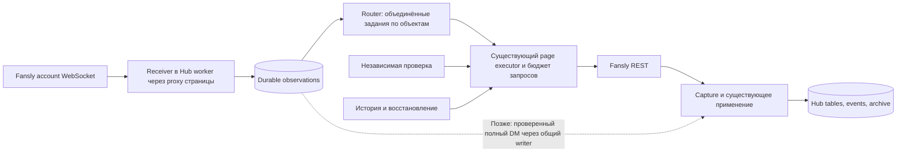

# Hub/Fansly: собственная кросс-сверка и предлагаемый порядок работ

**Дальнейшая работа:** по итогам обсуждения составлен [единый общий план перехода](../fansly-events-migration-plan-2026-09-07.md). Его этапы и gates являются рабочим планом; этот документ сохраняет доказательства и историю решений кросс-сверки.

**7 сентября 2026. Статус: итоговое архитектурное предложение; реализации и изменений production нет.** Этот документ уточняет спорные решения двух исследований. При расхождении с моим первым [ARCHITECTURE.md](../fansly-events-architecture-2026-09-07/ARCHITECTURE.md) использовать решения здесь. Исходные документы D и рецензию на них не редактировал.

## 1. Как предлагаю делать

**Выбираю гибрид: Hub принимает события постоянно, REST получает историю и независимо проверяет доступное состояние. Первой работой должен быть измерительный shadow ограниченного обхода, а не большой новый событийный конвейер. Проверку реального сокета можно вести параллельно.**

Согласен с главным полезным выводом D: значительную долю нагрузки создаёт повторный обход списка диалогов, и возможность его сократить нужно проверить отдельно от WebSocket. Но рекомендацию «взять D целиком, добавить три инварианта из I» не принимаю: в D остаются потеря кадров на лимите, недостаточный критерий остановки обхода, завышенные обещания восстановления и ошибки в модели fan earnings.

Предлагаю принять следующий порядок:

1. **A0 — shadow существующего обхода.** Никаких дополнительных запросов в Fansly, остановок действующего обхода или изменений бизнес-таблиц. Считаем, где новый алгоритм остановился бы и что осталось бы ниже. Это первый небольшой PR после завершения архитектурного обсуждения.
2. **Отдельно исправить доказанные причины лишних запросов.** Для followers сначала установить, какое условие вызывает повторную сверку и почему. Для fan earnings сначала обеспечить правильную обработку изменений и повторных снимков, затем выбирать адресных кандидатов по изменениям транзакций.
3. **B0/B1 — серверный WebSocket через прокси страницы, сначала журнал, затем адресные подсказки существующим обработчикам.** На этом этапе REST остаётся единственным писателем бизнес-данных; событие не запускает полный sync.
4. **Сокращать полные обходы и добавлять прямое применение полных DM отдельно.** У каждого изменения свой результат проверки и откат. Прямой WS-писатель появляется только если измерения показывают, что адресная REST-дочитка не даёт нужной свежести или стоимости.

Не требуется заранее строить Kafka, Redis, браузерную ферму, новый планировщик или универсальный materializer для всех 17 потоков. Нужные расширения добавляются к существующим worker, журналу, page executor и состоянию адресных заданий.

**Сохранение свежести — ограничение, а не строка в обещании.** По умолчанию не принимаем ухудшение тихих диалогов до 6 часов и fan earnings до недели. Если дешёвый детектор конкретного изменения не подтверждён, сохраняем прежнюю независимую проверку этого состояния. В таком режиме обещание −46% или −75% ещё не доказано; это честная граница выбранной архитектуры.

## 2. Что я перепроверил сам

Сравнивались [D](../fansly-events-architecture-2026-09-07/ARCHITECTURE.md), [I](../fansly-events-architecture-2026-09-07/ARCHITECTURE.md) и [кросс-рецензия](../fansly-events-cross-review-2026-09-07.md). Три независимых агента повторно проверили [обход и планировщик](scheduler-and-bounded-scan.md), [протокол и сессию](protocol-cross-check.md), [корректность и отказы](independent-challenge.md). Координатор повторил production SQL, пересчитал экономику и проверил решающие участки кода.

- **Код:** local HEAD `582ef1cf8a2de52eba6639ef775ddbe3e15ba74c`; проверенный `origin/main` **`dcbba081d3bfbbf19a5e3ccf0ea3d77646d5076d`**, отставание 125 коммитов. Production API label уже **`dcbba081d3bf`** — более новый, чем утренний `2475b304`. Проверки current-code сделаны через `git show`, checkout не переключался. [Манифест и хэши входов](evidence/manifest.json).
- **Production:** только `read_only`, `BEGIN READ ONLY`, timeout 20–25 секунд; SSH — чтение image label. Запросы, результаты и окна сохранены в `evidence/`. Роли, конфигурация, процессы и данные не изменялись.
- **Браузер:** новых живых проб в этом раунде нет. Утренние два HTTP 101 из Firefox подтверждают endpoint, но не auth, fan-out или доставку кадров. Сниппет D исследован офлайн на искусственных данных; не запускался на странице модели.

| Проверяемое утверждение | Мой вердикт и влияние на решение |
|---|---|
| I: `read_only` не читает `page_sync_states` | **Моя ошибка.** Table-level SELECT отсутствует, но разрешены 14 колонок. Прямой SELECT успешен. Права на `sync_http_attempts` и `config_settings` действительно отсутствуют. [Проверка](evidence/read-only-verification.txt) |
| I: строка «Message delete / edit» | **Неподтверждённая формулировка.** Delete есть в изученном клиенте; Message edit как событие не найдено. Исправил таблицу. Возможность старых мутаций остаётся отдельным неизвестным, а не придуманным wire-событием |
| D: ~29,4 тыс. ответов/сутки; DM ~53%, earnings ~19%, followers reconcile ~12% | **Воспроизведено** на одном окне 1–6 сентября. Это сохранённые ответы и локальные failure rows, не счётчик всех физических HTTP attempts. [Замер](evidence/volume-cross-check.txt) |
| D: 86,6% повторов между обходами | **SQL-результат воспроизведён:** 26 298 из 30 362 сравнимых captured bodies. Сравнивается порядковая позиция внутри dispatch, а не доказанный provider offset; рестарт может сдвигать смысл позиции. Это сильный признак повторного чтения, но не доказательство корректности early-stop. [Результат](evidence/dedup-and-failures.txt) |
| D: 289 failures из 379 237 | **Не воспроизвелось:** тем же окном и page scope получается **259** `*:failed` rows. Это ~0,0683% всех observations; процент не является вероятностью HTTP-ошибки. Основной приоритет нагрузки от этого не меняется |
| D: «0×429/403, Fansly нас не ограничивает» | **Слишком сильный вывод.** Нулевые terminal rows подтверждены; адаптерные ретраи и незафиксированные попытки этим запросом не видны. Отсутствие ограничений не установлено |
| D: ограниченный обход даст −46% при прежней свежести | **Экономическая гипотеза с неподтверждённым условием.** Арифметика сходится при ~3 страницах и полном обходе раз в 6 часов; прежняя свежесть всех полей при этом не доказана. См. §3–4 |
| D: слотная ловушка и SLA 503 | **Подтверждено на main.** Изменение cadence без rebasing старого slot опасно; у `dm_conversations` SLA 3600 секунд. На первом этапе оставляем слоты 1800 секунд и выбираем режим внутри handler |
| Арбитр: handler gate — единственный возможный вариант | **Нет.** Atomic rebase и согласованная effective policy тоже реализуемы; они просто сложнее и не нужны для A0. «Поток никогда больше не пойдёт» математически чрезмерно: индекс станет достижимым намного позже; практически это длительная остановка |
| D: реальная причина 4-часового followers reconcile — mismatch count | **Указан правильный участок, RCA не закончена.** В нём три OR-условия, а не одно. Убирать trigger до измерения его ветвей нельзя. [Current-code разбор](scheduler-and-bounded-scan.md) |
| D: fan earnings только по новым транзакциям + weekly sweep ≈300/сутки | **Неверно в двух частях:** same-ID corrections не являются новыми транзакциями, а weekly sweep сам стоит ≈818/сутки. Нужны semantic delta и независимый max-age, §5 |
| I: dirty CAS, WS401 отдельно от REST401, generation fence | **Подтверждаю.** Их нужно сохранить; R+1 нельзя очищать при завершении R, а ошибка старого токена не должна блокировать новый |
| D: при превышении frame cap считать, но не сохранять | **Отклонено.** Это сознательная потеря принимаемых бизнес-фактов. Нужны ограниченная очередь, остановка при невозможности durable capture и явный gap; не молчаливый discard |
| D: один полный обход исправляет записи сокета при rollback | **Отклонено.** Обход списка не чинит произвольный старый текст, ложный tombstone или poisoned canonical key. Отключение — containment; исправление — отдельный проверяемый repair |
| D: сниппет маскирует токен и безопасен для живого теста | **Опровергнуто офлайн.** Для `{t:1,d:JSON.stringify({token,v:3})}` токен остаётся в логе. Сниппет также перехватывает другие сокеты, а Work Offline влияет на весь Firefox. [Воспроизведение](evidence/ws-tap-synthetic-result.json) |
| D A: допустим auth ACK `t=1` или `t=2` | **Неверно для изученного wsv3:** `t=2` — pong. Нужен verified `t=1` и проверка привязки сессии к странице. Не переносить поведение другого chatws-клиента |
| Арбитр: у I нет числовых гейтов | **Неточно.** В I уже есть p95/p99, 72 часа/7 дней, HTTP targets и fault injection. Но порядок prerequisites перегружен и economic baseline слабее D. Первое исправляю разделением этапов, второе — повторным замером |
| Management Session уже решает серверный доступ | **Не доказано.** Fansly описывает управляемые права и отзыв, но не обещает wsv3 portability, полноту событий или доступ ко всем REST scopes. Проба полезна до B, не является условием A0 |

Скорборд «7 из 8» не использую для принятия архитектуры: полнота отчёта не компенсирует unsafe stop, пропуск бизнес-кадров или неверную модель исправления данных. Из D беру измерения, приоритет A0 и минимальный handler gate; из I — точные гарантии отказов, версий и восстановления.

## 3. Экономика без подмены измерений прогнозом

Повторный замер за шесть полных суток даёт **29 419,7 nonfailure observations/сутки**. Внутри `dm_conversations`: **15 510,5** ответов списка, **113,5** account lookup и **55,7** message reads. Эти вспомогательные вызовы в модели оставлены целиком. Реальная сеть дополнительно включает retry, браузеры/расширения, session/bootstrap, WS handshakes и будущие догрузки. [Разбивка](evidence/list-baseline.txt).

При 48 слотах в сутки, F полных обходах и K страницах bounded scan на каждой из пяти больших страниц плюс одной на ari:

`DM_list_new = 15 510,5 × F / 48 + (48 − F) × (5K + 1)`

Полный обход заменяет bounded scan в своём слоте, поэтому двойного учёта нет. Это модель одинаковой стоимости полных обходов; рост инбокса, retries и extra repair измеряются отдельно.

| Условия модели | Ответов списка/сутки | Всего/сутки до новых догрузок | Снижение |
|---|---:|---:|---:|
| Полный обход остаётся каждые 30 минут | 15 510 | 29 420 | 0% от A |
| Полный раз в час, K=3 | 8 139 | 22 048 | 25,1% |
| Полный раз в 6 часов, K=3 | 1 997 | 15 906 | 45,9% |
| Полный раз в 6 часов, K=5 | 2 437 | 16 346 | 44,4% |
| Полный раз в 6 часов, K=10 | 3 537 | 17 446 | 40,7% |

Следовательно, **−46% — разумный условный сценарий, а не установленная экономия при прежних гарантиях**. K=3 пока не измерен безопасным stop algorithm. Оценка «300–500 строк» также не проверена реализацией: state across chunks, shadow comparison, fairness и fault tests могут увеличить объём.

Для C2 недельная rotation: `5724 / 7 = 817,7` вызова/сутки **ещё до событийных кандидатов**. Правильная модель `817,7 + 2U`, где U — дополнительные объединённые refresh фанов вне rotation; повторное совпадение работ не считается дважды. Если независимо перепроверять всех по-прежнему ежедневно, эта составляющая остаётся 5724, пока не подтверждён иной способ обнаружения quiet corrections.

Пример A при K=3/full6h + weekly earnings + 100–300 дополнительных fan refresh/сутки + followers≈300 даёт **≈8,0–8,4 тыс./сутки, −71…−73%**, до дополнительных WS/hydration/retry расходов. Здесь weekly freshness и followers≈300 — **условия сценария, не принятые изменения**. [Воспроизводимые входы и sensitivity model](evidence/economics-model.json).

До canary критерий экономии — реально выполненные физические попытки на одинаковом scope/нагрузке, а не число положенных в журнал строк. Использовать существующую HTTP telemetry и завершённые history units; не уменьшать знаменатель остановкой истории. Недоступный `sync_http_attempts` не мешает архитектурному решению, но не позволяет сейчас сертифицировать физическую экономию.

## 4. Ограниченный обход: что строить и чего пока нельзя обещать

`sortOrder=1` назван NEWEST в клиенте; HAR подтверждает lastMessage/createdAt. Это свидетельство клиентского намерения, **не контракт стабильной сортировки, snapshot pagination или change feed**. `lastMessage.createdAt` не является временем любого изменения диалога: прочтение и удаление могут не создать новый timestamp.

Основные ограничения D:

- Движущийся offset может пропустить группу без дублей. Если затем продвинуть временной watermark, следующий bounded scan может остановиться выше пропущенной группы. При стабилизировавшемся списке прежний следующий полный слот нашёл бы её с учётом очереди и дочитки; новый полный через 6 часов — позже. Текущий 30-минутный слот не означает строгие 30 минут end-to-end. В [независимом разборе](scheduler-and-bounded-scan.md) есть конкретный пример и предел count guards. Сам текущий полный обход тоже не идеален; сравниваем регрессию относительно него.
- Watermark строится от **последнего завершённого проверенного обхода**, а не последней попытки. Ошибка, перезапуск, cap, timeout и невалидные маркеры границу не продвигают. Сравниваются оба маркера list и embedded message; отсутствие или противоречие означает continuation/repair, а не предположение по snowflake.
- «1–3 страницы после reconnect» — оценка короткого всплеска. Это не предел длины восстановления. Лимит одного dispatch сохраняет незавершённый cursor/debt; следующий dispatch продолжает до подтверждённой boundary. Нельзя считать completed historical cursor доказательством новой дырки.
- Bounded mode не получает права full membership finalization: не скрывает невстреченные треды, не ставит full-sweep receipt и не завершает историческую coverage.
- Непрочитано, флаги, откат головы после удаления и связанные состояния требуют собственной проверки. В D резюме обещает ≤30 минут, а тело допускает до 6 часов. Это реальное изменение поведения продукта.

**Контракт A0:** virtual stop считается по уже полученным полным ответам и переносится между chunks в отдельном диагностическом состоянии. После virtual stop действующий full scan продолжается. Метрики: число «сэкономленных» list pages; changed/new/deleted/mismatched heads ниже границы; unread/flags drift; invalid/missing marker; duplicates/restarts; время завершения и ожидающий history backlog. Разделять metadata diff и реально отсутствующий материал. Raw capture, actual progress/checkpoints и serving writes остаются по прежнему пути.

Гейт A0: минимум 7 полных суток, все шесть страниц, включая большой инбокс lilly-2; ноль **необъяснённых** пропусков выбранного scope; достаточная активность по типам, плюс детерминированные проверки offset churn, удаления головы, старого incoming/outgoing DM, timestamp ties, restart и outage >1 часа. Неделя тишины не является успешным тестом покрытия.

**A1 не включается автоматически после зелёного A0.** Нужен сформулированный stop contract, его ограничения и подтверждение нужного срока discovery→materialization. Если сохранить прежнюю свежесть отдельных полей удаётся только полным обходом, он остаётся; альтернативой является явное продуктовое решение о большем допустимом возрасте этих полей. По исходному запросу такое ухудшение не принято.

Слоты остаются 1800 секунд; внутри обработчика — bounded/full mode и независимый срок следующей полной проверки. **Default означает полный обход в каждом прежнем scheduled slot, а не через 30 минут после завершения предыдущего.** Иначе full 00:00→00:12:30 пропустит слот 00:30 и следующий full начнётся лишь в 01:00. Для большего интервала нужен явный due anchor от scheduled/start boundary; завершение подтверждает coverage, но не сдвигает расписание. Не менять `cadence_seconds` напрямую. Отдельно хранить last completed discovery, last full membership и materialization lag. `succeeded_at` на пропущенном/no-op слоте или живой pong не доказывают свежесть базы и не должны скрывать проблему ради зелёного `/health/sync`.

## 5. Followers и fan earnings: безопасные самостоятельные изменения

**Followers.** Current `executor-handlers.ts:2086–2092` запускает anomaly reconcile при любом из трёх условий: разные counts; исчерпание без найденного known checkpoint; неизменный newest checkpoint при обработанных строках. Нужно измерить ветви, отличие headline/active counts, результаты полного прохода и уже существующий cooldown. Лишь затем исправлять причину. «Должен ходить раз в 48 часов» не основание отключить рабочее обнаружение аномалии; blast-radius и snapshot-drift guards сохраняются.

**Fan earnings.** Транзакции определяют, **кого перечитать у Fansly**, а не заменяют provider stats нашей суммой. Сигнал — insert или семантическое изменение transaction: status/amount/type, attribution, suppression и другие реально влияющие поля. Старый `transaction.posted` с ключом `txn:<id>` не сообщает повторное изменение того же ID. При смене fan binding dirty получают обе стороны; нулевой после reversal фан не должен исчезнуть из очереди из-за `spendersOnly`.

Изменение транзакции и dirty intent сохраняются атомарно. Существующий executor объединяет запросы по fan/window, делает прежние lifetime/monthly REST reads и сохраняет их до разбора. Claim revision R завершает только R; R+1 остаётся pending. Частичный успех двух endpoints, задержка пересчёта provider stats и неизвестная attribution оставляют проверяемый долг. История и независимая rotation имеют гарантированную долю бюджета.

Обнаружен **существующий code-level дефект**, который надо исправить до доверия C2: `fan.earnings_observed` дедупится по содержимому. Для последовательности снимков **A→B→A** третий снимок может быть отброшен как уже известный A, и проекция останется B. Агент воспроизвёл реальные canonical keys; coordinator проверил producer и projector. Это не доказанный production-инцидент и не утверждение, что каждый refund имеет такой payload. Это конкретный контрпример корректности. [Доказательство и ограничения](independent-challenge.md), [исполняемый probe](evidence/fan-earnings-aba-probe.mjs), [результат](evidence/fan-earnings-aba-result.json). Probe использует реальный canonicalizer и явно симулирует ledger; БД и сеть не используются.

Исправление должно различать identity наблюдения/перехода и fingerprint содержимого, сохранять идемпотентный replay одного observation и ordered apply. Weekly re-read сам этот дефект не лечит. Нужны A→B→A, unchanged retry, pending→posted с прежним ID, refund/late correction, empty response и stale-after-fresh tests. `last_checked_at` отличается от `last_changed_at`; max timestamp одного свежего фана не выдаётся за свежесть всех.

Первый C2 shadow оставляет daily rotation и измеряет изменения без prior transaction signal. Переход на недельный max-age — только если покрытие и продуктовый срок подтверждены отдельно. Номера миграций/decision и совместимость strict SDK enum брать из актуального main при подготовке PR.

## 6. Целевая событийная часть

**Транспорт и владение.** Один logical receiver на страницу, page-scoped egress с проверкой fail-closed. Dedicated advisory-lock session при текущем одном worker достаточна как минимальный механизм, если потеря DB session закрывает все её sockets, поколение credentials/egress fenced и старый процесс не завершает работу нового. Она не гарантирует физическое отсутствие overlap; ни TTL lease, ни replicas=1 сами этого тоже не гарантируют. Отдельную распределённую lease FSM до первого shadow не строим.

**Session.** Auth verified `t=1`, привязка к нужной странице/actor и scopes проверяются отдельно от pong. Предпочтительна management-сессия с минимальными достаточными правами **если проверка подтвердит работоспособность**; её нельзя автоматически подставлять вместо REST-сессии для всех 17 потоков. Fansly подтверждает выбор прав, одноразовый вход и отзыв, но не серверный WS-контракт. [Официальный источник, проверен 7 сентября](https://help.fansly.com/en/articles/12328641-management-sessions).

WS401 останавливает попытки этого WS generation и даёт одну ограниченную REST-пробу через обычную authority. При живом REST — продолжает работать REST, WS показывает отказ capability. Подтверждённый auth-отказ REST блокирует соответствующий доступ. Transport/429/5xx не превращаются в «токен умер». Никогда не копировать `/logout` клиента и не отзывать сессию автоматически.

**Журнал.** Сначала сохраняется исходный business envelope/вложенный encoded payload, затем decode/route; неизвестный тип остаётся доступным для повторного разбора. Не превращать batch только в распарсенные известные children с потерей остальных. Формат совместим с действующим capture/erasure codec; source явно обозначает native Fansly events, ключ включает connection UUID и локальный frame ordinal. Локальный ordinal — не provider replay cursor. Не писать auth token в лог. Heartbeat и доказанные ephemeral typing frames можно исключать по явной policy; business overflow нельзя молча отбрасывать. Если durable capture невозможен, остановить приём, зафиксировать degraded/gap и восстановить доступное через REST; transient facts до commit могут оказаться невосстановимыми.

**Адресная работа без лавины.** Router только coalesces dirty `(page, plane, subject)`; не делает HTTP и не запускает весь sync. Обрабатывает единственная existing dispatch authority, под тем же per-page/egress admission и с корректным абсолютным `Retry-After`, ограничением повторов и fairness между live/recovery/history. Текущий clamp `Retry-After:600→60s` нельзя копировать в событийную ветку. Десятки сообщений одного треда дают один catch-up до boundary; 1000 разных тредов остаются 1000 долгов под бюджетом, а не 1000 параллельных запросов.

**Прямой DM apply — отдельный шаг.** Вначале WS не пишет горячие головы, tombstones или canonical message keys: так не появляется второй писатель посреди длинного full scan. Позже полный проверенный DM проходит общий с REST writer: одинаковые field-presence/version rules, head repair, membership/erasure fences, атомарные обязательные writes и receipt. Не создавать быстрый hot store, который обещает секунды, пока нужные архив/Read Plane/AI узнают факт только через следующий REST. Существующий `message.material_observed` расширять при необходимости; его наличие само по себе не решает старый дедуп.

**При закрытом браузере** Hub receiver и REST продолжают работать. При обрыве — reconnect с backoff, джиттером и circuit breaker; независимый discovery не отменяется heartbeat. При проблеме с сессией показывается last verified coverage; другой исправный канал продолжает работу. Новые credential/route generations не наследуют ошибку старой. Ручные паузы сохраняются.

**История и пропуски.** REST backfill идёт до прежней подтверждённой границы, новые catch-up имеют отдельный checkpoint. Повторная проверка head не сертифицирует старые удаления/мутации. `state_reconciled` называет scope и границу; неизвестное не отмечается «полным». Сообщение, созданное и удалённое во время отсутствия обоих каналов, может не восстановиться — upstream replay не доказан. Сокет уменьшает это окно, не устраняет предел.

## 7. Проверки, переход и откат

| Шаг | Конкретный результат | Условие следующего шага | Откат |
|---|---|---|---|
| **A0 — первый PR** | Диагностический virtual bounded stop внутри full scan; метрики по странице; no-extra-HTTP, прежние business writes и checkpoints | ≥7 суток плюс churn/outage fixtures, известные ограничения и сравнение всех затронутых состояний; физический baseline перед урежением | `off`; по конструкции данные и polling прежние |
| **C1 — отдельный PR** | RCA трёх ветвей followers trigger; минимальный доказанный фикс с прежними защитами | Уменьшились redundant generations, не потеряны legitimate anomaly repairs | Флаг/ревёрт; request reconcile через прежний budget |
| **C2 — отдельный PR** | Исправленная snapshot identity, semantic transaction dirty, CAS, receipts; сначала shadow + прежняя rotation | Нет пропущенных quiet corrections, same-ID/A→B→A проходят; принятый per-fan max-age | Выключить delta selection, вернуть rotation; pending revisions и raw не удалять; repair неправильных снимков отдельно |
| **B0 — исследовательский протокол** | Актуальные формы auth/envelope; fan-out, TTL/reconnect, presence, management scopes и account binding | Проверки ниже; реальное соединение модели только после отдельного разрешения на конкретную пробу | Остановить тестовый receiver; без `/logout`, отключения Firefox целиком или смены чужой сессии |
| **B shadow → hints** | Capture + decode debt, затем coalesced targets; без WS business writer | ≥7 суток и достаточное число событий по типам; для массовых DM ориентир ≥2000 событий; каждый unexplained miss расследован; проверка DB-down/restart/proxy/token смены | Capture/route отключаются независимо; REST и history остаются |
| **A1 — по странице** | Доказанный bounded scan и handler full deadline; честные health clocks | Ранее сохранённая freshness или явно согласованное изменение; deliberate dropped event при живом pong обнаруживается в срок | Вернуть полные 30-минутные обходы с jitter, не сбрасывать history |
| **Direct DM, если нужен** | Общий REST/WS writer; archive/readers parity; targeted old-ID repair | Целевой p95 receive→required readers≤30s, p99≤120s при проверенной capacity; нулевые потери, resurrection и poisoning на corpus/fault tests | Отключить direct apply, исправить конкретные данные по versioned repair receipt |
| **Расширение** | По одной странице/функции/настройке, отдельное окно ≥3 суток; тяжёлые scope ≥7 суток | Измерены HTTP savings, discovery/materialization lag и отсутствие starvation истории | Предыдущие policy values, сохранённые до flip |

Порядок строк не создаёт зависимости A1 от WS: A1 можно включить независимо после собственного гейта. C1/C2 также выпускаются отдельно. Количество суток/событий — инженерные стартовые гейты, не доказательство абсолютной полноты или гарантия антифрод-безопасности.

**Минимальная живая проверка B:** сначала пассивные Received frames в native Firefox Network Monitor текущей сессии; никакого неисправного `ws-tap-snippet.js`, clipboard с auth или глобального Work Offline. Для проверки fan-out нужны независимые receiver observations одного и того же тестового события; отсутствие событий не является успехом. Две вкладки действительно создают дополнительные connections, вопреки фразе арбитра «ноль новых соединений». Disconnect/revoke/auth/idle и 6-часовую continuity проверять на выделенном тестовом аккаунте и его прокси. Затем одна ограниченная проба model page через её egress с согласованным окном и stop rules. Любой auth conflict, признаки потери в браузере, неожиданный 4xxx/транспортный отказ или ограничения REST останавливают пробу для разбора; 401 не является исключением, которое можно игнорировать.

Проба management token нужна перед рабочим B, а не «до любого кода»: не блокирует A0, офлайн декодер и тесты. Использование полного owner token для WS не считаю автоматически согласованным лишь потому, что он уже хранится для REST. Если management scope недостаточен, это отдельный выбор перед B; не переводить все потоки на менее привилегированную сессию.

**Канарейка:** A0 считает все страницы, lilly-2 обязательна как большой инбокс. Для первого реального A1/B canary предварительно предлагаю lilly-1; lora-2 — следующий средний инбокс, lilly-2 — последняя при расширении. Это выбор по имеющемуся объёму и активности, не проверенное окно низкой нагрузки. Владелец/оператор назначает безопасное рабочее окно до конкретного включения. Пассивный доступный Firefox Lora 1.0 остаётся источником исследования протокола.

**Решение, которое уже можно принять:** готовить только A0 как первый implementation slice; параллельно планировать ограниченную проверку протокола и разбирать followers/earnings correctness. Разрешения на production flip, тестовые сообщения, создание/отзыв management session или запуск нового сокета модели эта архитектурная сверка не заменяет. Сейчас ничего из этого не выполнялось.

## Источники current-code и воспроизводимость

Ревизия всех ссылок ниже зафиксирована: `dcbba081d3bfbbf19a5e3ccf0ea3d77646d5076d`.

- [Planner slot computation](https://github.com/goslingmanagment/core/blob/dcbba081d3bfbbf19a5e3ccf0ea3d77646d5076d/packages/db/src/repositories/page-sync.ts#L1012), [slot comparison](https://github.com/goslingmanagment/core/blob/dcbba081d3bfbbf19a5e3ccf0ea3d77646d5076d/packages/db/src/repositories/page-sync.ts#L1938), [DM SLA](https://github.com/goslingmanagment/core/blob/dcbba081d3bfbbf19a5e3ccf0ea3d77646d5076d/packages/db/src/repositories/page-sync.ts#L253).
- [Три followers trigger](https://github.com/goslingmanagment/core/blob/dcbba081d3bfbbf19a5e3ccf0ea3d77646d5076d/apps/runtime/src/services/sync/executor-handlers.ts#L2086), [transaction changes](https://github.com/goslingmanagment/core/blob/dcbba081d3bfbbf19a5e3ccf0ea3d77646d5076d/apps/runtime/src/services/sync/transactions.ts#L368).
- [Earnings content dedup](https://github.com/goslingmanagment/core/blob/dcbba081d3bfbbf19a5e3ccf0ea3d77646d5076d/apps/runtime/src/services/canonicalize/sync-pull.ts#L358), [snapshot apply by observedAt](https://github.com/goslingmanagment/core/blob/dcbba081d3bfbbf19a5e3ccf0ea3d77646d5076d/packages/db/src/repositories/message-archive.ts#L1549).
- SQL и outputs: [grants](evidence/read-only-verification.sql), [volume](evidence/volume-cross-check.sql), [list baseline](evidence/list-baseline.sql), [повторяемость и failures](evidence/dedup-and-failures.sql). Нет сырых сообщений, fan identities или настоящих credentials.
- [Офлайн проверка сниппета](evidence/ws-tap-synthetic-check.mjs) использует FakeWS и искусственные marker strings; реальных подключений — 0. [Протокольный разбор](protocol-cross-check.md) указывает точные строки сохранённого официального bundle и ограничения исторического снимка.
- [Моя исходная карта Hub](../fansly-events-architecture-2026-09-07/ingestion-map.md), [D Hub map](../fansly-events-architecture-2026-09-07/evidence/B-hub-ingestion-map.md) остаются подробными указателями; при разработке line numbers проверяются на принятом main.
