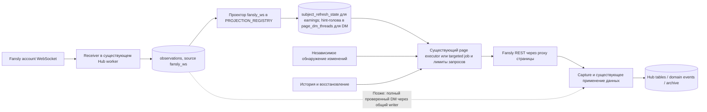
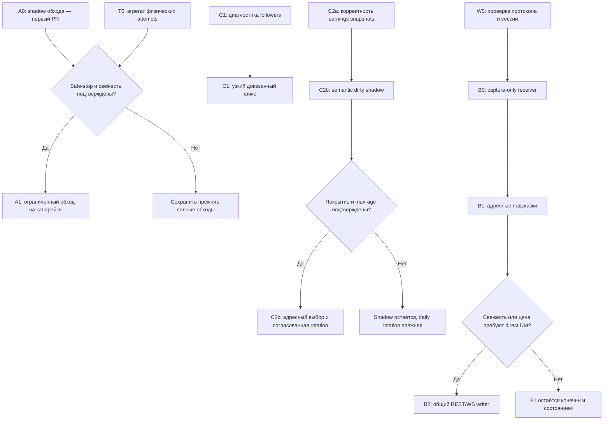

# Hub/Fansly: общий план перехода от polling к событиям

> Сохранена спецификация и обоснование архитектуры. Статусы, измерения и
> указания «следующий этап» ниже относятся к датам документа, а не к текущему
> состоянию. Текущую реализацию проверять по коду и профильному runbook; старые
> решения и отчёты доступны через Git по инструкции в `AGENTS.md`.

**Уточнение владельца от 16 сентября 2026 — Decision 364:** вместо обязательной
недели до первого B1 разрешён ограниченный запуск Lilly-1 / `message_created`
на 60 минут и не более 10 дополнительных HTTP attempts (также действует предел
5% измеренного baseline). Обычный polling сохраняется; срок и лимит проверяет
runtime. Условия входа и выхода — в
[актуальном B1 runbook](../docs/runbooks/fansly-ws-hints.md#bounded-early-canary-decision-364).
Недельное B0-наблюдение продолжается фоном для общего rollout. Закрытые presence
и paired-DM проверки повторяются только при релевантном изменении или сбое.
Тихий gap остаётся неизвестным, но не требует повторного шестичасового опыта
перед этим дополнительным запуском. Ошибки транспорта/сессии не принимаются.
Остальные требования A0/A1, свежести и сокращения polling ниже сохраняются.

**Статус: план работ, 7 сентября 2026; ревью 8 сентября внесено.** Сделано: предварительный рефакторинг до A0 (PR #153, `130150ac`, в production 08.09) — обработчик `dm_conversations` вынесен в `fansly-dm-conversations.ts`, типизированное состояние обхода `DmConversationSweepState`, один writer checkpoint, `diffConversationHead` с полным scope. Также в production 08.09 (`21e0ee33`): guard пустого обхода `dm_conversations` (PR #154, decision #274 — пустой ответ провайдера больше не скрывает инбокс) и сквозной Retry-After (PR #155, decision #275). Это основной документ дальнейшей работы. Предыдущие архитектуры и кросс-сверка остаются доказательной базой; их альтернативные порядки реализации заменены планом ниже.

**Первый этап — A0: измерительный shadow ограниченного обхода диалогов.** Он использует ответы уже работающего полного обхода и показывает, где можно было остановиться и что при этом было бы пропущено. Дополнительных запросов к Fansly и изменения бизнес-данных этот режим не делает. Параллельно исследуем серверный сокет и причины повторных запросов к followers/earnings.

**Целевая система:** Hub постоянно принимает события Fansly через прокси страницы, сохраняет бизнес-кадры в журнал, объединяет их в адресные задания и получает недостающие данные существующими REST-обработчиками. REST также загружает историю и независимо обнаруживает пропуски. Полные проверенные сообщения позднее могут применяться без дочитки, через общий с REST путь записи. Работа не зависит от открытого браузера чаттера.

## 1. Результат и ограничения

Переход должен одновременно уменьшить запросы, ускорить обновление и сохранить полноту доступных данных. Нельзя считать экономией остановленную историю, увеличенную без согласования давность данных или незаметно перенесённые в браузер запросы.

| Что проверяем | Требование |
|---|---|
| Принятые факты | После durable commit бизнес-кадр не теряется; разбор и применение повторяемы. Неизвестные типы сохраняются |
| История | Прежние cursors и факты сохраняются; новые пропуски имеют отдельную задачу восстановления. Полнота указывается для конкретного диапазона/типа данных |
| Свежесть | Для каждого затронутого состояния не хуже исходного измеренного режима. Потерянный сигнал проверяется независимо от живого сокета |
| Быстрые DM | Цель для включённого событийного пути: p95 получения→необходимые читатели ≤30 секунд, p99≤120 секунд при проверенной нагрузке. Через page executor эта планка не выводится (chunk = 5 запросов / 45 с, планировщик тикает раз в минуту, wakeup singleton по странице, FIFO по прокси без старения приоритета): либо B1-DM идёт через targeted job `sync.thread.backfill`, либо цель для B1 честно «минуты». Выбор фиксируется в B1. Список чатов, архив и Read Plane измеряются отдельно |
| Экономия | Общая целевая планка — ≥50% физических Fansly HTTP attempts в сопоставимых условиях. Это критерий завершения цели, не обещание первого этапа |
| Управляемость | Каждый режим включается отдельно, имеет диагностический отчёт, предыдущую конфигурацию и проверенный откат |

Сейчас не доказаны серверный replay, полный охват событий, стабильная pagination и работоспособность выбранной сессии на WebSocket. Факт, созданный и удалённый во время отсутствия получателя, может оказаться недоступным по REST. Такие интервалы обозначаются неизвестными; восстановление текущего состояния не объявляется полной историей изменений.

**По умолчанию не принимаем ухудшение тихих диалогов до 6 часов или earnings до недели.** Если дешёвая независимая проверка нужного состояния не найдена, прежний обход остаётся. Это не блокирует остальные ветки плана, но экономический результат тогда пересчитывается.

**Следствие для цели ≥50 %.** При этом дефолте ветка A даёт 0 % (полный обход в каждом 30-минутном слоте); даже конец лестницы §5 (6 часов) даёт 46 %, а строка −71…−73 % опирается на weekly earnings и followers≈300, которые план не принимает. Ни один сценарий, совместимый с этим абзацем, не достигает ≥50 %. Путь к цели один из двух: (а) дешёвый независимый детектор unread/flags/удалённой головы (§5 п. 5), который позволит редкий полный обход без потери свежести; (б) явное решение владельца об окне дрейфа для тихих диалогов и о max-age earnings. До этого «≥50 %» — условная цель, а не обязательство.

**Исходные решения владельца (8 сентября, implementation chat):** свежесть по умолчанию не ухудшается; WebSocket только через Management Session, owner token не используется; план и reviews сохраняются в `investigations/`; голову после provider-side deletion A0 не исправляет, а считает отдельным типом расхождения; B2 требует отдельного решения. Deploy, flip, живые socket probes, запуск lilly-2 recovery и переход A1 — только после явного «yes» в этом чате. До A0 закрыть три дефекта [DM-диагностики](https://github.com/goslingmanagment/core/blob/ecc864dadebfe200107d07319054df5b4c4385f3/investigations/fansly-dm-diagnostic-2026-09-08/REPORT.md). Состояние выполнения — [execution](https://github.com/goslingmanagment/core/blob/ecc864dadebfe200107d07319054df5b4c4385f3/investigations/fansly-events-execution-2026-09-08.md).

**Изменение выбора сессии, 13 сентября:** на предложение использовать для
сокета ту же Fansly-сессию, которую Hub уже использует для REST API, владелец
ответил «да давай использовать его же». Это заменяет исходное требование
Management-only и запрет reuse существующего owner token, если текущая сессия
имеет такой тип. Новый credential не создаётся: выбран существующий токен
страницы, хранящийся в Hub в зашифрованном виде. Его значение не передаётся
через CLI, логи, чат или диагностический экспорт. Первой готовится ограниченная
проба `lilly-1`; binding, fan-out, presence и continuity ещё требуют доказательств.
Отзыв рабочего токена, изменение REST/polling и переходы следующих этапов этим
выбором не разрешаются. [Контекст согласия](https://github.com/goslingmanagment/core/blob/ecc864dadebfe200107d07319054df5b4c4385f3/investigations/fansly-w0-protocol-2026-09-10/OWNER-CHOICE-20260913.md),
[Decision 325](https://github.com/goslingmanagment/core/blob/ecc864dadebfe200107d07319054df5b4c4385f3/docs/decisions.md#decision-325-reuse-the-existing-fansly-rest-session-for-w0-2026-09-13).

## 2. Основания и исходный объём

Код плана проверен на **`933d22f70242ee02804954361de04ab27823c1aa`**: local HEAD и `origin/main` совпадают. Относительно исследованного `dcbba081…` Fansly runtime, planner, schema и canonicalization не изменились. [Проверка актуальности](https://github.com/goslingmanagment/core/blob/ecc864dadebfe200107d07319054df5b4c4385f3/investigations/fansly-events-migration-plan-2026-09-07-review-code.md). Production в этом раунде повторно не проверялся; его ревизию определяем отдельно перед каждым включением.

Замер за **1–6 сентября UTC**: ~29,4 тыс. сохранённых ответов/сутки по шести страницам. Из них ~15,7 тыс. — `dm_conversations`, 5 724 — `fan_earnings`, 3 469 — `followers_reconcile`. У 86,6% сравнимых ответов списка повторяется сохранённое содержимое (замер за 2 суток, 05–07.09, не за всё окно; разброс по страницам 50,5% ari-1 … 91,8% lilly-1, 44% флотовой цифры даёт lilly-2). Это основание для оптимизации, а не доказательство безопасной остановки обхода. Физические ретраи и браузерный трафик этим замером полностью не покрываются.

| Условный сценарий | Оценка ответов/сутки по флоту | Предел применимости |
|---|---:|---|
| A0 shadow, прежние полные обходы | ~29 420 | Экономии ещё нет |
| Ограниченный обход ~3 страницы; полный в каждом 30-минутном слоте (дефолт §1) | ~29 420, 0% | Bounded ничего не экономит, пока full идёт в каждом слоте |
| То же; полный раз в 1 час | ~22 048, −25,1% | Первая ступень лестницы §5 |
| То же; полный раз в 3 часа | ~17 134, −41,8% | Вторая ступень |
| Ограниченный обход ~3 страницы; полный раз в 6 часов | ~15 906, −45,9% | Конец лестницы; safe-stop и сохранение свежести ещё не доказаны; по §1 не принят по умолчанию |
| Предыдущий сценарий + weekly earnings + 100–300 дополнительных fan refresh/сутки + followers_reconcile≈300 | ~8,0–8,4 тыс., −71…−73% | До дополнительной hydration/retry стоимости; weekly freshness и followers≈300 не приняты как новая политика; строка рассчитана вручную, `calculate-economics.py` её не порождает |

Допущения модели: «ответ» = строка `observations` с `source='pull'` без `%:failed`, один fetch может дать несколько строк; база списка 15 510/сутки (`kind='dm_conversations'`), ещё 169/сутки `account_lookup`+`dm_messages` под тем же producer оставлены как есть; 48 слотов сохраняются, полный обход замещает bounded в своём слоте, bounded = K+1 страниц без account_lookup/head-repair; остальные 15 потоков на baseline, включая `dm_messages` 797/сутки, который между окнами колеблется ×2 и который bounded/hints сами изменят.

Недельная сверка earnings сама стоит в среднем **5724/7≈818** запросов/сутки при прежнем roster и двух endpoints, плюс адресные обновления. Цифра «≈300 вместе с weekly sweep» исключена. [Замеры и пересчёт](https://github.com/goslingmanagment/core/blob/ecc864dadebfe200107d07319054df5b4c4385f3/investigations/fansly-events-cross-check-2026-09-07/DECISION.md#3-экономика-без-подмены-измерений-прогнозом).

До изменения polling фиксируем физические attempts. Таблица `sync_http_attempts` уже есть (page, stream, operation, attempt_number, state started/success/retry/failed, failure_kind, http_status, source, endpointTemplate/egressKey; строка на каждую физическую попытку адаптера), но baseline на ней сейчас не построить: у роли `read_only` нет SELECT, читателей в API/agent-read нет, запись best-effort (потерянные строки только в stdout), retention 30 суток, а отказ Fansly по отсутствию прокси происходит до создания run и в таблицу не попадает. Поэтому агрегированный read/report (page × operation × source × day × state, со счётчиком потерянных строк) — обязательный deliverable этапа **T0** (внутри A0 PR или отдельным PR до A1), а снимок baseline сохраняется вне 30-дневных таблиц. Не подменяем attempts наблюдениями. Production SQL выполняется только через разрешённый read plane; отсутствие SELECT не обходится app/superuser ролью.

## 3. Архитектура и границы изменений

Используем существующие worker, Postgres, журнал/CAS, page leases, checkpoints, canonicalizers, projections и egress resolver. На старте не вводим новый broker, общий планировщик или обязательный серверный браузер. Расширение остаётся клиентом Hub; существующая граница Stage 11/32 не превращается в browser response mirroring.

«Router» и «состояние адресных заданий» — не новые компоненты. Коалесценция сигналов по объекту уже делается проектором над `domain_events` (`fansly-engagement.ts` → `markSubjectRefreshDirty`, `least(next_due_at)`) и регистрируется в `PROJECTION_REGISTRY`. Для DM dirty-примитив другой: `page_dm_threads.last_message_id ≠ newest_stored_message_id` плюс `selectNextPageDmMessageSyncCandidate`, а адресный dispatch «этот тред сейчас» уже существует как job `sync.thread.backfill` с настоящим lease. Проектор над семейством `fansly_ws` для DM пишет hint-голову в `page_dm_threads` **без штампа generation** (иначе ломается авторитет членства #214) и зовёт `requestPageSync(dm_messages)`; для earnings зовёт `markSubjectRefreshDirty`. In-memory debounce не нужен: коалесценция уже в строке, а таймер в receiver был бы второй, теряемой при crash авторитетностью.

Первый WS release **не пишет бизнес-таблицы напрямую**. Он сохраняет кадры; следующий этап ставит конкретные targets существующим обработчикам. Это позволяет отдельно проверить транспорт, цену догрузок и корректность второго писателя.

| Компонент | Что потребуется изменить |
|---|---|
| `fanslyDmConversationsChunk` и cursor state | Virtual stop A0; позднее отдельный bounded cursor и deadline полного обхода |
| `page-sync` / `sync-status` | Сохранить scheduled slots; различать completed discovery, full membership и materialization. Не выдавать no-op за проверку всех данных |
| Transaction writer / earnings canonicalizer | Семантические изменения старых и новых транзакций; корректная identity снимков; адресные кандидаты |
| `subject_refresh_state` | Таблица уже существует (миграция 0134, PK `(page_id, plane, subject_ref)`, класс operational state), но с `CHECK plane IN ('media_stats','post_replies','post_engagement','of_post_stats')` и закрытым union в репозитории. Расширяется первым потребителем C2b: миграция CHECK (новые plane), `requested_revision`/`applied_revision`, claim token/deadline, `last_checked_at`/`last_changed_at`, compare-and-set завершение; образец семантики — `request_seq/applied_seq/leased_seq` в `page_sync_states`. Erasure fan-scope сейчас таблицу не трогает — добавить удаление по `(plane, subject_ref=fanRef)`. Существующие потребители (media_stats/post_replies/post_engagement) завершают dirty безусловно: инвариант R/R+1 действует только для новых plane, старые либо явно остаются как есть, либо мигрируют отдельным шагом |
| Worker services / page context / egress | Receiver supervision (долгоживущий сервис со `stop()` в `startWorkerServices`, остановка до `boss.stop`), поколение credentials/route — новая колонка (понятия в коде нет; не путать с lease-generation), auth binding, proxy-only transport, владение — `pg_advisory_lock` на выделенном клиенте вне пула (per-stream lease не переиспользовать; `withPageSyncLock` удалён в #153), `stop_grace_period` для `worker` в compose (сейчас 10 с до SIGKILL) |
| Capture / canonicalization | Новый source `fansly_ws` = миграция CHECK `observations_source_check` + `agentObservationSourceEnum` («exactly seven») и SQL CASE ingest path в agent-dataset — contract hash меняется уже в B0, нужен re-vendor SDK; `observation-kinds.ts` WRITTEN/RAW_ONLY; erasure fan-scope ищет по jsonb, а `d` и batch-дети в конверте — JSON-строки: декодированный слой или fan-ref писать в той же транзакции; для неизвестных batch children нет per-child parse debt — эмитить projection-only `ws.frame_observed` на каждого ребёнка по образцу notifications |
| Config / telemetry / contracts | Живые режимы default-off (`runtimeApply: "live"`; ключ = zod в `config.ts` + строка реестра + parity-тест), allowlist по fail-closed шаблону `isPageAllowlisted` из `fansly-stream-gate.ts` (не `fanslyNewStreamAllowed`: у него пустой = все), kill-switch ≤60 с — только собственный poll receiver'а (config читается per-call SELECT, notify нет), ограничение дополнительной нагрузки, отчёт покрытия; enum `sync_request_source` получает значение `event` (иначе WS-запросы неотличимы от anomaly в attempts и стоят за полным обходом по приоритету) |
| Общий DM writer — позднее | Согласованная запись REST/WS, материал/версии/удаления, обязательные readers и repair |

### Какие потоки остаются

| Потоки | Роль после первого перехода |
|---|---|
| `dm_conversations` | Независимый discovery и полный membership audit; bounded mode только после собственного gate |
| `dm_messages` | История, адресный catch-up, материалы и проверка пропусков; завершённая история не заменяет новую gap-задачу |
| `transactions`, `fan_earnings` | REST остаётся источником денежных данных; semantic transaction delta выбирает кого перепроверить |
| `followers`, `followers_reconcile` | Прежний incremental + независимый полный проход; исправляется только доказанная лишняя работа |
| `subscribers`, `top_spenders`, `light` | Сохраняют текущие проверки; WS-ускорение оценивается отдельным scope позже |
| `notifications` | Сохраняются head/history и исходная политика: retention и полное событие-покрытие не доказаны |
| `posts`, `post_replies` | Прежний сбор и сверка; события пока только сохраняются для исследования |
| `catalog`, `media_stats`, `purchase_history` | Прежние inventory/backfill. Новая покупка старого media требует head-revisit, не сброса истории |
| `stats_snapshot`, `payouts` | Прежние REST-потоки; успешный management login не означает достаточные права на них |

## 4. Порядок работ

Этапы ниже — отдельные небольшие изменения. Они не считаются выполненными наличием этого плана.

A1 не зависит от WS. C1, C2 и W0 можно вести независимо после начала A0. Если A1 не проходит, продолжаются C1, C2 correctness/shadow и WS; полные обходы сохраняются. Если B1 добавляет слишком много запросов, receiver остаётся capture-only, а экономия проверяется по другим веткам.

| Этап | Результат и критерий выхода | Откат |
|---|---|---|
| **A0 — первый PR** | Сначала офлайн-проход по retained raw `dm_conversations` за 1–6.09 через read plane (точка virtual stop, пропуски ниже стопа, распределение K — всё есть в сохранённых страницах с `offset`, heads, unread, flags, `total`), затем runtime-shadow ≥7 полных суток по шести страницам плюс churn/outage fixtures. Гейт (из DECISION §4): ноль **необъяснённых** пропусков выбранного scope, достаточная активность по типам, timestamp ties, restart и outage >1 часа проверены; неделя тишины не является успешным тестом. Отчёт по пропущенным heads, состояниям и предполагаемой стоимости; T0-агрегат attempts | Выключить диагностику; polling и данные прежние |
| **C1 — followers** | Измерены частота трёх ветвей anomaly trigger и доля коалесцированных запросов (`request_seq/applied_seq`); cooldown в коде **не существует** — кандидат фикса, не существующая защита. Отдельный фикс уменьшает redundant generations, сохраняя legitimate anomaly repair. Presence (online/lastSeen) питается побочно от followers polling — потребители presence входят в критерий выхода | Вернуть прежний trigger; сверку запросить через прежний budget |
| **C2a — earnings correctness** | A→B→A, replay и stale-after-fresh проходят. Есть план исправления уже неверной проекции, если проверка данных найдёт такие случаи | Сохранить новые факты/receipts; совместимый rollback кода и отдельный repair, без удаления журнала |
| **C2b — earnings shadow** | Dirty по semantic insert/change; old/new fan binding, revision CAS, lifetime/monthly receipts. Прежняя daily rotation сравнивает сигналы с реальными изменениями | Отключить адресный выбор, сохранить pending revisions и daily rotation |
| **C2c — адресный earnings** | Подтверждены per-fan detection/max-age, quiet corrections и стоимость. Интервал независимой rotation изменяется отдельным включением | Вернуть прежний daily режим; потерянные/неверные состояния исправить отдельно |
| **W0 — исследование сокета** | Безопасные fixtures, binding, fan-out/presence и continuity/recovery; scope matrix показывает доказанное и неизвестное | Завершить тестовый receiver; без `/logout`, смены рабочих credentials или глобального offline |
| **B0 — capture-only** | ≥7 суток shadow и достаточный корпус; raw-before-route, unknown types/debt, restart/DB/proxy/session tests. Ориентир для массовых DM — ≥2000 событий, не замена разнообразию случаев | Остановить receiver; REST остаётся, raw и gaps сохраняются |
| **B1 — hints** | Сигналы объединяются в адресные задачи, physical attempts и lag измерены; история не голодает; потерянный кадр обнаруживается прежней независимой проверкой | Выключить hints, оставить capture; вернуть прежнюю политику выбора REST targets |
| **A1 — реальное урежение** | Собственный gate из §5; фактическая свежесть каждого изменяемого состояния не ухудшена. Полный интервал повышается отдельными шагами | Режим off, новый полный sweep в прежних slots; bounded cursor не объявлять полным |
| **B2 — direct DM, при необходимости** | Полные native payloads, один общий writer, parity readers, версии/удаления/erasure и целевая latency; отрепетирован repair | Отключить direct apply; исправить конкретные данные по версии/диапазону |

## 5. Контракт ограниченного обхода

**A0 является измерением.** Он не останавливает full scan, не меняет настоящие cursor/generation/success, не скрывает треды и не создаёт второй запрос для сравнения. Диагностическое состояние переносится между chunks отдельно: начало обхода, прежняя boundary, virtual stop, увиденные неоднозначности и изменения ниже остановки. При отключении/сбое диагностики действующий sync продолжает работать по прежнему пути.

Shadow считает: предполагаемо исключённые pages/bytes; new/changed heads ниже границы; unread/flags/head rollback; отсутствующие/противоречивые timestamps и IDs; duplicates/restarts; длительность прохода; discovery→material lag; возраст ожидающей истории. Сравнение должно использовать состояние **до применения текущего ответа**, иначе полный обход сам скроет расхождение. Незавершённый/failed исходный full sweep или неполная диагностика получают результат **incomplete/unknown** и не входят в успешный знаменатель «0 пропусков»; доля таких проходов видна отдельно. Нужен отдельный отчёт чувствительности к overlap и глубине, а не один итоговый процент.

После #153 у A0 есть опора: предикат изменения — `diffConversationHead` (полный scope в `reasons`; streak сегодня считается по `LEGACY_UNCHANGED_PAGE_REASONS`, A0 считает полный список только в отдельном diagnostic state; рабочий streak не меняется), состояние обхода — `DmConversationSweepState` с одним `writeSweepCheckpoint`. Дом диагностического состояния: только ограниченные скаляры как опциональное поле `diagnostics` в cursor state, явно проносимое парсером (иначе исчезнет на первом resume), плюс заметки в `sync_run_events` по образцу `dm-sweep-dual-proof.ts`; никаких per-thread массивов (#212/#214); `stats`/`progress` не подходят (молча режутся до 12 ключей). Отчёт shadow — отдельная таблица + read op. Известные особенности текущего кода, которые shadow учитывает, а не «открывает»: существующие guard'ы пагинации не ловят delete+insert ниже прочитанного offset при неизменном `total`; `providerTotalMode: absent` — реальный режим, в нём drift-guard инертен; удалённая голова обнуляет `last_message_id`, но превью/время берутся из репейра, а follow-up `dm_messages` обычно не запрашивается — что считать головой после удаления, решение владельца.

Для **A1** дополнительно обязательны:

1. Явный stop contract. `sortOrder=1`/NEWEST и заполненный timestamp не доказывают стабильный snapshot. Mutable offset может пропустить группу без дубля и оставить её за новым watermark. Нулевая статистика за неделю дополняет, но не заменяет fixtures и анализ этого случая.
2. Boundary только от **завершённого проверенного** обхода. Timeout, cap, retry, crash и неизвестный marker не продвигают её. Сопоставляются list и embedded message IDs; конфликт означает continuation/repair. Snowflake не используется как доказательство отсутствия изменения.
3. Ограничение requests относится к одному dispatch. Незавершённый обход сохраняет durable continuation до boundary; «1–3 страницы» не является пределом восстановления после долгого разрыва.
4. Bounded cursor не получает full membership authority и не вызывает destructive finalization. История, visibility и erasure fences сохраняются.
5. Проверяется весь изменяемый scope: новые сообщения, удалённая голова/needs-reply, unread, flags, membership и последующая дочитка. Если часть состояний без нового сообщения требует полного обхода, он остаётся с прежним сроком, пока нет другого проверенного детектора.
6. Старые 1800-секундные slots сохраняются. **Default full30 означает полный обход в каждом прежнем слоте, не через 30 минут после completion.** При full 00:00→00:12:30 второй вариант пропустил бы 00:30 и дал бы следующий full только в 01:00. Более редкий full имеет явный scheduled/start anchor; completion подтверждает coverage, но не отодвигает due.
7. Отдельный `mode: "bounded"` в cursor state: без `lastSeenGeneration` и без ветки `page.done`; иначе bounded либо сертифицирует членство, склеенное из двух проходов, либо сжигает полный обход через overlap guard. Переключение режима только на границе обхода. Старый парсер отвергает неизвестный `mode` → свежий полный обход; это и есть rollback.
8. Интервал full — handler-internal deadline с persisted anchor в cursor state и live per-page конфиг. Cadence в `SYNC_STREAM_POLICY` глобальная на поток: увеличение уменьшает индекс слота и планировщик замолкает; per-page cadence в `page_sync_states` нет — policy не трогать.
9. Bounded completion с `satisfied:true` проставит `succeeded_at`, и `sync-status` покажет ложную свежесть (порог 3600 с). Нужен отдельный reader `lastFullSweepCompletedAt` из cursor state с собственным порогом (сейчас парсится, но в блок состояния не идёт).

Если gate пройден, лестница полного интервала: **30→60→180→360 минут**, по одной странице и настройке, не автоматически. На каждой ступени ≥3 суток, на первой существенной смене и сложных инбоксах ≥7 суток, полный comparator и deliberate dropped-frame/churn проверки. Значения являются кандидатами; ступень пропускается или отклоняется, если нарушает исходную свежесть.

## 6. Контракт followers и earnings

**Followers:** измерить три OR-условия реального trigger (подтверждены кодом): mismatch counts; exhaustion без known checkpoint; неизменный newest checkpoint при обработанных строках. Cooldown между сверками **не существует**: `triggerFollowersReconcileAnomaly` безусловно поднимает `request_seq`, есть лишь коалесценция через `request_seq/applied_seq` и кап рестартов внутри одной сверки (2); отдельно сверка ставится при seed состояния по `followerCount ≠ activeFollowerCount`. Установить влияние headline/active semantics, удалённых аккаунтов и pagination; cooldown — кандидат фикса. Сохранить snapshot-drift и blast-radius guards. Частота «48 часов в policy» сама по себе не доказывает, что anomaly-trigger ошибочен. Presence consumers обязательны в проверке: более редкий full roster уменьшает наблюдения старых фанов.

**C2a:** исправить identity повторных provider snapshots. Текущий content-key может потерять возврат A→B→A; более позднее наблюдение прежнего содержимого должно снова примениться, а replay того же observation — остаться идемпотентным. Identity наблюдения/перехода отделяется от content fingerprint; порядок применения и версия parser проверяются. Денежные суммы и единицы остаются provider-derived. [Офлайн контрпример](https://github.com/goslingmanagment/core/blob/ecc864dadebfe200107d07319054df5b4c4385f3/investigations/fansly-events-cross-check-2026-09-07/evidence/fan-earnings-aba-result.json) подтверждает canonical keys; ledger там симулирован, production-инцидент не установлен. Дефект подтверждён кодом: ключ `fan_earnings:<fan>:<window>:<stableHash>`, `domain_event_keys` `on conflict do nothing`, проекция видит только первое событие; `stableHash` 32-битный — коллизия в денежном ключе молча теряет снимок, закрывается тем же изменением ключа. Ограничение: canonicalizer stateless, проекция `truncate_replay`, поэтому identity «переход A→B» невозможна без потери воспроизводимости; replay-безопасный вариант — identity по observation, но тогда `fan.earnings_observed` (сегодня deliverable, уходит в SSE) должен стать projection-only, а `last_checked_at` жить в operational state. Объём C2a: bump версии канонизатора, replay всех `fan_earnings` наблюдений, repair проекции — не маленький багфикс, а отдельный PR, независимый от A0.

**C2b:** выбирать фана по семантическому изменению транзакции, включая прежний ID со сменой status/amount/type/attribution. `transaction.posted` с `txn:<id>` и фильтр по новому createdAt для этого недостаточны. При смене привязки помечаются old и new fan. Транзакционная запись и dirty intent коммитятся атомарно; идентичный upsert не создаёт бесконечную дочитку. Zero/negative после reversal и newly discovered/missing fan не отбрасываются старым `spendersOnly`.

Одна dirty-запись по объекту имеет `requested_revision`, завершённую revision, due/retry deadline и scope результата (кодирование scope двух endpoints — две строки `<fan>:lifetime`/`<fan>:monthly` или маска в одной — фиксируется в C2b PR). Claim R завершает только R; R+1 остаётся pending. У lifetime и monthly отдельных outcomes неудачный второй endpoint не маскируется успешным первым; сейчас пара атомарна на фана, а fan-scoped 400/404/410 останавливает walk перед фаном без счётчика отказов — детерминированный 404 одного фана блокирует поток страницы, C2c добавляет per-fan `consecutive_failures`. Транзакционная запись и dirty intent: единственный Fansly-писатель `transactions` — `persistFanslyTransactionsPage` под `withOwnedPageSyncTransaction`, dirty-upsert в ту же `dbTx`; прежнее состояние и старый фан читаются до update (`upsertTransaction` возвращает только новую строку). Пустой ответ, поздний пересчёт Fansly, изменение за transaction lookback и неизвестная attribution требуют явно описанного повторного чтения/неподтверждённого состояния.

`last_checked_at` и `last_changed_at` различаются. Один свежий fan не делает свежей всю страницу; необходимы per-fan/window age и последний завершённый independent sweep. На shadow сохраняется daily rotation. C2c меняет её только после доказанного обнаружения quiet corrections в прежний срок либо отдельного принятия нового max-age; неделя не является default.

## 7. Исследование и внедрение WebSocket

Подтверждён кандидат транспорта `wss://wsv3.fansly.com/?v=3`; опубликованный стабильный серверный контракт не установлен. Исторический bundle и HTTP101 не доказывают доставку всех событий или серверную пригодность сессии.

| Проверка | Что получить | Какой этап блокирует |
|---|---|---|
| **Безопасный capture — offline** | Synthetic double-JSON auth/batch/unknown fixtures; диагностический экспорт без outbound auth, cookies, URL secrets и переписки | Любую новую live capture-процедуру |
| **Credentials и binding** | Проверенный page/account через credential generation и REST; `t=1` verified отдельно от `t=2` pong; capability matrix нужной сессии | Server shadow |
| **Fan-out и presence** | Browser + один receiver получают одни согласованные события; нет борьбы за сессию; независимый наблюдатель проверяет presence при browser off и WS off/on | Сокет на рабочей странице |
| **Continuity и gap recovery** | ≥6 часов на тестовом аккаунте; короткий и >3 минут receiver-only gap; timeline и REST catch-up receipts | B0 readiness |
| **Durable shadow** | ≥7 суток, корпус разрешаемых типов, raw/decode debt, duplicate/reorder/DB-down/restart/смена credentials и proxy, parity с REST | B1 для соответствующих типов |
| **Hints** | Coalescing/CAS, бюджет, history progress и dropped-frame detection, фактическая цена и latency | Урежение polling, опирающееся на WS, и/или расширение routing; независимый A1 имеет свой gate |
| **Direct DM** | Full payload corpus, общий writer, reader parity, old-ID repair и rollback rehearsal | B2 |

По решению владельца от 13 сентября W0 использует существующую зашифрованную
Fansly REST-сессию выбранной страницы. Management Session больше не обязательна;
её прежняя рекомендация в reviews отражает решение на момент их написания.
Первая ограниченная проба `lilly-1` через её page proxy завершена
13 сентября: 120 секунд, t1 и девять кадров; переподключений и REST-запросов нет.
Это краткая проверка транспорта и auth, не доказательство полноты событий
или actor/page mapping. Значение токена получает только доверенный процесс через
существующий credential path; наружу выходят лишь безопасные metadata receipts.
Ограниченная процедура и локальное сравнение парных metadata-отчётов
подготовлены в W0; публичный стабильный серверный контракт не установлен. Успешный вход не меняет REST credentials или политики 17 streams.
Остальные гейты таблицы сохраняются; короткая проба не заменяет fan-out,
presence, шестичасовую continuity или B0 shadow.

Для пассивного исследования использовать штатный Firefox Network Monitor и Received frames. Не запускать прежний `ws-tap-snippet.js`: его утечка nested token воспроизведена офлайн. Не использовать clipboard с auth или Work Offline на всём Firefox. Разрыв тестового receiver, создание новой сессии и отправка тестового сообщения — отдельные согласованные действия. Не отзывать рабочую REST-сессию и не вызывать `/logout` ради проверки. Same-token fan-out и разные browser/receiver sessions — разные условия эксперимента; совпадение токенов не предполагается только из-за общей страницы.

**B0 capture:** receiver в существующем worker, одно логическое владение страницей, page proxy fail-closed и проверка dispatcher реальным transport test. WS-кода в Hub нет вообще: транспорт — `WebSocket` из undici с `dispatcher` из `resolveEgress({kind:"page"})`; глобальный `WebSocket` Node 22 без dispatcher уйдёт с IP VPS и пройдёт CI, потому что ratchet `check-raw-fetch.mjs` считает только `fetch(` — расширить ratchet на `WebSocket(`/`connect(` с единственным легальным домом в `services/egress` и запретить глобальный `WebSocket` через ESLint. Fansly-адаптер держит собственный кэш dispatcher'ов мимо `resolveEgress` и закрывает Agent при любой transport-ошибке REST — receiver не делит с ним Agent; вынос `FanslyPageEgress` (page → dispatcher, egressKey, generation, rotate) в `services/egress` — часть B0. Transport-тест на оба типа прокси (HTTP CONNECT и SOCKS5). Журналирование — через `insertObservation` напрямую с ключом connection UUID + ordinal, не через `persistRawPayload` (вне sync-run он берёт `randomUUID()` как idempotency key). При одном worker достаточно dedicated advisory-lock session вне пула, если её потеря закрывает все принадлежащие receivers; credentials/route generation защищают от stale writes. Физическое overlap при failover возможно и входит в transport gate. Новый lease framework не prerequisite A0.

В журнал сначала попадает исходный business envelope, включая неизвестные batch children; потом decode/route. Key включает connection UUID и local frame ordinal, который не объявляется provider sequence/replay cursor. Capture representation совместим с существующим erasure; новый source отражается в CHECK/registries/contracts/strict SDK readers. Parser/routing/apply success — разные состояния.

Heartbeat и доказанная ephemeral typing telemetry исключаются по явной policy. При business overflow **не считать кадры, молча переставая сохранять**: ограниченная очередь, stop/degraded и gap, если durable capture невозможен. После durable commit факт сохраняется; до него transient факт может быть потерян. Никакой «полный обход гарантированно вернёт всё».

**B1 routing:** сначала только подтверждённые DM create/new-group типы. Сигнал delete сохраняет target/mutation debt, но не считается исправленным чтением только головы; включение его repair требует доказанного пути к старому ID. Money/follow/subscription/media события пока журналируются; routing расширяется отдельными типами после проверки. Message edit не объявляется существующим событием.

Проектор не делает HTTP и не запускает весь sync. Одна строка по `(page, plane, subject)` объединяет всплеск через `least(next_due_at)`; отдельного debounce нет. Wakeup — существующий `requestPageSync` + планировщик/continuation; для DM-hints выбор между page-executor stream и targeted job `sync.thread.backfill` (второй адресный dispatch-путь уже существует) фиксируется по latency-цели §1. Все calls, включая auth probe и reconnect catch-up, проходят общий page/egress budget и абсолютный `Retry-After`. Раньше clamp 60 с действовал только для in-process retry, а по исчерпании `FanslyApiError` не нёс заголовок и executor давал 429 без `retryAt` — исправлено в #155 (decision #275): `FanslyApiError.retryAfterAt`, `retry_at = max(retryAfterAt, лестница)`, Retry-After сверх clamp не жжёт попытки; receiver использует тот же путь, локальной политики нет. Незавершённые 1000 targets остаются долгом, а не 1000 параллельными запросами.

До B1/C2 адресных reads задаётся измеримый лимит дополнительной нагрузки: стартовый кандидат — **не более +5% физических HTTP attempts от baseline страницы за сопоставимое 24-часовое окно**, плюс прежние burst/concurrency ограничения. Значение фиксируется в canary policy до включения. Пока baseline не измерен, новые догрузки не включаются. При превышении отключается дополнительный выбор, capture и прежняя сверка продолжаются. История и независимый discovery получают гарантированный budget; существующие дневные лимиты и паузы сохраняются.

**B2:** если B1 не выполняет latency/cost цель, полные проверенные сообщения применяются через общий с REST writer. У DM две плоскости: архивная (`message.material_observed`, проектор с precedence по `material_observed_at`, уже два продюсера — Fansly pull и OFAPI; третий не создаёт второго писателя) и горячая (`page_dm_messages`/`page_dm_threads`: unread, needs-reply, голова), которая пишется напрямую хендлерами под page-lease, а читатели объединяют обе. Один `material_observed` не обновит то, что видят чаттеры; запись горячей плоскости в B2 — только под `acquireTargetedPageSyncLease` + `withOwnedPageSyncTransaction` (прецедент targeted-backfill), либо перевод горячей плоскости на событийное питание отдельным решением. Это единственный блокер плана, и он в самой поздней ветке. Нужны field-presence/version precedence, sparse-before-full, late REST, head regression/repair, sticky tombstones с корректным восстановлением, generation membership, erasure fence и atomic mandatory writes+receipt. Archive/media/Read Plane завершаются по собственным receipts/watermarks; изменение AI `clientContext` расширения — отдельный scope.

## 8. Сбои и восстановление

| Ситуация | Поведение |
|---|---|
| Браузер закрыт | Server receiver и REST продолжают работать при исправной сессии/прокси |
| Сокет оборван, REST исправен | Backoff с jitter/circuit breaker; gap остаётся открытым до завершённого catch-up. Независимый discovery не отменяется |
| Pong идёт, business events потеряны | REST comparator обнаруживает missed change; деградация coverage. Healthy socket не означает свежую базу |
| WS401 | Остановить попытки этого generation; одна ограниченная REST-диагностика. Живой REST продолжает работу; `/logout` не вызывается |
| REST вернул отказ/ошибку | Core классифицирует auth/permissions/rate limit/transport/5xx. Один 403 без контекста не равен смерти всех sessions; retry и page parking — по существующей authority |
| Сменился token/proxy | Новый generation; старый receiver не блокирует новую сессию и не завершает её задания. Нет direct-IP fallback |
| БД недоступна / capture переполнен | Receiver прекращает приём при невозможности сохранить факт, показывает degraded/gap. Уже сохранённое повторно разбирается без Fansly-запросов |
| Crash после capture/части применения | Незавершённый decode/route/apply receipt повторно обрабатывается; completed marker не ставится заранее |
| Событие R+1 пришло во время дочитки R | Завершается только R; R+1 остаётся dirty |
| Долгий offline / старое удаление | Checkpointed restoration нужного диапазона; head receipt не закрывает весь DM archive. Недоступное остаётся unknown/unrecoverable с указанием scope |

Показатели здоровья: last verified connection, last durable business frame, возраст dirty/decode/apply debt, последний completed discovery и full membership, reader lag, открытые gaps. Ни no-op `succeeded_at`, ни последний timestamp одного фана не заменяют эти показатели и не используются для искусственного устранения SLA503.

## 9. Проверка, выкладка и откат

Для каждого PR — тесты изменённых инвариантов, `pnpm check`, необходимые DB integrations/ratchets. Не писать проверки, которые только повторяют реализацию. Обязательные сценарии по соответствующим этапам: mutable offset без дубля; удаление головы; missing/mismatched marker; crash между chunks; завершение с invalid membership; default full30 slots; R/R+1; pending→posted same ID; A→B→A; partial two-endpoint result; repeated/unknown batch; DB-down; proxy missing; token сменился во время401; `Retry-After:600` + restart; 1000 signals на один и на разные targets; history starvation; stale REST после WS; old-ID mutation и repair.

**Выкладка каждого режима:** подготовить PR, инертный default-off код, read-only baseline, именованную canary policy, команды проверки и отката; отдельно согласовать конкретное production действие. Config live-editable, а не boot-only staged enum. Пустой allowlist означает «никто». Применение kill-switch проверяется, целевой срок остановки новой работы ≤60 секунд; незавершённая leased операция имеет определённый безопасный выход.

A0 после проверки инертности собирает shadow по всем шести страницам; lilly-2 обязательна для проверки большого инбокса. Для первого A1/B live canary предлагается **lilly-1**, затем lora-2, lilly-2 последней. Перед конкретным включением подтвердить доступность оператора и окно нагрузки; исторические объёмы не доказывают тихий час. По одной странице, функции и настройке; verification windows не объединять одним большим flip.

Перед каждым flip сохраняются: точная deployed revision, config до/после, page scope, deadlines/лимиты, baseline окна, текущие checkpoints/pauses, критерии abort и предыдущая совместимая версия. После deploy проверить API/worker/scheduler revisions и нужные readers. Текущий deploy helper пересобирает локальный production-pinned `hub` CLI и сверяет contract hash; сбой только этой локальной операции не является основанием откатывать здоровый production.

**Общий abort:** необъяснённая потеря/повреждение материала, ухудшение freshness, нарушение proxy/session boundary, рост requests сверх canary cap, голодание истории или неработающий kill-switch. Сначала отключить виновный режим и сохранить evidence; повторное включение — после причины и проверки.

**Данные не откатываются удалением.** Raw, domain facts, pending revisions и ручные паузы сохраняются. A1 off запускает новый полный sweep прежним механизмом; bounded cursor не превращается в full. Восстановление расписания использует jitter и прежний rate limit. Отключение direct apply или earnings logic прекращает дальнейшее влияние, но не чинит старые неверные суммы/тексты/tombstones: для них отдельный versioned repair из retained evidence, с диапазоном и подтверждением обязательных readers.

## 10. Первый рабочий пакет и завершение цели

**Следующий implementation пакет — только A0.** Его описание готово для отдельного PR:

- Входы: `fansly-dm-conversations.ts` (обработчик после #153), `DmConversationSweepState` и `writeSweepCheckpoint` в `cursor-state.ts`, `diffConversationHead`/`LEGACY_UNCHANGED_PAGE_REASONS` в `fansly-dm-head-diff.ts`, retained raw responses (`persistRawPayload`, retention без срока), характеристический тест `tests/fansly-dm-conversations-sweep.integration.test.ts` как сеть безопасности.
- Изменения: чистое virtual-stop решение отдельным модулем (правило стопа: граница от последнего завершённого обхода, overlap и глубина K как параметры — отчёт чувствительности по ним); опциональное поле `diagnostics` в cursor state, явно проносимое парсером, только скаляры; заметки в `sync_run_events`; отдельная таблица shadow-отчёта + read op; T0-агрегат по `sync_http_attempts`; config-ключ по шаблону `runtimeApply: "live"` + allowlist через `isPageAllowlisted`, три файла на ключ (zod, реестр, parity-тест). Никакого WS, direct writer, общего policy resolver или переработки всех потоков; `version`/`mode` cursor state не менять.
- Проверки: shadow/off дают прежние HTTP вызовы, business writes, checkpoints, finalization и scheduled slots; diagnostics failure не портит основной sync. Fixtures показывают, где early stop небезопасен.
- Выход: PR с тестами, формат отчёта, план инертного deploy/shadow и откат. Затем наблюдение ≥7 суток; по результату — решение A1 go/no-go и пересчитанная экономическая модель.

Общая задача завершена, когда на включённых страницах измерены фактическая экономия и latency при сохранённой согласованной свежести/истории, пройдены сбои и откат, а оставшиеся непокрытые области явно перечислены. Если часть предпосылок не подтверждается, выпускаются полезные независимые улучшения, но цель «≥50% без ухудшения данных» не объявляется достигнутой.

## Глоссарий

- **plane** — значение `subject_refresh_state.plane` (#226): семейство адресных заданий.
- **Read Plane / read plane** — в §1/§7 Agent Read Plane (#196); в §2 — роль `read_only` в Postgres.
- **scope matrix / capability matrix** — одно и то же: таблица «что доказано / что неизвестно» по правам сессии и типам событий (W0).
- **SLA503** — `/health/sync` отдаёт 503, когда `freshnessSlaSeconds` (3600) нарушен.
- **t=1 / t=2** — типы WS-кадров: `t=1` auth/verified, `t=2` pong (protocol-cross-check §2).
- **full30** — полный обход в каждом 30-минутном слоте планировщика (§5 п. 6).
- **Stage 11/32, DP 1-B** — историческая граница «расширение не зеркалит ответы Fansly в Hub»: [Stage 11](https://github.com/goslingmanagment/core/blob/5d4cf1b120488951c03746a14fdd6ee734c3fb92/docs/migration-history/stages/stage-11-client-capture-lane.md), [Stage 32](https://github.com/goslingmanagment/core/blob/5d4cf1b120488951c03746a14fdd6ee734c3fb92/docs/migration-history/stages/stage-32-extension-cutover.md).
- **Server shadow / сокет на рабочей странице / B0 readiness** — три названия одного этапа B0 в §7.

## Доказательная база

- [Финальная независимая проверка общего плана](https://github.com/goslingmanagment/core/blob/ecc864dadebfe200107d07319054df5b4c4385f3/investigations/fansly-events-migration-plan-2026-09-07-review.md).
- [Кросс-сверка и принятые уточнения](https://github.com/goslingmanagment/core/blob/ecc864dadebfe200107d07319054df5b4c4385f3/investigations/fansly-events-cross-check-2026-09-07/DECISION.md), [независимые проверки](https://github.com/goslingmanagment/core/blob/ecc864dadebfe200107d07319054df5b4c4385f3/investigations/fansly-events-cross-check-2026-09-07/REVIEW.md).
- [Карта ingestion/17 streams](https://github.com/goslingmanagment/core/blob/ecc864dadebfe200107d07319054df5b4c4385f3/investigations/fansly-events-architecture-2026-09-07/ingestion-map.md), [подробная карта Hub](https://github.com/goslingmanagment/core/blob/ecc864dadebfe200107d07319054df5b4c4385f3/investigations/fansly-events-architecture-2026-09-07/evidence/B-hub-ingestion-map.md).
- [Ограниченный обход и scheduler](https://github.com/goslingmanagment/core/blob/ecc864dadebfe200107d07319054df5b4c4385f3/investigations/fansly-events-cross-check-2026-09-07/scheduler-and-bounded-scan.md), [корректность и отказы](https://github.com/goslingmanagment/core/blob/ecc864dadebfe200107d07319054df5b4c4385f3/investigations/fansly-events-cross-check-2026-09-07/independent-challenge.md).
- [Протокол и границы живых проб](https://github.com/goslingmanagment/core/blob/ecc864dadebfe200107d07319054df5b4c4385f3/investigations/fansly-events-cross-check-2026-09-07/protocol-cross-check.md), [исторический реверс](https://github.com/goslingmanagment/core/blob/ecc864dadebfe200107d07319054df5b4c4385f3/investigations/fansly-events-architecture-2026-09-07/evidence/A-fansly-ws-protocol.md).
- [SQL outputs](https://github.com/goslingmanagment/core/blob/ecc864dadebfe200107d07319054df5b4c4385f3/investigations/fansly-events-cross-check-2026-09-07/evidence/volume-cross-check.txt), [экономическая модель](https://github.com/goslingmanagment/core/blob/ecc864dadebfe200107d07319054df5b4c4385f3/investigations/fansly-events-cross-check-2026-09-07/evidence/economics-model.json), [скрипт пересчёта](https://github.com/goslingmanagment/core/blob/ecc864dadebfe200107d07319054df5b4c4385f3/investigations/fansly-events-cross-check-2026-09-07/evidence/calculate-economics.py).

Номера новых миграций выбираются при соответствующем PR из актуального main. Принятые здесь архитектурные ограничения сохраняются в этом плане; обоснование изменений записывается рядом с соответствующим кодом или runbook, история изменения — в PR. План не разрешает автоматически production flips, сообщения или новые сессии.
