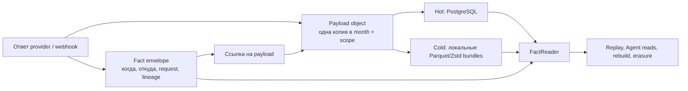

# Архитектура хранения без потери фактов

Статус: **proposal, production не менялся**.

Дата: 2026-08-11

Ревизия кода: локальная ветка `agent/ci-runner-budget` на момент расследования.

База фактов: код, decisions #63, #102, #103, #128, #134, #149, #161,
#176, Stage 28, локальный production dump от 2026-07-10 и owner-approved
read-only production census от 2026-08-11. Никаких production writes, DDL,
deploy, restart, config changes или cleanup во время census не выполнялось.

## 1. Вывод

Главная экономия должна получиться не из сокращения retention и не из удаления
полезных полей, а из устранения повторных физических представлений. Текущий
production census изменил порядок приоритетов:

При 10.36 GB free фактическая filesystem runway ещё не измерена, но
арифметический all-in сценарий уже даёт около 4.2 дня до overhead. Безопасно
действовать как при **не более чем четырёх днях**, поэтому первый no-DDL
stop-loss должен быть отдельным deploy, а не ждать полной CAS архитектуры.

1. **Stop-loss №1 — checkpoint amplification.** Fansly `dm_conversations`
   хранит растущий `snapshotConversationIds` целиком в каждом промежуточном
   checkpoint. Тот же cumulative array попадает в `checkpoint_advanced`,
   `checkpoint_loaded` и `sync_runs.stats`. Каждый новый page повторяет весь
   предыдущий prefix, поэтому объём растёт как O(N²). Только эти три копии
   дали около **1.34 GB сжатых JSONB values за 24 часа**.
2. **Stop-loss №2 — stdout.** Worker пишет подробный trace каждого HTTP
   transition в unbounded Docker `json-file`; текущий forward rate около
   **413.5 MB/day** только у worker.
3. **Главная долгосрочная экономия — payload structural sharing.** Один и тот
   же pull response сейчас лежит в `sync_raw_payloads` и `observations`, а
   повторяющиеся snapshots создают дополнительные полные TOAST values.
4. **Возврат уже занятого места требует физического rewrite/drop.** `DELETE`,
   `DETACH` и обычный `VACUUM` сами по себе не возвращают filesystem bytes.

Для payload plane целевая модель разделяет две сущности:

1. **Логический факт**: факт запроса, ответа, наблюдения, события и его lineage.
   Он сохраняется согласно действующему 100-летнему контракту.
2. **Физическое представление**: повторяющийся JSON/bytea, индекс, горячая
   проекция, лог контейнера, Docker image или build cache. Представлений одного
   факта сейчас бывает несколько. Лишнее представление можно убрать только
   после доказательства, что факт читается и восстанавливается из оставшегося.

Целевая схема:



Вместе checkpoint normalization и payload model дают четыре независимых
выигрыша:

- один conversation id хранится один раз в sweep-members set, а checkpoint и
  telemetry содержат только маленькие scalars/count и terminal digest;
- новый pull response больше не записывается полным JSON одновременно в
  `sync_raw_payloads` и `observations`;
- повторно встречающийся payload внутри одного security/erasure scope хранится
  один раз, но каждое наблюдение остаётся отдельным фактом;
- после появления cold-aware чтений старые heap/TOAST/индексы действительно
  удаляются, а не просто detach-ятся рядом с новой Parquet-копией.

Текущее Stage-28 tiering включать нельзя. Оно пока увеличивает суммарное место:
создаёт Parquet, затем `DETACH` и переносит исходную таблицу целиком в
`tiered_pending_drop`; `DROP` в коде отсутствует. Кроме того, production lake
не смонтирован в persistent volume, export не снимает sealed source snapshot,
а verify не сравнивает source/readback content digest.

## 2. Что известно по объёму

### Current production, 2026-08-11

Host в момент стабильного замера после завершения диагностических запросов:

- filesystem: 84,357,709,824 B total, 69,683,269,632 B used,
  **10,362,753,024 B available**, 88%; inode usage 4%;
- `pg_database_size`: **55,054,122,007 B**;
- Docker Postgres volume: около 55.3 GB allocated, то есть примерно 79% всех
  занятых host bytes;
- WAL: 184,549,376 B, replication slots и long transactions отсутствовали;
- lake отсутствует, build cache равен 0, container writable layers меньше
  1 MB — они не объясняют рост.

Пять главных relations занимают 48,563,298,304 B, или **88.21% БД**:

| Relation | Heap/aux | TOAST | Indexes | Total |
|---|---:|---:|---:|---:|
| `sync_raw_payloads` | 471,252,992 | 18,966,347,776 | 84,320,256 | **19,521,921,024** |
| `observations_2026_07` | 418,709,504 | 10,131,750,912 | 210,493,440 | **10,760,953,856** |
| `sync_run_events` | 586,924,032 | 9,421,660,160 | 129,556,480 | **10,138,140,672** |
| `observations_2026_08` | 161,619,968 | 4,034,699,264 | 83,795,968 | **4,280,115,200** |
| `sync_runs` | 651,616,256 | 3,145,932,800 | 64,618,496 | **3,862,167,552** |

Bounded 24-hour census, `pg_column_size` сжатых values до tuple/index
overhead. Raw потребовал heap scan под timeout, потому что `captured_at` не
индексирован; `Pull observations` — диагностическое подмножество строки «Все
observations» и отдельно в total не суммируется:

| Plane/value | Rows | Bytes/day |
|---|---:|---:|
| Raw payload | 24,353 | 328,070,381 |
| Pull observations | 24,353 | 328,128,194 |
| Все observations | 33,893 | 346,167,238 |
| `sync_run_events.details` | 41,919 | 1,004,705,940 |
| `sync_runs.stats` | 6,135 | 345,618,623 |
| HTTP attempt selected fields | 24,672 | 9,207,447 |
| Webhook raw + parsed | 8,602 | 11,961,280 |

Итого около **2.046 GB/day только в values**. Внутри этого потока:

- `checkpoint_advanced`: около 836 MB/day, из них `dm_conversations`
  828,044,259 B;
- `checkpoint_loaded`: около 171 MB/day, из них `dm_conversations`
  169,508,532 B;
- `dm_conversations` partial-run stats: 325,132,474 B/day; вместе с completed
  и failed runs — около 343 MB/day;
- raw + все observations: около 674 MB/day.

Это не измеренная filesystem runway. Только арифметические сценарии: 10.36 GB
/ 2.046 GB/day DB values = 5.07 дня; с текущими 0.424 GB/day logs = 4.20 дня,
ещё до tuple/index/WAL overhead. Page reuse и retention могут, наоборот,
снизить physical allocation. Сравнивать compact local restore с bloated current
production для прогноза нельзя. Поэтому операционно нужно действовать как при
**не более чем четырёх днях**, а точный forecast строить из повторных `df` и
volume samples 5-15 min / 1h / 24h / 7d.

Container logs — отдельный, меньший, но неограниченный поток. Все контейнеры
используют `json-file` без opts; сейчас занято 317,889,370 B. Пересчёт по
возрасту каждого контейнера даёт worker около **413.5 MB/day**, API около 10.5
MB/day и весь forward log stream около **424 MB/day**. Image/build/tmp cleanup
может безопасно вернуть только около 52 MB без удаления newest rollback.
Logs + junk составляют около 370 MB **gross**: net reclaim меньше на retained
compressed incident archive и новые driver files. Это guardrail, а не решение
DB crisis.

Read-only JSON aggregate во время census один раз создал 1.66 GB transient
PostgreSQL temp spill. Запрос был автоматически отменён по 120-second
`statement_timeout`; `pgsql_tmp` после rollback пуст, всё место вернулось.
Этот инцидент подтверждает: при 10.36 GB headroom нельзя запускать full JSON
hash/explode, `VACUUM FULL` или rewrite без отдельного temp/WAL budget.

### Historical restore baseline, 2026-07-10

Локально доступен production dump:
`/Users/dmitriy/backups/agency-hub/agency_hub_core-2026-07-11-prod-e18d9f2.dump`.
Он создан PostgreSQL 16.13 2026-07-10 в 21:33 MSK, занимает около 4.5 GiB в
custom compressed формате. Restore в изолированный локальный PostgreSQL 16
успешен. Это исторический снимок, а не текущий production.

Логический COPY stream снимка показывает:

| Хранилище | Строки | Логические байты COPY | Что важно |
|---|---:|---:|---|
| `sync_raw_payloads` | 603 334 | 25.64 GB | Почти весь объём в `response_payload` |
| `observations_2026_07` | 174 472 | 5.33 GB | Для pull обычно повторяет raw response |
| `sync_run_events` | ~989 тыс. | 355.5 MB | Операционная телеметрия |
| `sync_http_attempts` | ~532 тыс. | 273.0 MB | Операционная телеметрия |
| `sync_runs` | ~123 тыс. | 193.3 MB | Уже имеет bounded-retention policy |
| `ofapi_webhook_events` | ~141.5 тыс. | 170.1 MB | Только parsed JSON; `raw_body` появился позже в migration 0101 |
| `message_archive` | ~354.1 тыс. | 112.2 MB | Serving/rebuild projection |
| `page_dm_messages` | ~353.9 тыс. | 84.5 MB | Hot serving projection |
| `dm_message_archive` | ~22.4 тыс. | 24.7 MB | Legacy/provenance требует census |
| `ai_generation_content` | 996 | 22.3 MB | Повторяются prompt blocks |

Логические размеры нельзя считать освобождаемыми байтами. Поэтому dump был
восстановлен и измерен через PostgreSQL size functions. Physical snapshot:

| Relation/plane | Physical total | Heap/aux | TOAST | User indexes |
|---|---:|---:|---:|---:|
| Вся БД | 11,627,306,007 B (10.83 GiB) | - | - | - |
| `sync_raw_payloads` | 7,796,580,352 B | 162,004,992 B | 7,614,742,528 B | 19,832,832 B |
| `observations_2026_07` | 1,490,739,200 B | 89,702,400 B | 1,376,296,960 B | 24,739,840 B |
| Обе payload relations | 8.65 GiB | - | - | - |

Эти две relations занимали **79.9% всей БД**, причём подавляющая часть была в
TOAST. Это подтверждает payload structural sharing как главный долгосрочный
reclaim после текущего checkpoint stop-loss. Это всё ещё не означает, что
можно вернуть все 8.65 GiB: одна canonical payload copy должна остаться, к ней
добавятся refs/catalog, а целевой codec нужно измерить на том же corpus.

Следующие physical planes снимка:

- `sync_run_events`: 481.4 MB;
- `sync_http_attempts`: 392.2 MB;
- `sync_runs`: 255.8 MB;
- `ofapi_webhook_events`: 191.9 MB;
- frozen `ofapi_webhook_events_w2_lineage_snapshot`: 159.2 MB;
- `message_archive`: 188.9 MB;
- `page_dm_messages`: 164.6 MB;
- `dm_message_archive`: 30.3 MB;
- pg-boss: 98.0 MB;
- `ai_generation_content`: 14.35 MB, из них 13.62 MB TOAST;
- `tiered_pending_drop`: только около 917 KB в этом снимке.

Следовательно, parked tiering не был причиной июльского объёма, но его текущая
реализация не сможет уменьшить будущий объём. Frozen lineage snapshot является
кандидатом на разовый reclaim только после отдельного доказательства, что его
rescue purpose закрыт и live journal содержит полный нужный material.

При этом кратность записи подтверждена кодом, а не оценкой: общий
`persistRawPayload()` сначала вставляет `response_payload` в
`sync_raw_payloads`, затем почти всегда передаёт тот же объект как
`observations.payload`. Исключение существует для отдельных quarantined
ответов с дополнительным replay-контекстом. Внешний факт запроса нужен в обеих
линиях lineage, две полные копии его тела не нужны.

На восстановленном corpus это также подтверждено данными:

- 90 189 pull observations сопоставлены с recent raw captures; 89 070, или
  98.76%, попали в тот же `(account, md5(jsonb::text))` census bucket. Строгое
  JSONB equality подтвердило 89 057 pairs и 1,206,619,420 B body;
- на стабильном пути с 8 июля counts raw/observation совпадают, а exact JSON
  equality покрывает более 99.8% payload bytes;
- только вторая cross-table copy дала около 1.207 GB суммы
  `pg_column_size(body)` за неполные 5-11 июля: 306.48 MB 8 июля, 307.11 MB 9
  июля и 389.20 MB 10 июля;
- объединённый июльский корпус recent raw + pull observations содержит 220 953
  payload occurrences, но только 48 835 `(month, account,
  md5(jsonb::text))` digest buckets;
- сумма `pg_column_size` всех occurrences равна 2 907 MB, одна copy каждого
  object равна 583 MB. Duplicate component корпуса составляет 2 324 MB, или
  79.95%, до tuple/reference/index overhead.

Последняя цифра включает не только очевидную пару raw/observation, но и
повторяющиеся snapshots внутри месяца. MD5 здесь использовался только как
census codec; collision/full canonical identity не доказывались. Поэтому
2 324 MB / 79.95% — corpus estimate для CAS, а не обещание вернуть filesystem:
physical reclaim появляется только после versioned codec benchmark, skinny
table/partition rewrite и вычитания refs/catalog.

Измеренный общий slope на последних полных днях снимка:

| День | Raw payload values | Все observation payload values | Raw + observations | С relation/telemetry overhead |
|---|---:|---:|---:|---:|
| 2026-07-08 | 306.7 MB | 317.3 MB | 624.0 MB | ~780 MB/day |
| 2026-07-09 | 307.2 MB | 321.2 MB | 628.4 MB | ~785 MB/day |
| 2026-07-10 | 389.3 MB | 428.9 MB | 818.1 MB | ~1.02 GB/day |

То есть исторический baseline уже был около **0.78-1.02 GB/day** только для
raw, observations и sync telemetry. Снимок старше текущего production и сделан
до появления webhook exact `raw_body` и нескольких новых таблиц/индексов, так
что это не верхняя граница текущего роста.

Основной скачок raw начался 27 июня: дневной body вырос примерно с 20-75 MB до
250-390 MB. Два endpoint family объясняют почти всё накопленное raw body:

- `dm_conversations`: 3.209 GB, 182 589 captures;
- `followers`: 2.775 GB, 339 386 captures;
- остальные endpoint families вместе: около 0.61 GB.

Дополнительные доказанные копии в snapshot:

- frozen `ofapi_webhook_events_w2_lineage_snapshot` полностью совпадал с live
  journal по всем 138 082 строкам и занимал 159.2 MB;
- live webhook и webhook observations имели 60 793 exact payload matches,
  около 37.8 MB повторного тела;
- 353 201 из 353 896 `page_dm_messages` уже присутствовали в
  `message_archive`, но hot store всё ещё несёт `purchased_at`/tombstone
  semantics и поэтому не является безопасным DROP-кандидатом.

## 3. Карта полезного и лишнего

| Класс | Политика | Примеры |
|---|---|---|
| Первичный business/audit fact | Не удалять | observation envelope, provider response, webhook raw body, command result |
| Lineage и dedup identity | Не терять; физически уплотнить | observation key, request metadata, payload digest, source ids |
| Canonical ledger | Не пересоздавать с новыми ids/order; только exact-row-preserving tier | `domain_events` с `id`, `account_seq`, dedup keys |
| Rebuildable serving projection | Можно tier/drop только после доказанного rebuild | `message_archive`, `page_dm_messages` |
| Ограниченная операционная телеметрия | Bounded retention и физический reclaim | `sync_runs`, attempts/events, pg-boss history, ops samples |
| Диагностические логи | Размерный cap и ротация; audit facts остаются в БД | stdout/stderr, optional HTTP trace file |
| Host junk | Удалять по строгому allowlist | старые candidate/rollback images, старый build cache, failed deploy temp dirs |

Материализация не считается мусором только потому, что она производная. Если
она является единственным доступным read path или содержит legacy-only строки,
она сохраняется до shadow rebuild с полным равенством.

## 4. Подтверждённые источники amplification

### 4.1. `dm_conversations` checkpoint amplification

Fansly full-scan checkpoint содержит `snapshotConversationIds`, cumulative
array всех conversation ids, уже увиденных в текущем sweep. На каждой странице
код создаёт новый prefix и записывает его в `page_sync_cursors.state`.
`summarizeCheckpoint()` затем без сокращения копирует весь state:

- в `checkpoint_loaded` при старте следующего run;
- в каждый `checkpoint_advanced` после очередной страницы;
- в `sync_runs.stats.checkpoint.before/after` при завершении run.

Если sweep содержит N страниц, telemetry сохраняет prefixes размера
`1 + 2 + ... + N`: это O(N²) ids, хотя полезная membership set имеет размер
O(N). Production подтверждает следствие: около 1.34 GB/day compressed values
при максимальном одном checkpoint value около 333 KB в run stats.

Авторитетный operational checkpoint — `page_sync_cursors`; serving CLI/UI из
run telemetry читает только cursor text/timestamp и advanced flag. Проверка
overlap/final count требует membership, но не требует повторять массив в
каждом JSON envelope.

Предпочтительная membership model уже существует: `page_dm_threads` имеет
unique `(platform_account_id, platform_conversation_id)`,
`last_seen_generation` и индекс `(platform_account_id,
last_seen_generation)`. Текущая страница и checkpoint применяются одной
`withOwnedPageSyncTransaction`; crash оставляет либо оба stamp+checkpoint, либо
ни одного, а same-stream workers fenced lease token/request sequence.

Перед использованием нужен один hardening: terminal `dm_messages` path может
race, переupsert-нув ранее прочитанный generation и регрессировав более новый
stamp, потому что общий conflict update сейчас безусловно принимает excluded
value. `last_seen_generation` должен обновляться монотонно: NULL сохраняет
current, иначе берётся `greatest(current, excluded)`. Для Fansly generations
только растут; OnlyFans writers platform-gated и не получают новую семантику.
После race integration proof для active sweep можно:

1. Внутри page transaction считать повтором id, у которого
   `last_seen_generation = current generation`, и сохранить нынешний
   fail-closed overlap verdict.
2. Upsert-нуть новые ids с current generation.
3. Хранить в checkpoint только
   `{generation, offset, pageCount, observedCount, providerTotal...}`.
4. При каждом completion сверить `count(*) where last_seen_generation =
   generation` со scalar count; при наличии provider total — также с ним.
   Invisibility разрешается только после этой проверки.

Exact page order и исходные ids уже journaled в raw/observation capture; ops
telemetry сохраняет count, а deterministic full set digest считается один раз
на completion, не на каждом prefix. То есть новый store не
нужен, active membership не растёт между sweeps, а полезный safety proof
остаётся. Отдельная additive `sync_sweep_members` таблица нужна только как
fallback, если после monotonic hardening integration proof обнаружит другой
writer, который может разрушить generation set.

Erasure/delete page threads во время active sweep берут тот же writer fence или
abort-ят sweep; иначе membership может исчезнуть между count и finalization.

Безопасный cutover двухступенчатый: сначала legacy array остаётся authority, а
на каждом advancement сравниваются page-local duplicates и incremental count;
полный set digest выполняется один раз на completion, чтобы shadow proof сам не
оставался O(N²);
затем overlap/final-count reader переключается на generation set, а array
остаётся rollback fallback один полный sweep. После scalar state v2 старый
binary не обязан продолжать тот же offset: он безопасно не распознаёт v2,
но видит top-level `generation`, выбирает значение выше текущего max и повторно
fetch-ит sweep. Это теряет
только progress/экономию, не captured facts и не finalization correctness.

### 4.2. Pull capture

`apps/runtime/src/services/sync/shared.ts` пишет почти каждый ответ дважды:

- `sync_raw_payloads.response_payload`;
- `observations.payload`.

Затем полезные поля попадают в `domain_events.data` и serving projections.
Последние копии могут быть оправданы скоростью чтения; первые две должны
ссылаться на один immutable payload object.

Сейчас сбой после durable raw insert и до observation может оставить
недостроенную chain, но raw capture при этом правильно выживает. Нельзя
«исправить» это одной транзакцией, которая откатит единственную provider-copy.
Новый протокол заранее выдаёт stable occurrence id: первая транзакция durable
пишет body + raw envelope + observation intent, вторая идемпотентно достраивает
observation по тому же body без повторного vendor-fetch. Reconciler завершает
застрявшие intents; лишний raw occurrence не создаётся.

### 4.3. OFAPI webhook

Одна доставка может присутствовать как:

- exact `raw_body bytea`;
- parsed `ofapi_webhook_events.payload jsonb`;
- `observations.payload` с тем же parsed material;
- `sync_event` после обработки;
- для malformed/conflict пути ещё и base64 raw body внутри JSON, что добавляет
  примерно треть к размеру exact bytes ещё до TOAST.

Exact raw bytes и parsed semantic JSON имеют разные назначения и оба могут быть
нужны. Parsed JSON не должен храниться дважды. Malformed observation должен
ссылаться на exact raw object, а не встраивать base64-копию.

### 4.4. Сообщения

Текст и material проходят цепочку raw/observation -> domain event ->
`page_dm_messages` -> `message_archive`, а часть legacy материала также есть в
`dm_message_archive`. AI transcript пока читает union трёх stores. Нельзя
удалять один store по названию: legacy seed может быть единственной копией.
Сначала нужен provenance census и shadow rebuild.

### 4.5. AI content

`ai_generation_content.prompt_blocks` повторяет static/persona/transcript
blocks на каждом вызове. Completion может ещё совпадать с `fan_profiles.body`,
причём текущий safety contract использует exact text equality. После payload
слоя тот же content-addressed подход можно применить к prompt blocks, сохраняя
порядок, role, ACL и exact bytes. Current relation около 150,003,712 B (<0.3%
БД), поэтому это поздняя S7-оптимизация, не приоритет рядом с telemetry/payload.

### 4.6. Host storage

Production Compose не задаёт `logging:` ни одному сервису. Если daemon остался
на стандартном `json-file`, stdout/stderr не имеют rotation. Локальный Compose
уже использует bounded `local` driver.

Deploy создаёт уникальные candidate/rollback tags и clean-full tag на dependency
checksum. После успешного deploy старые tags и BuildKit cache не очищаются;
после failed dist-only build может остаться точный
`/tmp/agency-hub-dist-overlay-*` context.

## 5. Инварианты целевой системы

1. **Capture first.** Ответ уже записан транзакционно до parse/project.
2. **Occurrence не схлопывается.** Два одинаковых ответа в разное время дают
   два envelope и один общий payload object.
3. **Dedup ограничен месяцем и scope.** Нельзя делить content object между
   разными capture months, account/tenant, ACL-классами или erasure domains
   только из-за совпавшего SHA-256. Month scope немного уступает глобальному
   CAS в compression ratio, зато делает каждый cold bundle самодостаточным и
   не создаёт вечных cross-segment references.
4. **Hash не является доказательством равенства сам по себе.** На конфликте
   сравниваются kind, canonicalization version, logical length и полный
   canonical content. Несовпавшее тело получает отдельный durable collision
   ordinal и incident; capture не откатывается и не coalesce-ится.
5. **Exact bytes и semantic JSON не смешиваются.** Webhook raw body хэшируется
   как bytes; разобранный JSON имеет versioned canonical JSON digest.
6. **Hot и cold дают один контракт.** Replay, Agent reads, capture floors,
   cursors, projection rebuild и erasure не должны знать, где физически лежит
   payload.
7. **Cold файл на этом VPS не backup.** Он экономит место, но теряется вместе с
   диском/VPS. Это соответствует решениям #128/#161, но не уменьшает принятый
   disaster-risk.
8. **Удаляется только доказанно лишнее представление.** До последнего gate
   исходная таблица parked и может быть reattach-нута.
9. **Никакого глобального prune.** Volume и неизвестные images никогда не
   попадают под storage cleanup.
10. **Admission защищает capture.** При критическом диске можно останавливать
    backfill/reconcile/AI и другие восстановимые bulk lanes, но не webhook,
    command result и другой первичный бизнес-факт.

## 6. Payload object model

Имена предварительные; финальный DDL должен следовать конвенциям следующей
forward-only migration.

### 6.1. Identity catalog отдельно от body

```sql
capture_payload_objects (
  bucket_month date not null,
  object_id bigint not null,
  platform_account_id bigint not null,
  access_class text not null,
  erasure_domain text not null,
  representation text not null,       -- canonical_json | exact_bytes
  codec_version smallint not null,
  content_sha256 bytea not null,
  collision_ordinal integer not null default 0,
  logical_bytes bigint not null,
  content_type text null,
  first_seen_at timestamptz not null,
  primary key (bucket_month, object_id),
  unique (
    bucket_month, platform_account_id, access_class, erasure_domain,
    representation, codec_version, content_sha256, logical_bytes,
    collision_ordinal
  )
) partition by range (bucket_month)
```

ACL/erasure identity хранится явными typed columns, а не opaque `scope_key`:
иначе невозможно доказать, почему два payload разрешено coalesce-ить или
разделять. Restricted AI material никогда не coalesce-ится с обычным capture.
Catalog остаётся hot и маленьким даже после переноса body; envelope FK поэтому
не ломается при cold move.

### 6.2. Hot bodies по representation

```sql
capture_json_hot_bodies (
  bucket_month date not null,
  object_id bigint not null,
  body jsonb not null,
  primary key (bucket_month, object_id),
  foreign key (bucket_month, object_id)
    references capture_payload_objects(bucket_month, object_id)
) partition by range (bucket_month);

capture_byte_hot_bodies (
  bucket_month date not null,
  object_id bigint not null,
  body bytea not null,
  primary key (bucket_month, object_id),
  foreign key (bucket_month, object_id)
    references capture_payload_objects(bucket_month, object_id)
) partition by range (bucket_month);

capture_payload_locations (
  bucket_month date not null,
  object_id bigint not null,
  storage_tier text not null,          -- hot | cold
  segment_id bigint null,
  row_locator bigint null,
  primary key (bucket_month, object_id)
)
```

JSON остаётся queryable `jsonb` в hot tier. Exact webhook bytes не смешиваются
с JSON canonical form. Полные canonical octets рядом с `jsonb` не хранятся:
это снова было бы две body copies. Digest строится frozen application codec;
на `ON CONFLICT` совпадение hash/length не принимается вслепую — reader
canonicalize-ит существующий body и сравнивает полный content. Если ни один
существующий ordinal не равен, writer под hash-scoped lock выделяет следующий
ordinal, сохраняет отличающееся тело и поднимает incident; уникальность не
должна заставлять потерять уже captured response.

Закрытый capture month должен образовывать ref-closed cohort: envelopes и все
body, на которые они ссылаются. Новый месяц создаёт новый object даже для
старого digest. Это осознанная плата за самодостаточные segments без вечных
cross-month references; для static AI blocks/link dimensions позже вводится
отдельный versioned store.

Hot-column TOAST compression (`pglz` против `lz4`) выбирается только по corpus
benchmark размера, write CPU и read latency. LZ4 может быть быстрее, но не
считается автоматически более компактным.

### 6.3. References

Аддитивно появляются nullable composite references:

- `observations.(payload_bucket_month, payload_object_id)`;
- `sync_raw_payloads.(payload_bucket_month, payload_object_id)`;
- `ofapi_webhook_events.(parsed_bucket_month, parsed_object_id)`;
- `ofapi_webhook_events.(raw_bucket_month, raw_object_id)`.

На dual-write стадии старые inline columns остаются authority. После parity
они становятся compatibility fallback, затем nullable, затем в новых rows не
заполняются. Старый heap физически переписывается только отдельной owner-gated
операцией. До первой inline-NULL строки все pre-CAS rollback images должны
выйти из rollback allowlist; pin-ится CAS-aware rollback release. Возврат к
более старому binary требует сначала восстановить inline bodies из object
store и доказать completeness.

`domain_events.data`, message material и AI blocks переносятся позже и только
если physical census подтверждает выигрыш. Не нужно создавать универсальный
blob store для каждой маленькой JSONB строки.

Текущий `observations.payload_hash` сохраняется как provenance. Для pull он
считался от `JSON.stringify()` уже разобранного объекта, а исходные wire
whitespace/key order не сохранялись. CAS digest является отдельным полем над
замороженным canonical codec и не переписывает исторический hash.

### 6.4. Queryable fields

Несколько read paths сейчас выполняют SQL `payload->...` прямо по
`observations`: harvest reconciliation, erasure matching и некоторые admin/read
запросы. Перед удалением inline JSON их query-critical поля переносятся в
маленькие typed locator/projection columns или специализированные indexes.
Нельзя заменять их случайным per-row чтением Parquet.

### 6.5. Mutable parse state

`observations.parse_version` сейчас обновляется после capture и входит в индекс.
Это делает update non-HOT, создаёт WAL и index churn прямо в большой immutable
таблице. Parse state следует вынести в узкую `observation_parse_state`/queue.
Envelope и его payload тогда действительно immutable, а часто изменяемая
операционная запись остаётся маленькой и bounded.

## 7. Write protocol

Для одного provider response используется durable two-step protocol:

1. Фиксирует один `captureInstant` до вычисления month bucket, чтобы raw и
   observation не разъехались по месяцам на границе UTC; определяет
   security/erasure scope и content kind.
2. Строит versioned canonical bytes и SHA-256. Для exact webhook body берёт
   исходные bytes без JSON reserialize.
3. Выдаёт stable occurrence id. Tx A вставляет metadata/object через
   `ON CONFLICT` с full-content check, body при необходимости, raw request
   envelope и durable observation intent; затем коммитит capture-first.
4. Tx B по receipt/occurrence id идемпотентно создаёт observation. Если body
   canonical-exact совпадает, используется тот же object; отличный override
   получает отдельный object. Intent отмечается completed.
5. Parser/projector запускается только после observation commit. Crash между
   транзакциями оставляет raw+intent; reconciler достраивает chain из локального
   body без повторного vendor-fetch.

Так retry не теряет единственную captured copy и не создаёт новый occurrence.
Idempotency observation и факт повторного физического запроса остаются разными
понятиями.

Приложение получает единый `FactReader`/`PayloadReader` seam. Он авторизует
через envelope/principal; произвольный lookup по object id не является public
service API:

```ts
loadObservationPayload(observationId, principal): Promise<unknown>
loadRawCaptureBody(rawPayloadId, principal): Promise<unknown | Buffer>
scanObservations(range): AsyncIterable<ObservationWithPayload>
```

Сначала reader работает только с inline/hot DB. Затем добавляется shadow cold
backend. Только после parity прямые обращения к `observations.payload`
запрещаются static contract test.

## 8. Локальный cold store

### 8.1. Durability prerequisite

Сейчас `LAKE_DIR` по умолчанию равен относительному `lake`; Docker `WORKDIR`
равен `/app`; production Compose не монтирует lake volume. Поэтому worker пишет
в container writable layer, а force-recreate может скрыть/потерять файлы.

До любого нового export нужно:

- задать абсолютный `LAKE_DIR`, например `/var/lib/agency-hub/lake` внутри
  контейнера;
- смонтировать persistent named/bind volume: maintenance/worker RW, API RO;
  `.staging` и final обязаны быть на одном filesystem для atomic rename;
- проверить ownership, свободное место, atomic rename и startup read/write
  sentinel;
- заново экспортировать уже parked partitions в новый volume;
- оставить `RETENTION_TIERING_ENABLED=false`.

Volume остаётся локальным и не является сторонним сервисом. Отдельный второй
local disk дал бы failure-domain/headroom преимущество; lake на том же root
disk остаётся только более компактным representation, не backup.

### 8.2. Bundle

Cold unit должен быть не россыпью мелких файлов, а bundle разумного размера,
например 128-512 MiB после benchmark:

```text
lake/
  observations/2026/01/<segment-id>/
    envelopes.parquet
    payloads.parquet
    manifest.json
```

Parquet пишется с явно заданным Zstd, уровнем и row-group size, выбранными на
реальном корпусе. Нынешний DuckDB `COPY ... FORMAT parquet` не задаёт codec и
поэтому использует default Snappy. Zstd не следует включать с произвольным
максимальным level: нужен benchmark `bytes + export CPU + replay latency`.
Текущий промежуточный NDJSON в `/tmp` также создаёт опасный peak на том же
filesystem. Новый export стримится сразу в mounted `.staging` и до старта
проверяет headroom для staging, WAL и parked source.

### 8.3. Catalog и state machine

```sql
storage_segments (
  id bigint primary key,
  segment_kind text not null,
  state text not null,                    -- staging | verified | active | retiring | retired
  schema_version integer not null,
  relative_path text not null,
  codec text not null,
  row_count bigint not null,
  logical_bytes bigint not null,
  file_bytes bigint not null,
  min_fact_key jsonb not null,
  max_fact_key jsonb not null,
  source_content_sha256 bytea not null,
  readback_content_sha256 bytea not null,
  file_sha256 bytea not null,
  created_at timestamptz not null,
  activated_at timestamptz null
)
```

Manifest хранится и в БД, и рядом с files. Путь только относительный и
валидируется против configured root, чтобы catalog не мог читать произвольный
host path.

### 8.4. Export proof

Правильный export:

1. Сначала ставит DB-enforced seal по immutable ingest high-water. Все более
   поздние capture/updates маршрутизируются в late-arrival/current segment;
   mutable parse state уже вынесен из fact table. Если writer не уважает seal,
   unit вообще не tierable.
2. Снимает repeatable source snapshot уже sealed unit.
3. Читает строки в каноническом порядке.
4. Считает ordered source content digest, row count, key bounds и schema
   version.
5. Стримит сразу в compressed `.staging` bundle на том же filesystem, без
   uncompressed `/tmp` copy.
6. Читает Parquet обратно и считает тот же canonical digest.
7. Сравнивает source/readback digest, count, bounds и обязательные nullability
   constraints.
8. Делает `fsync(file)`, `fsync(dir)`, atomic rename и переводит catalog в
   `verified`.
9. Под тем же seal/advisory lock перед activation повторно проверяет source
   high-water/count/digest и отсутствие delta; затем detach + catalog
   `verified -> active` выполняются в одном lock window. Любое изменение
   abort-ит unit.

Текущая проверка считает rows и SHA самого файла, но не доказывает равенство
содержимого source и Parquet. Для owner-gated physical delete этого
недостаточно.

Текущие `observations` допускают late historical `received_at`, а
`parse_version` обновляется in place, поэтому calendar month сейчас не sealed.
Одного repeatable-read export без writer fence/final locked reconciliation
недостаточно: поздняя строка может попасть между verify и detach.

### 8.5. Readers before delete

До удаления первой исходной партиции cold-aware должны стать:

- observation canonicalizer/replay;
- domain event stream, cursors и account sequence continuity;
- Agent capture floor и payload endpoint;
- projection rebuild, включая message archive;
- erasure search/rewrite;
- admin/audit lookup и restore drill.

Capture floor считается как минимум по active cold segments и hot data.
Detached month не должен делать floor более новым или создавать ложный gap.

Payload body month нельзя drop-ать отдельно: raw, observation и webhook refs
одного capture cohort должны иметь доказанную ref closure и cold-aware
resolver. `sync_raw_payloads` сейчас unpartitioned, поэтому одного monthly
observation swap недостаточно; либо сначала появляется month locator/ref proof,
либо corresponding bodies остаются hot.

### 8.6. Physical reclaim

`DETACH` не освобождает место. После grace и всех проверок выполняется
owner-gated `DROP TABLE tiered_pending_drop.<exact-name>`. Это удаляет только
лишнее PostgreSQL-представление; logical facts уже активны в verified cold
bundle.

После DROP rollback означает restore из bundle, а не reattach. Поэтому перед
первым DROP обязателен restore в temporary schema и shadow rebuild projections
с равенством counts/digests/serving results.

### 8.7. `domain_events`: другая физическая ось

Сейчас `domain_events` partitioned по provider business time `occurred_at`.
Исторический факт с датой 2024 года может быть записан сегодня, поэтому старая
партиция никогда не является гарантированно sealed ingest prefix. Использовать
`occurred_at` как storage lifecycle key нельзя.

Новый layout строится по immutable ingest coordinate: `created_at`/`recorded_at`
или sealed ranges глобального event `id`. `occurred_at` остаётся бизнес-временем
и индексом поиска. Перед cold move catalog доказывает для каждого account
`min_seq`, `max_seq`, `count` и отсутствие внутренних дыр. SSE может держать
ограниченный hot replay horizon и существующий snapshot recovery для старого
cursor, но cold events остаются authority для projection rebuild и истории.
IDs, `account_seq`, dedup keys и внешние cursors при rewrite не меняются.
`domain_events` — canonical ledger, не disposable projection: replay из
observations не считается rollback, если он создаёт новые ids/order.

## 9. Уплотнение уже накопленного

### 9.0. `sync_run_events` и `sync_runs`: первый reclaim unit

Эти две relations уже занимают **14,000,308,224 B**. Большая часть TOAST —
повторные checkpoint prefixes. Действующий 30-day retention разрешает удалять
старую ops telemetry, но текущий row-by-row `DELETE` плюс autovacuum лишь делает
страницы повторно используемыми внутри relation; filesystem может не получить
их обратно, а peak plateau при текущем slope слишком велик.

Целевой future layout:

- `sync_run_events` time-partitioned по immutable `emitted_at`, например daily;
- `sync_runs` и attempts получают совместимый lifecycle/partition plan либо
  остаются skinny parent rows с FK-safe child partitions;
- retention выполняет verified `DROP` завершённой partition, а не большой
  row delete;
- checkpoint membership живёт отдельно, event details/stats остаются narrow;
- completed/running distinction и composite `(run,page,stream)` FK semantics
  сохраняются.

Для уже накопленного нельзя делать mass `UPDATE`, full shadow или немедленный
`VACUUM FULL` при 10.36 GB headroom. Безопасная единица — один closed UTC-day:
до physical pilot ни один current-data rewrite не считается разрешённым.

1. Freeze high-water. Eligible только terminal runs ниже него, которые не
   являются `page_sync_cursors.last_succeeded_run_id`.
2. Streaming-export без uncompressed `/tmp`: `sync_runs`, events, attempts и
   отдельный `raw_run_links(raw_payload_id, sync_run_id)`, потому что current FK
   при delete обнуляет run link.
3. Bundle получает canonical length-prefixed digest в PK order, counts/id
   bounds, file SHA-256; затем scratch restore и `EXCEPT ALL` в обе стороны.
   File+directory fsync и atomic rename manifest выполняются до activation.
4. Cold-aware admin run reader, raw-lineage resolver либо owner restore CLI
   появляется **до** source prune. Online horizon и cold-read SLA — отдельное
   решение; exact telemetry и raw->run lineage при этом не теряются.
5. После отдельного owner gate source rows удаляются. Это даёт relation reuse,
   но ещё не filesystem reclaim.
6. Только когда pilot докажет, что оставшийся live heap+TOAST+indexes, WAL и
   reserve помещаются в headroom: pause worker/scheduler, `VACUUM FULL
   sync_run_events` под maintenance lock, verify, затем по отдельным gates
   `sync_runs` и attempts. `VACUUM FULL` сохраняет table identity/FKs, но берёт
   `ACCESS EXCLUSIVE` и требует новую physical copy.

State machine segment: `planned -> writing -> source_verified ->
readback_verified -> active_source_present -> restore_verified ->
drop_authorized -> active_cold`. До prune rollback просто удаляет staging; после
prune restore возвращает original ids, links и sequence high-water.

Existing rows архивируются exact, а не переписываются в новый compact JSON:
для exact archive применим `EXCEPT ALL`; equivalence compact future schema
проверяется отдельным normalized comparator. Альтернатива без cold reader —
compact только future writes и ждать штатного 30-day expiry/reuse.

Операция стартует только если measured compressed bundle + restore scratch +
post-prune live relation + indexes + WAL + rollback reserve укладываются в
заранее выбранный budget. Если нет, сначала требуется временный локальный
filesystem headroom; пытаться добыть его непроверенным rewrite опаснее самого
заполнения.

### 9.1. `observations`

Работа идёт по одной monthly partition:

1. Backfill `payload_object_id`, не меняя inline payload.
2. Проверка count, id/time bounds, payload digest и reference completeness.
3. Создание skinny shadow partition с payload reference и только реально
   используемыми indexes.
4. Короткий transactional detach/attach swap под lock timeout.
5. Старую partition park на grace window.
6. Shadow replay и serving parity.
7. Owner-gated drop старой partition.

Это требует временного headroom минимум под одну старую partition, новую skinny
partition, WAL и cold bundle. Если headroom нет, операция не начинается.

### 9.2. `sync_raw_payloads`

Таблица не partitioned и имеет inbound lineage FKs. Простое `UPDATE payload =
null`, `DROP COLUMN` или обычный `VACUUM` не гарантирует возврат места
filesystem.

Безопасные варианты после payload backfill:

- planned maintenance rewrite (`VACUUM FULL`/`CLUSTER`) с заранее измеренным
  lock budget; либо
- skinny shadow table, полная проверка, короткая остановка writers, перенос
  inbound FKs и atomic rename.

Второй вариант предпочтительнее при достаточном временном headroom. Будущая
skinny request metadata может оставаться unpartitioned; её большой content уже
живёт в monthly `capture_payload_objects`/hot-body partitions.

### 9.3. Dedup keys и indexes

`observation_keys` и `domain_event_keys` повторяют длинные text keys и держат
их в PK indexes. Для будущих rows нужен fixed-size SHA-256 key плюс exact-key
collision check. Миграция не должна менять idempotency semantics.

Index нельзя удалять только из-за размера. Сначала собираются
`pg_stat_user_indexes`, планы реальных запросов и bloat. Неиспользуемый индекс
удаляется `CONCURRENTLY` только после полного business cycle наблюдения.
Раздутый индекс перестраивается `REINDEX CONCURRENTLY`; heap/TOAST reclaim
делается shadow rewrite, а не надеждой на `VACUUM`.

### 9.4. Projections

`message_archive`, `page_dm_messages` и legacy `dm_message_archive` пока не
являются первыми кандидатами на удаление. Сначала каждая строка получает
provenance class:

- rebuildable from hot+cold facts;
- legacy-only;
- conflict/tombstone.

Удалять можно только первый класс и только когда serving reader умеет получать
эквивалентный материал без нарушения latency/FTS contract.

### 9.5. Retired/shadow relations

Message archive rebuild намеренно переименовывает старую полную таблицу в
`message_archive_retired_<timestamp>` и оставляет её для rollback. Current
census уже исключил большой quick win: `message_archive_retired_%` отсутствуют,
shadow занимает 65,536 B, 24 `tiered_pending_drop` relations вместе 917,504 B.
Единственный заметный кандидат —
`ofapi_webhook_events_w2_lineage_snapshot`, 158,973,952 B; его имя и measured
equality исторического dump всё ещё не являются разрешением на production DROP.

Для каждой копии нужны:

- consumer-zero inventory;
- `EXCEPT ALL`/material equality в обе стороны;
- tombstone, PPV, media и legacy-only coverage;
- истёкшее rollback window;
- отдельный owner gate на exact relation name.

### 9.6. Конкретные index hypotheses

Кандидаты, которые нужно проверить через current `pg_stat_user_indexes` и
production-shaped `EXPLAIN`, но не удалять вслепую:

- `ofapi_commands_payload_redaction_idx`: redaction sweep удалён, а terminal
  payload стал постоянным фактом;
- `sync_raw_payloads_retain_idx` и
  `dm_message_archive_retain_until_idx`: при 36500-дневном retention их даты
  близки к 2126 году и текущий sweep может не получать пользы;
- `observations_parse_idx(parse_version, received_at)`: replay идёт другим
  keyset и сам mutable parse state лучше вынести из envelope.

Если range lookup всё же нужен, BRIN или маленькая state-table может быть
дешевле большого B-tree. Решение принимает план запроса и полный business-cycle
usage, а не размер индекса отдельно.

## 10. Остановка нового мусора на host

### 10.1. Container logs

Во всех production services задаётся bounded Docker `local` driver. По
измеренному rate разумный первый cap — `max-size: 20m`, `max-file: 5` для
postgres/api/scheduler/worker: worst-case footprint около 400 MB и worker
получает несколько часов detailed incident window. Точный cap можно менять
после 7-day telemetry, но отсутствие cap запрещается Compose contract test.
Application audit не должен существовать только в stdout.

Worker сейчас безусловно пишет started/success/retry/failure каждого HTTP
attempt в stdout, хотя структурные request/response shapes и outcomes уже
хранятся в `sync_http_attempts`. В нормальном режиме stdout оставляет
failures/retries, anomaly и per-run summary; per-attempt success trace
включается только временным bounded debug flag. Это сохраняет диагностический
signal и убирает повторное представление.

Смена driver требует recreate. Чтобы не выбросить текущий incident window,
каждый container обрабатывается отдельно: graceful stop, стабильный `LogPath`
streaming в Zstd на persistent host path, сохранение `docker inspect` и
original SHA-256, `zstd -t`, только затем recreate. Worker идёт первым; API и
Postgres остаются доступны. Ручное truncate активного log запрещено.

`SYNC_HTTP_TRACE_FILE` в production либо запрещён, либо направлен в отдельный
rotated sink с таким же cap. Сейчас это append-only file path.

### 10.2. Images и build cache

Cleanup запускается только **после успешного health gate** и строит allowlist по
image ID:

- running/current image;
- один или два проверенных rollback image;
- active clean-full dependency base;
- image текущего candidate до promotion.

Удаляются только более старые repo-owned candidate/rollback tags, которые не
входят в allowlist. BuildKit cache получает age/space cap. `docker system prune
--volumes`, `docker volume prune` и широкое `image prune -a` запрещены.

Failed remote build должен иметь `EXIT` trap, удаляющий только заранее
разрешённый exact `/tmp/agency-hub-dist-overlay-<id>` path.

### 10.3. Storage telemetry

Текущий alert смотрит только общий filesystem и `pg_database_size` при 80%.
Absolute filesystem free/used и volume bytes снимаются каждые 5-15 минут для
admission gate; relation-level тяжёлый census — daily/off-peak:

- filesystem used/free;
- PG database, heap, TOAST и indexes по relation/partition;
- WAL и replication slots;
- lake active/staging/retired bytes;
- Docker logs, images, writable layers и build cache;
- rows/day и bytes/day по основным capture kinds.

Alert должен показывать slope и `days_to_full`, например warning <30 дней,
critical <7 дней, а не ждать одного процента заполнения.
При нарушении owner-defined `Rmin` admission останавливает новые
backfill/reconcile/AI bulk jobs и temp-heavy maintenance, но оставляет API,
webhook capture и command results; это reversible pause, не delete.

### 10.4. Lifecycle registry

Retention/deleter policy сейчас распределена между кодом, pg-boss defaults,
SQL, shell и Docker. Нужен один registry, где у каждого plane зафиксированы
owner, authority, retention/rebuild proof и sanctioned physical deleter.

Установленный pg-boss сейчас имеет bounded defaults, но runtime их явно не
pin-ит. Его retention/deletion следует задавать и проверять integration test,
чтобы dependency upgrade не превратил queue history в новый бесконечный plane.
Существующий deleter allowlist test также нужно расширить на SQL/shell/Docker:
текущий TS-only scan не увидит опасный volume prune или новый maintenance SQL.

## 11. Поэтапный cutover

### S0. Read-only census

**Diagnostic census завершён 2026-08-11 без production mutations; destructive
reclaim gate ещё не закрыт.** Current DB/Docker profile и июльский restore
corpus сняты. Полный JSON hash benchmark остаётся только на локальном dump:
production headroom недостаточен для temp-heavy scan.

Gate state:

- top heap/TOAST/index и bounded 24h value census известны;
- temporary headroom 10.36 GB, недостаточен для blind full-table rewrite;
- около 14 GB host usage остаётся residual между `df` и опубликованными
  PG/log/image planes (OS, image/shared layers, Docker metadata и прочее) —
  полного sum-to-`df` reconciliation пока нет;
- physical filesystem slope и baseline replay/Agent/projection results нужно
  зафиксировать перед первым mutation gate.

### S1. Immediate containment, без изменения business state

- `summarizeCheckpoint` перестаёт копировать `snapshotConversationIds` в ops
  events/run stats: сохраняет count, generation, offset, provider totals и
  bounded diagnostic sample; authoritative exact array пока остаётся
  неизменным в `page_sync_cursors`. Full set hash на каждом advancement
  запрещён — он сохранил бы O(N²) compute;
- bounded production logging;
- stdout пишет failures/retries и run summary, а successful request transitions
  остаются в `sync_http_attempts`; optional trace file запрещён либо bounded;
- перед per-container recreate текущий log stream архивируется и
  checksum/restore-проверяется; worker меняется первым, API/Postgres остаются
  доступны;
- exact deploy temp cleanup;
- retention-aware image/cache GC;
- storage slope telemetry;
- scheduled и manual destructive tiering остаются закрыты.

Gate: checkpoint view/contracts не меняются, large-state telemetry имеет
жёсткий byte ceiling, count/sample корректны, Compose/deploy
contract tests проходят, no-volume-prune static test и failure-path test
зелёные. Эта стадия не меняет operational checkpoint и не удаляет DB facts.

### S2. Checkpoint normalization

- сделать `page_dm_threads.last_seen_generation` monotonic на conflict update и
  доказать race с terminal `dm_messages` writer integration test;
- repository query использует существующий `page_dm_threads` generation index
  как active membership set; schema migration не нужна;
- dual-proof cumulative array + generation set;
- на каждом advancement: page-local/ count/duplicate parity; full set digest
  один раз на completion;
- один полный успешный и один interrupted/resumed sweep;
- переключение overlap/finalization на unique generation rows;
- compact scalar-only `page_sync_cursors.state`; legacy array остаётся fallback
  на rollback window.

Gate: provider drift, overlap, restart, lease-loss, erasure/delete fence,
concurrent terminal writer и destructive-finalization tests дают те же
решения; generation count/digest
равны legacy array. Старый binary может безопасно начать новый generation и
re-fetch после rollback. После этого будущий checkpoint plane становится O(N),
а не O(N²).

### S3. Payload foundation

- пустые additive catalog/hot-body/observation-intent tables, current
  partitions и nullable refs;
- capture-first CAS raw transaction + idempotent observation completion;
- hot-only `PayloadReader`;
- flags default-off; только bounded canary с жёстким rows/bytes ceiling;
- inline columns остаются `NOT NULL` authority, historical backfill отсутствует;
- collision, ACL и concurrency tests.

Nullable-column DDL берёт краткий `ACCESS EXCLUSIVE`; ставятся
`lock_timeout='2s'` и statement timeout, при занятом lock операция abort/retry,
а не ждёт. Gate: canary не превысил headroom budget, inline/object digests и
parser/projector outputs равны, missing-reference count нулевой.

### S4. Pointer-only new writes

- только после расширенного business-cycle dual-write отдельного cohort;
- все прямые readers переведены на seam;
- query-critical JSON fields вынесены в narrow typed storage;
- new capture пишет payload один раз;
- inline fallback сохраняется только для старых rows.

Rollback: вернуть dual-write; object rows остаются дополнительной копией.
После первой inline-NULL row rollback floor — предыдущий CAS-aware release;
pre-CAS binary больше не является безопасной целью, пока inline bodies не
восстановлены и не verified.

### S5. Current-data rewrite

- verified archive/compact rewrite `sync_run_events` и `sync_runs` первым:
  30-day logical retention остаётся, но future layout получает time partitions,
  чтобы физический reclaim был `DROP PARTITION`, а не бесконечный DELETE bloat;
- backfill objects;
- monthly observation shadow swap;
- skinny `sync_raw_payloads` rewrite;
- index/dedup-key compaction по статистике.

Gate на каждую unit: count + canonical digest + lineage + shadow replay +
serving parity + grace. До последнего gate старый source не drop-ается.

### S6. True cold tiering

- persistent shared absolute `LAKE_DIR` и startup sentinel;
- segment catalog/state machine;
- Parquet/Zstd benchmark;
- source/readback content digest;
- cold-aware readers/floors/cursors/erasure;
- restore and projection drills;
- owner-gated drop parked heap.

Только здесь Stage 28 начинает реально освобождать место.

### S7. Вторичные оптимизации

- content-addressed AI prompt blocks;
- message store provenance/rebuild compaction;
- link-stats snapshot structural sharing;
- более компактные fixed-size dedup keys;
- пересмотр hot windows по измеренному access pattern.

## 12. Обязательные тесты

1. Large `snapshotConversationIds` никогда не попадает целиком в
   `sync_run_events.details`, `sync_runs.stats` или stdout; summary имеет
   bounded bytes и exact count; full digest считается только на completion.
2. `page_dm_threads` generation set даёт то же множество, duplicate/overlap
   verdict и final count, что legacy array, включая crash/resume, lease loss и
   erasure/delete fence.
3. Concurrent terminal `dm_messages` upsert не может регрессировать
   `last_seen_generation`; NULL и OnlyFans paths сохраняют прежнюю семантику.
4. Старый binary после rollback безопасно начинает новый generation вместо
   неправильного продолжения v2; новый binary умеет продолжить обе версии.
5. Одинаковый payload одновременно из N writers создаёт один object и N
   envelopes.
6. Одинаковый digest в другом scope не делит content/ACL.
7. Искусственная hash collision не coalesce-ит разные bytes, выдаёт durable
   collision ordinal/incident и не откатывает capture.
8. Crash после каждого шага write/export/activate восстанавливается
   идемпотентно без missing fact.
9. Inline и object parser outputs byte/semantic equal на corpus.
10. Hot и cold replay дают одинаковые events, sequence и projections.
11. Capture floor до и после detach/drop одинаков.
12. Agent payload/read routes не теряют старый range.
13. Erasure переписывает shared object/segment без удаления чужого scope и без
   resurrection старой версии.
14. Restore из bundle в пустую staging schema проходит без parked PostgreSQL
    source.
15. Production Compose ограничивает logs каждого сервиса.
16. Deploy GC никогда не выбирает live/rollback/base image ID и не содержит
    volume prune.
17. Failed build удаляет только свой exact temp context.
18. Retention deleter allowlist не расширяется неявно.
19. Corpus roundtrip покрывает JSON null/arrays/Unicode/large values, exact
    binary/malformed webhook и разные JSON key order/whitespace semantics.
20. Static ratchet запрещает новые прямые чтения inline payload вне resolver.
21. Late historical `domain_event` не попадает в уже sealed storage unit, а
    cursor/floor остаются корректными.
22. Integration test pin-ит фактический pg-boss retention/deletion.

## 13. Что не делать

- Не включать текущий scheduled или manual tiering ради свободного места.
- Не удалять `sync_raw_payloads`, считая `observations` достаточной копией:
  metadata, mapper lineage и часть старых rows различаются.
- Не оставлять только projections: они rebuildable и могут быть неполными.
- Не gzip/brotli-ить JSONB в opaque bytea до появления reader seam: SQL payload
  predicates, replay и erasure перестанут работать.
- Не снижать capture retention и не пропускать неизменившийся response после
  факта запроса. Сохраняется occurrence, схлопывается только тело.
- Не делать `VACUUM FULL` на большой production table без lock/headroom plan.
- Не удалять индексы по одному размеру без usage/plans.
- Не использовать `docker system prune --volumes` или общий recursive cleanup.
- Не называть local lake резервной копией.

## 14. Как считать реальный эффект

Перед реализацией и после каждого слайса считается:

```text
net_reclaimed =
  dropped_heap_toast_indexes
  + removed_host_junk
  - active_cold_files
  - new_catalog_and_locator_indexes
  - temporary_overlap_still_in_grace
```

Каждая операция сначала проходит hard headroom inequality с выбранным
`Rmin` — filesystem reserve, который mutation не имеет права съесть:

```text
S1 deploy:
  free >= Rmin + deploy_delta + compressed_log_archive + new_log_caps + failure_margin

Archive day:
  free >= Rmin + staging_bundle + restore_scratch + prune_WAL_peak

VACUUM FULL relation:
  free >= Rmin + post_prune_live_heap_toast + rebuilt_indexes + WAL_peak

Historical CAS/shadow:
  free >= Rmin + unique_CAS + skinny_shadow + indexes + WAL + temp
```

Все terms измеряются physical pilot, не logical COPY bytes. Нарушение любого
inequality означает abort до source mutation.

Для нового pull capture ожидаемая форма меняется с нескольких независимо
TOASTed occurrences на один object в `(month, scope)` и skinny references.
Только устранение raw/observation pair почти делит document lane пополам;
повторы snapshots дали collision-unverified digest-bucket estimate 79.95% на
июльском корпусе. Точный filesystem coefficient всё равно публикуется только после
physical benchmark и table rewrite.

Success metrics:

- bytes/day всего VPS и отдельно каждого plane;
- compressed payload bytes / logical payload bytes;
- unique payload objects / envelope count;
- hot DB bytes / logical fact;
- cold file bytes / logical fact;
- p95 hot и cold replay/read latency;
- zero missing facts, zero digest mismatch, zero false floor;
- forecast `days_to_full` после cutover.

Measured effect ledger, без ложной точности:

| Slice | Future slope | Existing-byte pool | Что можно обещать сейчас |
|---|---:|---:|---|
| Compact checkpoint telemetry | около **1.34 GB/day avoided** | 14.00 GB в events+runs | Daily value saving измерен; exact reclaim только после rewrite |
| Bounded/sparse stdout | rotation ограничивает footprint примерно 400 MB; suppression saving ещё не измерен | 317.9 MB logs gross | Net после retained archive/new files измеряется post-deploy |
| Host allowlist cleanup | 0 | около 52 MB без current logs | Малый exact one-time reclaim |
| Raw/observation shared payload | ожидаемо до **~328 MB/day pair copy avoided** до refs | 34.56 GB raw+Jul/Aug observations | Override может отличаться; current equality scan не завершён, июльские digest buckets дали collision-unverified 79.95% estimate |
| Current Stage-28 tiering | отрицательный до DROP | 0.9 MB parked сейчас | Не использовать как reclaim |

После G1 24-hour DB value slope должен упасть примерно с 2.046 GB/day к
порядку 0.7 GB/day, если workload mix сохранится. Это проверяемая гипотеза, не
SLA: публикуется фактический rolling slope после deploy. Только G3 cutover
убирает large checkpoint update/WAL churn; G2 ещё держит legacy array и делает
shadow proof. G4/G5 возвращают существующие GiB только после физического
drop старого representation.

## 15. Следующие owner-gated production действия

Read-only census завершён. Следующие gates нельзя объединять:

1. **G1 — stop-loss deploy.** Bounded checkpoint telemetry, bounded Docker
   logging и success-trace suppression. Никакого DDL/delete/tiering. Проверить
   после одного natural partial+complete `dm_conversations` run: max/avg
   details/stats bytes, те же UI/CLI checkpoint fields, failures/retries в
   trace, Docker log opts, DB/log slope. Rollback — предыдущий image; он снова
   пишет verbose telemetry, business state не меняется.
2. **G2 — generation-membership dual-proof.** Legacy array остаётся authority;
   существующий `page_dm_threads.last_seen_generation` читается как shadow
   membership. На одном полном business cycle сравнить count, set digest,
   duplicate/overlap decisions и resume. Никакого DDL или historical rewrite;
   отдельная membership table вводится только если parity докажет, что
   generation projection недостаточна.
3. **G3 — checkpoint cutover.** Переключить только Fansly
   `dm_conversations` на normalized membership; выдержать отдельное окно и
   затем убрать legacy array только из новых state. Старые rows остаются
   readable.
4. **G4 — exact current-data reclaim unit.** Только после локального dry-run,
   temporary-headroom расчёта, archive/restore proof и shadow equality выбрать
   точную relation/partition. Park, grace и physical DROP — три разные точки;
   irreversible DROP требует отдельного подтверждения exact table name.
5. **G5 — payload CAS.** Additive dual-write, read seam, pointer-only future
   rows и historical rewrite также переключаются отдельными flags/windows.
6. **G6 — cold DROP.** Допускается только после persistent lake, sealed
   snapshot, source/readback content digest и cold-aware replay/read/floor.

Production full-table JSON hash/explode запрещён при текущем headroom. Corpus
benchmark выполняется на локальном dump; production проверки ограничиваются
indexed time units с `statement_timeout`, `lock_timeout` и `temp_file_limit`.

До destructive gates owner отдельно фиксирует: `Rmin`; incident-log window;
online telemetry horizon и cold-read SLA; same-disk или второй local-disk lake;
maintenance window для relation rewrite; CAS ACL/erasure classes и canonical
codec; exact manifest/segment ID для каждого source-drop approval.

## 16. Проверяемые источники

Ключевые code anchors:

- [`snapshotConversationIds` state codec](../apps/runtime/src/services/sync/cursor-state.ts),
  [Fansly sweep transaction](../apps/runtime/src/services/sync/executor-handlers.ts),
  [verbose checkpoint/HTTP telemetry](../apps/runtime/src/services/sync/observability.ts)
  и [`last_seen_generation` writer](../packages/db/src/repositories/page-dm.ts);
- [`persistRawPayload`](../apps/runtime/src/services/sync/shared.ts) и
  [`insertRawPayload`](../packages/db/src/repositories/sync.ts);
- [schema capture/event/message/AI tables](../packages/db/src/schema.ts);
- [Stage-28 tiering implementation](../apps/runtime/src/services/tiering/index.ts);
- [erasure implementation](../apps/runtime/src/services/erasure/index.ts);
- [production Compose](../docker-compose.production.yml);
- [deploy script](../scripts/deploy-production.sh);
- [Agent read-plane tiering constraints](../docs/runbooks/agent-read-plane-enablement.md);
- [append-only decisions](../docs/decisions.md).

Primary upstream documentation:

- [PostgreSQL 16 TOAST](https://www.postgresql.org/docs/16/storage-toast.html):
  large values are compressed/out-of-line per datum; column compression is
  configurable.
- [PostgreSQL 16 database size functions](https://www.postgresql.org/docs/16/functions-admin.html):
  definitions of table, index, TOAST and total relation sizes.
- [PostgreSQL 16 partitioning](https://www.postgresql.org/docs/16/ddl-partitioning.html):
  detach keeps a standalone table; physical removal is a separate action.
- [DuckDB `COPY`](https://duckdb.org/docs/current/sql/statements/copy.html):
  Parquet default is Snappy; Zstd and compression levels are explicit options.
- [DuckDB Parquet performance guide](https://duckdb.org/docs/current/data/parquet/tips):
  row group and sort choices affect compression and pruning.
- [Docker local logging driver](https://docs.docker.com/engine/logging/drivers/local/):
  bounded rotation and compression options.
- [Docker pruning](https://docs.docker.com/engine/manage-resources/pruning/):
  images, build cache and volumes are separate cleanup scopes.
